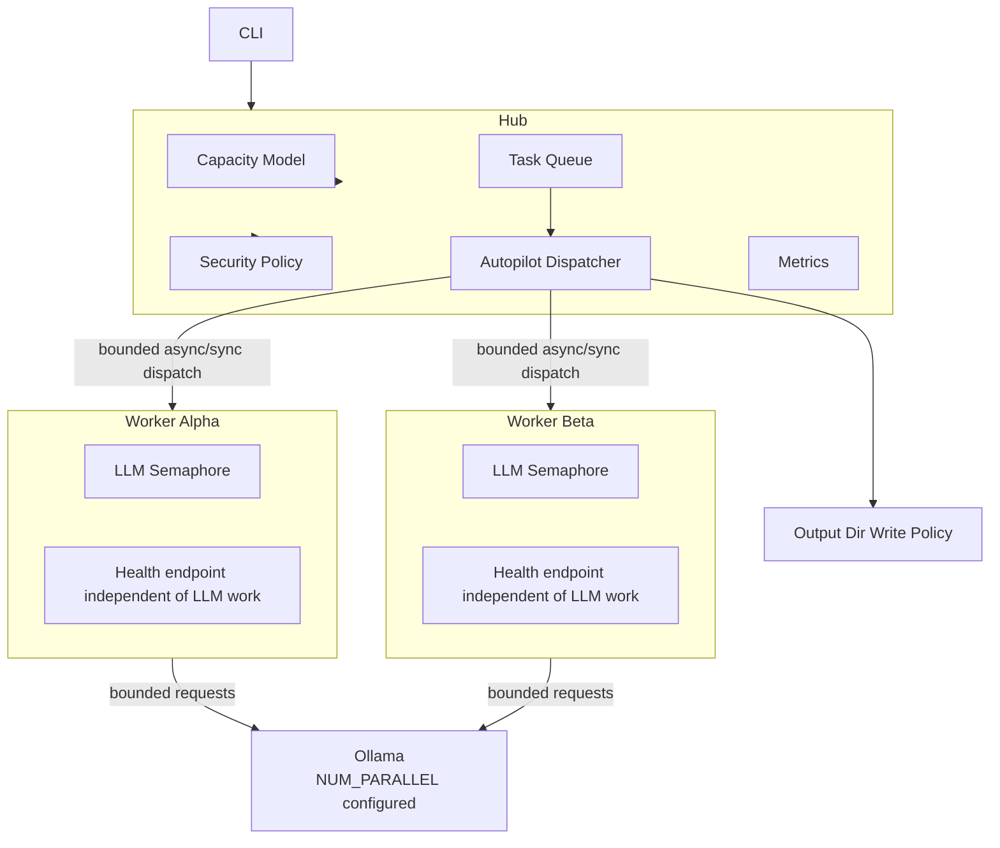

# Ananta Orchestrierung — Bottleneck-Analyse

> **Datum:** 2026-05-15  
> **Status:** überarbeitet nach Code-Review  
> **Ziel:** Identifikation und Priorisierung der Engpässe, die verhindern, dass Ollama, Worker und Hub kontrolliert parallel arbeiten.  
> **Leitprinzip:** Nicht „einfach alles parallel hochdrehen“, sondern kontrollierte Parallelität mit Policy, Kapazitätsmodell, Messpunkten und Fail-Closed-Verhalten.

---

## 0. Wichtigste Korrekturen gegenüber der ersten Analyse

Die ursprüngliche Analyse ist als Diagnose brauchbar, aber an mehreren Stellen zu optimistisch bzw. zu grob:

1. **Concurrency ist aktuell wahrscheinlich noch stärker begrenzt als beschrieben.**  
   Der aktuelle Code in `agent/routes/tasks/autopilot_dispatch_policy.py` begrenzt die effektive Parallelität auf `security_policy.max_concurrency_cap`; wenn dieser Wert fehlt, ist der Default faktisch `1`.

   ```python
   return max(1, min(int(requested_max_concurrency), int(security_policy.get("max_concurrency_cap") or 1)))
   ```

2. **`max_concurrency=8` ist kein sicherer Default.**  
   Eine höhere Parallelität muss an verfügbare Worker, Backend-Kapazität, Ollama-Slots, VRAM und Sicherheitsprofil gekoppelt werden.

3. **`sgpt_lock` sollte nicht blind entfernt werden.**  
   Der globale Lock ist ein echter Bottleneck, kann aber auch CLI-/Cache-/Session-Seiteneffekte verhindern. Er sollte durch konfigurierbare Semaphoren ersetzt werden.

4. **Health-Check-Probleme müssen am Worker-Servermodell geprüft werden.**  
   Wenn der Worker während eines LLM-Calls keine Health-Requests bedienen kann, helfen kürzere Health-Intervalle nur begrenzt. Entscheidend ist, ob Flask/threading/gunicorn/worker model parallele Health-Requests zulässt.

5. **Parallelität verschärft Workspace-/Output-Risiken.**  
   Mit `--output-dir` können mehrere Tasks denselben Zielordner beschreiben. Ohne Locking, Task-Subdirs oder Write-Ownership-Regeln entstehen Race Conditions.

---

## 1. Hauptbefund

Das System hat nicht nur einen Bottleneck, sondern eine Kette aus mehreren seriellen Begrenzungen:

```text
Goal Planning -> Task Queue -> Autopilot Policy Cap -> Sync Dispatch -> Worker LLM Lock -> Ollama Queue -> Tool Execution -> Health/Timeout Feedback
```

Wenn eine Stufe serialisiert, bringt Parallelität in den anderen Stufen nur begrenzt etwas.

---

## 2. Kritische Bottlenecks

### Bottleneck #1: Ollama-Parallelität nicht explizit konfiguriert

| Aspekt | Bewertung |
|---|---|
| Datei | `docker-compose.base.yml` |
| Problem | `OLLAMA_NUM_PARALLEL` fehlt im `ollama`-Service |
| Wirkung | Ollama kann Requests intern serialisieren bzw. nicht im gewünschten Umfang parallel abarbeiten |
| Risiko beim Fix | höherer VRAM-/RAM-/KV-Cache-Verbrauch |
| Empfehlung | konfigurierbar starten, nicht hart auf 8 setzen |

Empfohlener sicherer Einstieg:

```yaml
environment:
  NVIDIA_VISIBLE_DEVICES: all
  NVIDIA_DRIVER_CAPABILITIES: compute,utility
  OLLAMA_NUM_PARALLEL: ${OLLAMA_NUM_PARALLEL:-2}
  OLLAMA_MAX_LOADED_MODELS: ${OLLAMA_MAX_LOADED_MODELS:-1}
  OLLAMA_KEEP_ALIVE: ${OLLAMA_KEEP_ALIVE:-5m}
```

Für Tests:

```bash
OLLAMA_NUM_PARALLEL=1
OLLAMA_NUM_PARALLEL=2
OLLAMA_NUM_PARALLEL=4
```

Dabei messen:

- Tokens/s
- LLM-Latenz p50/p95
- Queue-Wartezeit
- VRAM
- OOM / Modell-Neuladen
- Task-Erfolgsrate

---

### Bottleneck #2: Globaler `sgpt_lock`

| Aspekt | Bewertung |
|---|---|
| Datei | `agent/common/sgpt.py` |
| Problem | `sgpt_lock = threading.Lock()` serialisiert zentrale SGPT-Aufrufe |
| Wirkung | nur ein SGPT-CLI-Aufruf gleichzeitig pro Prozess |
| Fix | Lock durch konfigurierbares Semaphore ersetzen |
| Risiko | CLI-Tools könnten gemeinsame Ressourcen nutzen |

Nicht empfohlen:

```python
# einfach löschen
```

Empfohlen:

```python
sgpt_semaphore = threading.Semaphore(settings.sgpt_parallelism)
```

Zusätzlich getrennte Slots:

```json
{
  "llm_cli_parallelism": {
    "sgpt": 2,
    "opencode": 1,
    "aider": 1,
    "codex": 1
  }
}
```

---

### Bottleneck #3: Autopilot-Concurrency durch Policy faktisch Default 1

| Aspekt | Bewertung |
|---|---|
| Datei | `agent/routes/tasks/autopilot_dispatch_policy.py` |
| Problem | `security_policy.max_concurrency_cap` defaultet auf `1` |
| Wirkung | selbst wenn mehr angefordert wird, kann die effektive Parallelität bei 1 bleiben |
| Fix | explizite Capacity-/Policy-Konfiguration |
| Risiko | zu hoher Wert kann Worker, Ollama oder Workspace-Sicherheit überfahren |

Besser:

```json
{
  "autopilot": {
    "requested_max_concurrency": 4
  },
  "security_policy": {
    "max_concurrency_cap": 4
  },
  "runtime_capacity": {
    "ollama_num_parallel": 2,
    "max_dispatch_per_worker": 1,
    "max_llm_calls_per_worker": 1
  }
}
```

Die effektive Concurrency sollte nicht nur ein statischer Wert sein, sondern aus diesen Grenzen berechnet werden:

```text
effective_concurrency =
  min(
    requested_max_concurrency,
    security_policy.max_concurrency_cap,
    online_workers * max_dispatch_per_worker,
    ollama_num_parallel * model_capacity_factor
  )

Fail-Closed Regel:

- Fehlt ein notwendiger Kapazitätswert oder ist er ungültig, wird konservativ auf `1` zurückgefallen.
- Der Security-Cap bleibt immer die harte Obergrenze.
```

---

### Bottleneck #4: Synchroner Hub->Worker Dispatch

| Aspekt | Bewertung |
|---|---|
| Datei | `agent/routes/tasks/autopilot_tick_engine.py` |
| Problem | `_forward_with_retry(...)` blockiert bis Worker `/step/propose` fertig ist |
| Wirkung | Dispatch-Slot ist während LLM-Call belegt |
| Kurzfristiger Fix | Timeouts und Concurrency sauber konfigurieren |
| Langfristiger Fix | Async Dispatch mit ACK + Callback/Result-Polling |

Zielzustand:

```text
Hub -> Worker: propose request
Worker -> Hub: ack/proposing
Worker arbeitet LLM intern
Worker -> Hub: proposal_result callback
Hub setzt Task fort
```

---

### Bottleneck #5: Health-Check und Worker-Erreichbarkeit

| Aspekt | Bewertung |
|---|---|
| Problem | Worker können während langer LLM-Calls als offline erscheinen |
| Mögliche Ursache | Health-Endpoint wird durch Worker-Servermodell blockiert |
| Nicht ausreichend | nur Health-Intervall senken |
| Erforderlich | Servermodell prüfen und Health-Endpoint vom LLM-Call entkoppeln |

Zu prüfen:

- Läuft Worker Flask threaded?
- Gibt es pro Worker nur einen Request-Thread?
- Blockiert `/step/propose` alle anderen Endpoints?
- Kann `/health` während laufendem LLM-Call antworten?
- Gibt es ein internes Worker-State-Modell: `online`, `busy`, `degraded`, `offline`?

Aktueller Stand (Code-Check am 2026-05-15):

- `agent/ai_agent.py` startet Flask mit `app.run(..., threaded=True)`.
- `/health?basic=1` wird bereits bevorzugt als leichter Liveness-Check verwendet.
- Das Worker-Statusmodell wurde auf `online|busy|degraded|offline` nachgeschärft.
- Proposal-Strategiepfad nutzt jetzt ein explizites Budget (`max_total_seconds`, `max_llm_calls`, `max_strategy_attempts`) und setzt bei Erschöpfung `reason_code=proposal_budget_exhausted`.
- Output-Dir-Locking nutzt kanonische Pfade (`realpath/commonpath`) und blockiert parallele Schreibzugriffe auf denselben Zielpfad.

Messstatus `/health` unter künstlich langem Propose-Call:

- Reale Socket-Latenzmessung im Sandbox-Lauf nicht möglich (`PermissionError` beim lokalen Bind auf Testport).
- Daher als Follow-up weiter offen: Messung in Docker-Laufzeitumgebung mit echter Worker-Instanz und p50/p95-Latenz.

Empfohlen:

```text
offline != busy
```

Ein Worker, der einen langen LLM-Call ausführt, ist nicht automatisch offline.

---

### Bottleneck #6: Polling statt Event-getriebene Wakeups

| Aspekt | Bewertung |
|---|---|
| Problem | Autopilot arbeitet über Polling |
| Wirkung | zusätzliche Latenz und ungenaue Reaktion |
| Quick Fix | Poll-Intervall reduzieren + wake() konsequent auslösen |
| Langfristig | Event-Bus / Callback-Modell |

Kurzfristig reicht vermutlich:

```text
Task erstellt -> wake()
Task fertig -> wake()
Worker registriert -> wake()
Worker wieder verfügbar -> wake()
```

Redis/Event-Bus erst einführen, wenn einfache Wakeups und Callbacks nicht reichen.

---

### Bottleneck #7: Sequentielles Strategy-Chaining

| Aspekt | Bewertung |
|---|---|
| Datei | `worker/core/propose_orchestrator.py` |
| Problem | Strategien werden nacheinander probiert |
| Wirkung | ein Task kann mehrere LLM-Calls nacheinander erzeugen |
| Fix | Task-weites Timeout, Strategie-Budget, optional Parallel-Race |
| Risiko | parallele Strategien erhöhen LLM-Last stark |

Empfohlen:

```json
{
  "proposal_budget": {
    "max_total_seconds": 90,
    "max_llm_calls": 2,
    "max_strategy_attempts": 2,
    "allow_parallel_strategy_race": false
  }
}
```

Erst messen, dann parallelisieren.

---

### Bottleneck/Risk #8: Parallele Schreibzugriffe auf denselben `output_dir`

| Aspekt | Bewertung |
|---|---|
| Datei | `agent/services/worker_workspace_service.py`, `agent/tools.py` |
| Problem | Mehr Parallelität plus `--output-dir` kann mehrere Tasks in denselben Zielordner schreiben lassen |
| Wirkung | Race Conditions, kaputte Artefakte, überschreibende Dateien |
| Fix | Output-Dir-Policy, Write-Ownership, Locking oder Task-Subdirs |

Mögliche Policy:

```json
{
  "output_dir_policy": {
    "shared_output_dir_mode": "deny_parallel_writes",
    "per_task_subdirs": true,
    "file_write_locking": true,
    "require_declared_artifacts": true
  }
}
```

Erlaubte Modi:

| Modus | Bedeutung |
|---|---|
| `deny_parallel_writes` | Nur ein Task darf gleichzeitig in denselben output_dir schreiben |
| `task_subdirs` | Jeder Task schreibt in eigenen Unterordner |
| `file_locking` | Gemeinsamer Ordner erlaubt, aber Datei-Locks nötig |
| `unsafe_shared` | nur manuell/debug, nicht Default |

Default sollte sein:

```text
deny_parallel_writes
```

---

## 3. Messbarkeit fehlt noch

Bevor größere Architekturumbauten passieren, müssen Messpunkte rein.

Pflichtmetriken:

```text
goal_planning_duration_seconds
task_queue_wait_seconds
dispatch_wait_seconds
worker_propose_duration_seconds
llm_call_duration_seconds
llm_queue_wait_estimate_seconds
worker_busy_seconds
ollama_request_count
ollama_parallel_inflight
task_success_rate
task_failure_reason_count
workspace_write_conflict_count
```

Ohne diese Werte bleibt Optimierung geraten.

---

## 4. Priorisierte Roadmap

### P0 — kontrollierte Quick Wins

1. `OLLAMA_NUM_PARALLEL` konfigurierbar setzen, Default `2`
2. `security_policy.max_concurrency_cap` explizit konfigurieren
3. Metriken für Queue/Dispatch/LLM/Worker einbauen
4. Worker-Health während langem LLM-Call testen
5. Output-Dir-Policy gegen parallele Writes festlegen

### P1 — Code-Fixes

1. `sgpt_lock` durch konfigurierbare Semaphoren ersetzen
2. Effective-Concurrency aus Policy + Worker + Ollama-Kapazität berechnen
3. Propose-Budget pro Task einführen
4. Health-State `busy` von `offline` trennen
5. `wake()` konsequent bei Statusänderungen auslösen

### P2 — Architektur

1. Async Dispatch mit ACK + Result Callback
2. Event-Bus erst nach Messung und Stabilisierung
3. Optionale parallele Strategy-Races nur mit Budget

---

## 5. Zielbild



---

## 6. Zusammenfassung

Die ursprüngliche Bottleneck-Analyse ist im Kern richtig: Das System verliert Durchsatz durch serialisierte LLM-Calls, niedrige Concurrency, blockierenden Dispatch und unklare Worker-Verfügbarkeit.

Die Umsetzung sollte aber nicht lauten:

```text
alles auf 8 setzen
```

Sondern:

```text
kontrollierte Parallelität = Policy + Kapazitätsmodell + Messung + sichere Workspaces
```

Erst wenn diese Basis steht, lohnt sich der größere Umbau Richtung Async Dispatch und Event-Bus.
