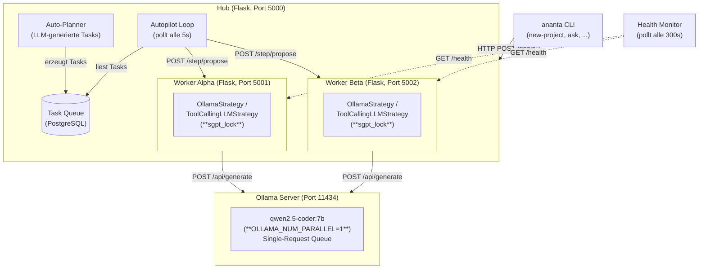
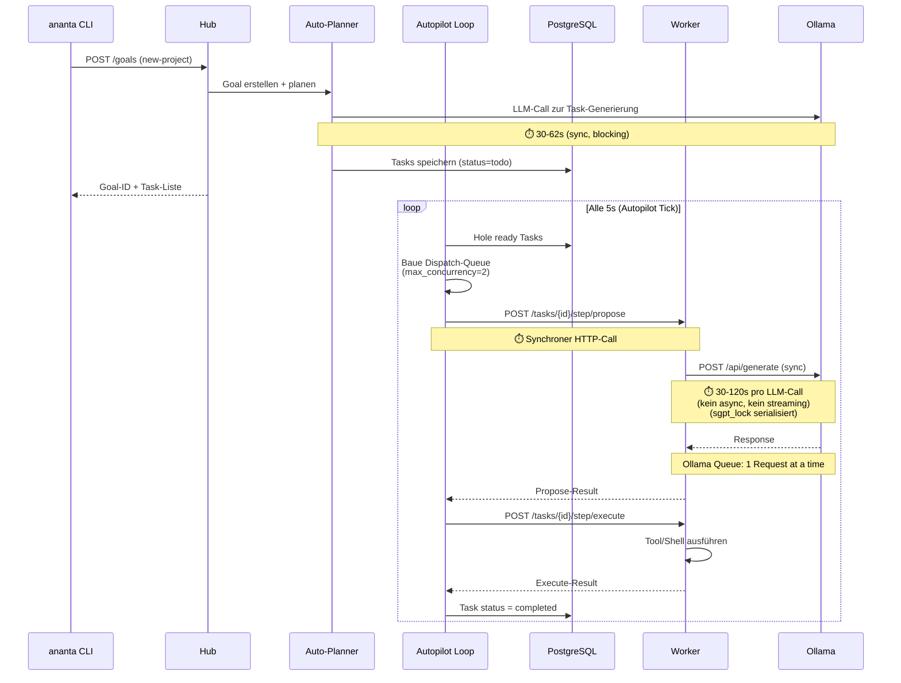
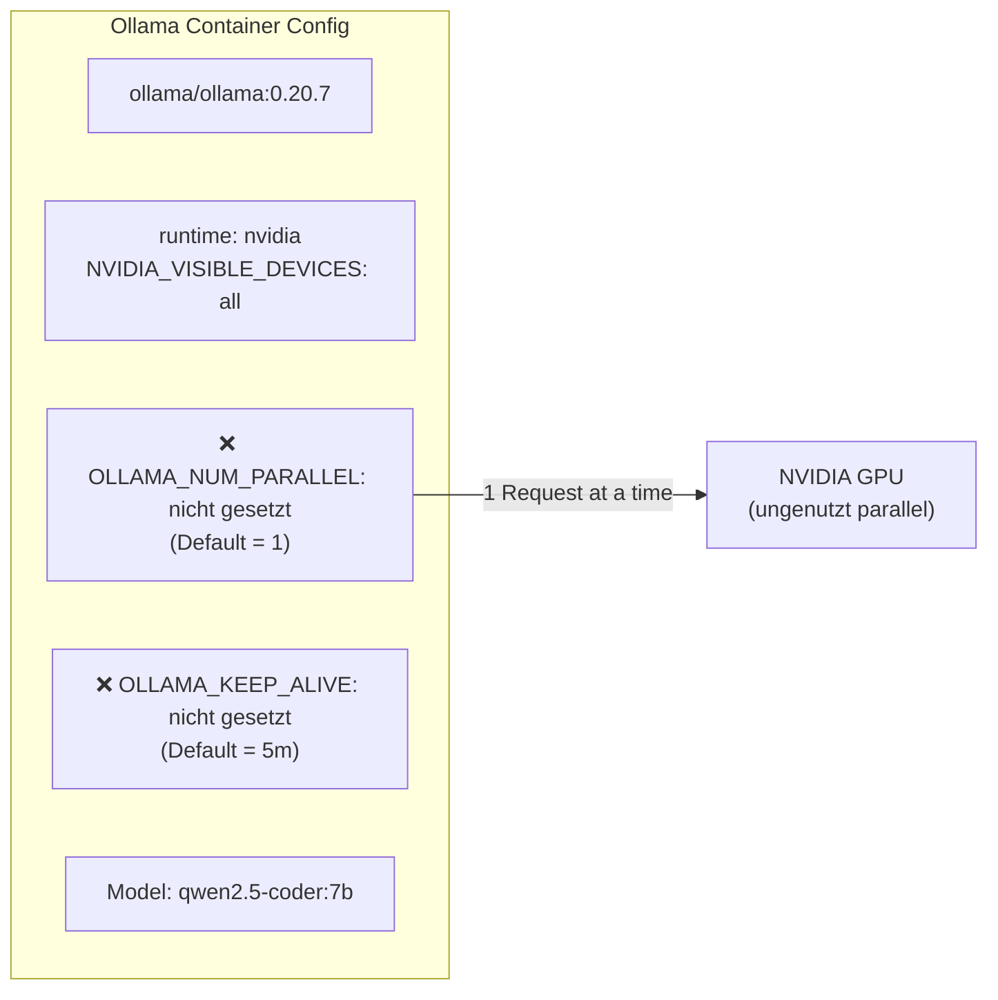
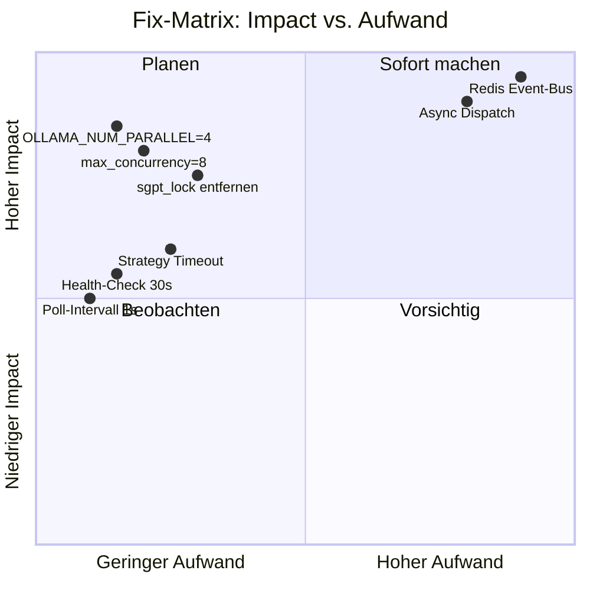
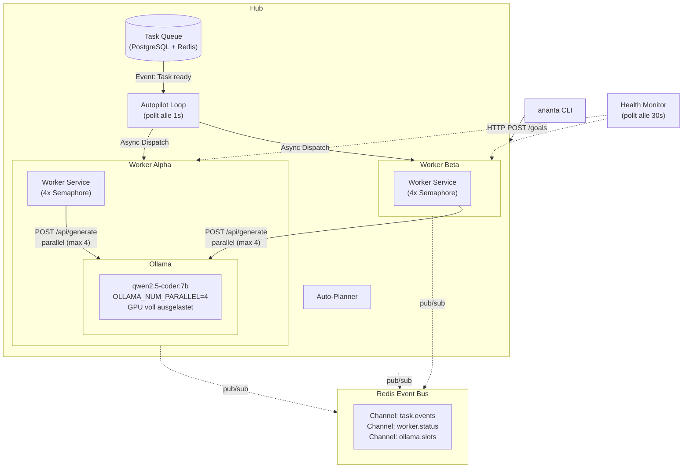

# Ananta Orchestrierung — Bottleneck-Analyse

> **Datum:** 2026-05-15
> **Ziel:** Identifikation aller Engpässe, die verhindern, dass Ollama richtig ausgelastet wird und Tasks parallel & schnell abgearbeitet werden.

---

## 1. Systemarchitektur (Ist-Zustand)



---

## 2. Task-Abarbeitung: Der Vollständige Flow mit Delay-Analyse



---

## 3. Die 7 Kritischsten Bottlenecks

### Bottleneck #1: `OLLAMA_NUM_PARALLEL` nicht gesetzt ⚠️ KRITISCH

| Aspekt | Wert |
|--------|------|
| **Datei** | `docker-compose.base.yml` (Zeile 122-140) |
| **Problem** | Ollama verarbeitet standardmäßig **nur 1 Request gleichzeitig** pro geladenem Model. Ohne `OLLAMA_NUM_PARALLEL` ist das der Default. |
| **Wirkung** | Auch wenn Hub 8 Tasks parallel dispatched → Ollama serialisiert alle LLM-Calls in einer internen Queue. GPU wird nie voll ausgelastet. |
| **Fix** | `OLLAMA_NUM_PARALLEL: 4` (oder höher, abhängig von GPU-VRAM) als Environment-Variable im Ollama-Container setzen. |

**Log-Evidenz:**
```
Worker sendet POST /api/generate → 30s idle
Worker sendet POST /api/generate → 30s idle
→ 2 Tasks brauchen 60s statt 30s, weil Ollama serialisiert
```

### Bottleneck #2: Globaler `sgpt_lock` ⚠️ KRITISCH

| Aspekt | Wert |
|--------|------|
| **Datei** | `agent/common/sgpt.py:33` |
| **Problem** | `sgpt_lock = threading.Lock()` — **alle** CLI-basierten LLM-Calls (`sgpt`, `ananta-worker`, `opencode`, `codex`, `aider`) müssen diesen Lock exklusiv halten. |
| **Wirkung** | **Nur 1 LLM-Call gleichzeitig pro Worker-Prozess.** Wenn Worker 3 Strategien nacheinander probiert (agent_loop → tool_calling → fallback), blockiert jeder Call alle anderen. |
| **Fix** | Lock entfernen oder durch ein per-Worker-Semaphore ersetzen (`threading.Semaphore(4)` statt `threading.Lock()`). |

**Relevanter Code:**
```python
# agent/common/sgpt.py:33
sgpt_lock = threading.Lock()  # ← globaler Flaschenhals

# agent/common/sgpt.py:505
with sgpt_lock:               # ← blockiert alle anderen LLM-Calls
    result = subprocess.run(cmd, ...)
```

### Bottleneck #3: Autopilot-Concurrency auf 2 gecappt 🔴 HOCH

| Aspekt | Wert |
|--------|------|
| **Datei** | `agent/routes/tasks/autopilot_dispatch_policy.py:6-7` |
| **Problem** | `max_concurrency = 2` (Default). Die `resolve_effective_concurrency()`-Funktion cappt zusätzlich auf `1` im "safe"-Mode. |
| **Wirkung** | Maximal 2 Tasks gleichzeitig in der LLM-Phase. Bei 9 Tasks → 5 Runden (2+2+2+2+1), jede Runde 30-120s = **2.5-10 Minuten Gesamtzeit**. |
| **Fix** | `max_concurrency` auf 8 erhöhen (oder dynamisch an verfügbare Worker anpassen). |

### Bottleneck #4: Synchroner HTTP-Dispatch 🔴 HOCH

| Aspekt | Wert |
|--------|------|
| **Datei** | `agent/routes/tasks/autopilot_tick_engine.py:616-622` |
| **Problem** | Hub dispatched Tasks per **synchronem HTTP POST** an Worker. Der Dispatch-Thread blockiert bis der Worker den kompletten Propose (inkl. LLM-Call) beendet hat. |
| **Wirkung** | Ein Dispatch-Slot ist für die gesamte Dauer eines LLM-Calls belegt (30-120s). Kein fire-and-forget, kein async handoff. |
| **Fix** | Async-Dispatch: Hub POSTet Task an Worker, Worker antwortet sofort mit "ack", Hub markiert Task als "proposing", Worker callbackt später mit Result. |

**Relevanter Code:**
```python
# agent/routes/tasks/autopilot_tick_engine.py:616
candidate_data = loop._forward_with_retry(
    target_worker.url,
    f"/tasks/{task.id}/step/propose",
    propose_payload,
    token=target_worker.token,
)  # ← BLOCKIERT bis Worker LLM-Call beendet hat (bis zu 120s!)
```

### Bottleneck #5: 5-Sekunden Poll-Intervall 🟡 MITTEL

| Aspekt | Wert |
|--------|------|
| **Datei** | `agent/routes/tasks/autopilot.py:521` |
| **Problem** | `self._wake_event.wait(self.interval_seconds)` — der Autopilot tickt standardmäßig nur alle 5 Sekunden. |
| **Wirkung** | Fertige Tasks bleiben bis zu 5s in der Queue, bevor der nächste Dispatch beginnt. Über die Gesamtlaufzeit summiert sich das zu 10-20s Leerlauf. |
| **Fix** | Intervall auf 1s reduzieren. Zusätzlich: `wake()`-Event nach jedem Task-Completion triggern (existiert bereits, wird aber nicht überall aufgerufen). |

### Bottleneck #6: 300-Sekunden Health-Check 🟡 MITTEL

| Aspekt | Wert |
|--------|------|
| **Datei** | `agent/services/background/monitoring.py:59` |
| **Problem** | Worker-Health-Check nur alle **300 Sekunden (5 Minuten)**. Timeout 30s pro Worker. Failure Threshold: 5. |
| **Wirkung** | Ein Worker, der 90s+ an einem LLM-Call hängt, wird vom Health-Check nicht erreicht → nach 5-15 Minuten als "offline" markiert → Tasks werden umsonst dispatched → Fehlschlag. **Gesehen in Logs:** Worker geht alle 2-3 Minuten "online→offline". |
| **Fix** | Intervall auf 30s senken. Timeout auf 5s reduzieren. Health-Check sollte parallel (nicht sequentiell) laufen. |

**Log-Evidenz aus der Sitzung:**
```
Hub Log:
  Agent beta Statusaenderung: online -> offline  (19:05:33)
  Agent alpha Statusaenderung: online -> offline  (19:05:33)
  → Beide Worker offline → keine Tasks mehr ausführbar
  → 2 Minuten später wieder online (Re-Registration nach 150s)
  → Zyklus wiederholt sich alle 2-5 Minuten
```

### Bottleneck #7: Sequentielles Strategy-Chaining 🟡 MITTEL

| Aspekt | Wert |
|--------|------|
| **Datei** | `worker/core/propose_orchestrator.py:70-101` |
| **Problem** | Der `ProposeStrategyOrchestrator` probiert Strategien **sequentiell**. `agent_loop_tool_calling` ruft LLM bis zu 3x auf, dann `tool_calling_llm`, dann `json_schema_llm`, etc. |
| **Wirkung** | Ein Task kann 3+ LLM-Calls nacheinander auslösen (30-120s pro Call), bevor die nächste Strategie drankommt. Gesamt: bis zu 6 Minuten pro Task in der Propose-Phase. |
| **Fix** | Timeout pro Task (nicht pro Strategie). Parallel execution der Strategien (wer zuerst antwortet gewinnt). Redundante Strategien eliminieren. |

---

## 4. Ollama-Konfiguration im Detail



| Parameter | Aktuell | Optimal | Begründung |
|-----------|---------|---------|------------|
| `OLLAMA_NUM_PARALLEL` | nicht gesetzt → **1** | `4` (oder `8`) | Erlaubt parallele LLM-Requests; 4 passt für 7B Modelle auf 8GB+ VRAM |
| `OLLAMA_KEEP_ALIVE` | nicht gesetzt → **5m** | `5m` (ok) | Hält Model im VRAM zwischen Requests |
| `OLLAMA_MAX_LOADED_MODELS` | nicht gesetzt → **1** | `1` (ok) | Nur ein Model nötig |
| `OLLAMA_NUM_THREAD` | nicht gesetzt → auto | `4-8` | CPU-Threads für Prompt-Processing |

---

## 5. Warum Ollama kaum GPU-Last zeigt

Die GPU-Last bleibt niedrig, weil Tasks gar nicht erst bis zu Ollama durchdringen:

```
1. CLI → Hub: Goal erstellt                         ✅ (ms)
2. Hub → Auto-Planner: Tasks generieren             ⏱️ 30-60s (1 LLM-Call)
3. Auto-Planner → DB: Tasks gespeichert             ✅ (ms)
4. Autopilot: Nächster Tick in 5s                   ⏱️ 0-5s Wartezeit
5. Autopilot: Dispatch-Queue bauen                  ✅ (ms)
6. Autopilot: Worker auswählen                      ✅ (ms)
7. Hub → Worker: POST /step/propose                 ⏱️ HTTP-Latenz (ms)
8. Worker: sgpt_lock.acquire()                      ⏱️ **WARTET** (wenn anderer Call aktiv)
9. Worker → Ollama: POST /api/generate              ⏱️ 30-120s **serialisiert**
10. Ollama: Interne Queue (num_parallel=1)           ⏱️ **WARTET** (wenn anderer Request aktiv)
                                                      ──────────────
                                                      ⏱️ **60-180s+ pro Task**
```

In der Praxis:
- **9 Tasks** beim `new-project` → 5 completed, 4 failed nach >5 Minuten
- **GPU-Peak** nur während der 1-2 Tasks die tatsächlich parallel bei Ollama ankommen
- Danach: Leerlauf weil Worker offline, Dispatch voll, oder Queue leer

---

## 6. Fix-Matrix: Impact vs. Aufwand



| # | Fix | Impact | Aufwand | Typ | Priority |
|---|-----|--------|---------|-----|----------|
| 1 | `OLLAMA_NUM_PARALLEL=4` setzen | 🔥 Hoch | ⚡ Gering (Env) | Config | **P0** |
| 2 | `max_concurrency` von 2 → 8 | 🔥 Hoch | ⚡ Gering (Config) | Config | **P0** |
| 3 | `sgpt_lock` durch Semaphore ersetzen | 🔥 Hoch | 🔧 Mittel | Code | **P1** |
| 4 | Async Task Dispatch (fire-and-forget + callback) | 🔥 Hoch | 🏗️ Groß | Architektur | **P1** |
| 5 | Health-Check: 300s → 30s, parallel, Timeout 5s | 🔵 Mittel | ⚡ Gering | Config | **P2** |
| 6 | Autopilot Poll: 5s → 1s | 🔵 Mittel | ⚡ Gering | Config | **P2** |
| 7 | Strategy-Chaining: Timeout pro Task statt pro Strategie | 🔵 Mittel | 🔧 Mittel | Code | **P2** |
| 8 | Ollama auf Version ≥0.25 aktualisieren | 🟢 Niedrig | ⚡ Gering | Config | **P3** |
| 9 | Redis Event-Bus für echte Event-Driven Orchestrierung | 🔥 Hoch | 🏗️ Sehr Groß | Architektur | **P3** |

---

## 7. Detaillierte Code-Fundstellen

### Konfiguration (Quick Wins)

| Fix | Datei | Zeile | Aktuell | Neu |
|-----|-------|-------|---------|-----|
| OLLAMA_NUM_PARALLEL | `docker-compose.base.yml` | ~135 | (fehlt) | `OLLAMA_NUM_PARALLEL: 4` |
| max_concurrency | `agent/routes/tasks/autopilot_dispatch_policy.py` | 6 | `max_concurrency = 2` | `max_concurrency = 8` |
| autopilot interval | `agent/routes/tasks/autopilot.py` | 521 | `self.interval_seconds = 5` | `self.interval_seconds = 1` |
| health check | `agent/services/background/monitoring.py` | 59 | `_sleep_with_shutdown(300)` | `_sleep_with_shutdown(30)` |
| health timeout | `agent/services/agent_health_monitor_service.py` | 117 | `timeout = 30` | `timeout = 5` |

### Code-Änderungen

| Fix | Datei | Zeile | Beschreibung |
|-----|-------|-------|-------------|
| sgpt_lock | `agent/common/sgpt.py` | 33 | `sgpt_lock = threading.Lock()` → `threading.Semaphore(4)` |
| propose timeout | `agent/routes/tasks/utils.py` | 73-74 | LLM-Propose-Timeout von 180s auf 60s reduzieren |
| stale recovery | `agent/routes/tasks/autopilot_tick_engine.py` | 941 | `_PROPOSING_STALE_SECONDS = 90` → `30` |
| health threshold | `agent/routes/system.py` | 91 | `_agent_offline_failure_threshold = 3` → `5` |
| strategy order | `worker/core/propose_orchestrator.py` | 70-101 | Strategien parallel probieren, nicht sequentiell |

---

## 8. Ziel-Architektur (Soil)



---

## 9. Zusammenfassung

```
Aktuelle Situation:
───────────────────
8 Bottlenecks → GPU idle → Tasks stuck → User wartet → ❌

Kernproblem:
  Die System besteht aus 5+ synchronen Polling-Loops,
  die alle nacheinander blockieren. Kein Event-Driven,
  keine Parallelisierung, kein echtes async.

Schnellste Erfolge (P0, heute umsetzbar):
  1. OLLAMA_NUM_PARALLEL=4      → GPU wird parallel genutzt
  2. max_concurrency=8           → 8 statt 2 Tasks parallel
  3. Poll-Intervall 1s           → 5x weniger Leerlauf

Kurzfristig (P1, diese Woche):
  4. sgpt_lock → Semaphore       → LLM-Calls parallel im Worker
  5. Health-Check alle 30s       → Worker offline schneller erkannt
  6. Propose-Timeout reduzieren  → Tasks hängen weniger lange

Mittelfristig (P2-P3):
  7. Async Dispatch (+ Callback) → Dispatch blockiert nicht mehr
  8. Redis Event-Bus             → Echte Event-Driven Architektur
  9. Parallel Strategy Execution → Schnellere Task-Verarbeitung
```

---

*Erstellt aus: Code-Analyse, Docker-Logs, und Runtime-Beobachtung der Sitzung vom 15.05.2026.*
*Relevante Dateien: `agent/routes/tasks/autopilot_tick_engine.py`, `agent/common/sgpt.py`, `docker-compose.base.yml`*
