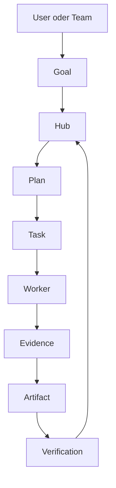

# Ananta

[](https://github.com/ananta888/ananta/actions/workflows/quality-and-docs.yml)
[](https://github.com/ananta888/ananta/actions/workflows/backend-isolated-flows.yml)
[](https://github.com/ananta888/ananta/actions/workflows/live-llm-smoke.yml)

@Sponsored by www.ananta.de

**ANANTA** steht fuer **Autonomous Networked Agents Navigate Trusted Artifacts**.

Ananta ist eine offene, local-first Multi-Agenten-Plattform fuer sichere KI-gestuetzte Softwareentwicklung. Sie verbindet Hub-Worker-Orchestrierung, deterministischen Projektkontext, CodeCompass-Artefakte, rollenbasierte Ausfuehrung und Least-Privilege-Policies, damit KI-Agenten produktiv arbeiten koennen, ohne blind Zugriff auf Code, Secrets oder Infrastruktur zu bekommen.

Ananta ist eine kontrollierte Hub-Worker-Plattform fuer goal-basierte Agentenarbeit. Du beschreibst ein Ziel; der Hub plant, priorisiert und delegiert Aufgaben, Worker fuehren die Arbeit in getrennten Laufzeitkontexten aus, und Ergebnisse werden ueber Pruefung und Artefakte nachvollziehbar gemacht.

Der Kern ist bewusst nicht "ein Chatbot mit Tools", sondern ein steuerbares System fuer:

- Goal -> Plan -> Task -> Execution -> Verification -> Artifact
- Hub-kontrollierte Orchestrierung statt Worker-zu-Worker-Automation
- Docker-basierte Hub- und Worker-Laufzeiten
- reproduzierbare Releases, CI-Gates und Security-/Governance-Regeln

| Einstieg | Fuer wen | Link |
| --- | --- | --- |
| Direkt ausprobieren | lokale Nutzer und Reviewer | [Schnellstart](#schnellstart-in-5-minuten) |
| Ein-Kommando-Installation | lokale Nutzer und Reviewer | [Bootstrap Install](docs/setup/bootstrap-install.md) |
| Wofuer Ananta offiziell steht | Produkt-/Projekt-Orientierung | [Kern-Use-Cases](docs/use-cases.md) |
| Blueprint/Template/Team einfach verstehen | Erstnutzer und Demos | [Blueprint Product Model](docs/blueprint-product-model.md) |
| Standard-Blueprints mit Beispielen | Erstnutzer und Demos | [Standard Blueprints](docs/standard-blueprints.md) |
| Strategy-Game als Architektur-Lernschicht | Demos und technische Reviewer | [Ananta Strategy Game](docs/ananta-game/README.md) |
| Offizieller UI-Standardweg | Erstnutzer und Demos | [UI Golden Path](docs/golden-path-ui.md) |
| Offizieller CLI-Standardweg | lokale Nutzer und Reviewer | [CLI Golden Path](docs/golden-path-cli.md) |
| Offizieller Release-Standardweg | Maintainer und Betreiber | [Release Golden Path](docs/release-golden-path.md) |
| Passendes Produktprofil waehlen | Demo, Trial, Team oder Security-Kontext | [Produktprofile](docs/product-profiles.md) |
| Architektur verstehen | technische Reviewer | [Architektur](#architektur) |
| Release bewerten | Maintainer und Betreiber | [Release und Governance](#release-und-governance) |
| API nutzen | Integratoren | [Einfache CLI- und API-Beispiele](#einfache-cli--und-api-beispiele) |

## Kern-Use-Cases (offiziell)

Ananta fokussiert sich bewusst auf eine kleine Menge reproduzierbarer Kernanwendungsfaelle, damit Einstieg, Demo, Benchmarks und Produktprofile auf derselben Basis stehen.

- Repository verstehen
- Bugfix planbar und testbar machen
- Start/Deploy diagnostizieren (Compose/Health/Logs)
- Change Review (Risiken, Tests, Governance)
- Gefuehrte Goal-Erstellung fuer Erstnutzer
- Neues Softwareprojekt anlegen
- Existierendes Softwareprojekt weiterentwickeln
- Research-gestuetzte Projektweiterentwicklung mit DeerFlow und Evolver

Details: `docs/use-cases.md`. Reproduzierbare Demo-Flows stehen in `docs/demo-flows.md`

**Task Engine:** Lese-Operationen (`list_files`, `git status`, `json_validate` …) werden deterministisch ohne LLM-Call ausgeführt. Architektur und Ablaufdiagramme: [`docs/task-engine-deterministic-hybrid-llm-policy.md`](docs/task-engine-deterministic-hybrid-llm-policy.md)., inklusive des offiziellen DeerFlow+Evolver-Standardpfads. Strukturierte Eingaben fuer die neuen Softwarepfade stehen in `docs/goal-input-schemas.md`. Fuer Shell-Guardrails siehe `docs/security/shell-command-policy.md` und die Migrationsnotiz `docs/release/shell-command-policy-migration.md`.

**CodeCompass-Handoff:** Wie CodeCompass Snippets, Line-Ranges und ganze Dateien priorisiert an den ananta-worker weitergibt: `docs/codecompass-relevant-snippet-handoff.md`.

## Schnellstart in 5 Minuten

### A) CLI-first ohne Docker (lokal)

Wenn du primar die CLI nutzen willst, brauchst du keinen Docker-Stack:

- Voraussetzung: Der Befehl `ananta` ist installiert. Falls nicht, zuerst `docs/setup/bootstrap-install.md` nutzen.

```bash
ananta init --yes --runtime-mode local-dev --llm-backend ollama --model ananta-default
ananta first-run
# status/plan benoetigen einen laufenden Hub + passende ANANTA_* Zugangsdaten
ananta status
ananta plan "Analysiere dieses Repository und schlage die naechsten Schritte vor"
```

Ausfuehrungs-Backend fuer Worker/CLI (leicht umschaltbar):

```bash
# Standard: interne Ananta-Worker-Ausfuehrung (empfohlen)
python -m pip install shell-gpt
export SGPT_EXECUTION_BACKEND=ananta-worker

# Alternative: OpenCode
npm i -g opencode-ai
export SGPT_EXECUTION_BACKEND=opencode
```

Weitere CLI-Einstiege:

- `docs/setup/quickstart.md`
- `docs/cli/commands.md`
- `docs/golden-path-cli.md`

Wenn du statt CLI-only den Hub/Worker lokal ohne Docker, das Frontend lokal oder den kompletten Full-Stack mit Docker brauchst, nutze die folgenden Pfade.

### B) Lokalen Hub und Worker ohne Docker starten

Dieser Pfad startet sowohl den Hub als auch Worker ohne Docker.

Terminal 1: (Hub starten)

```bash
export ROLE=hub
export PORT=5000
export HUB_URL=http://localhost:5000
export HUB_CAN_BE_WORKER=true
export INITIAL_ADMIN_USER=admin
export INITIAL_ADMIN_PASSWORD=ananta-local-dev-admin
python -m agent.ai_agent
```

Terminal 2: (CLI nutzen)

```bash
export ANANTA_BASE_URL=http://localhost:5000
export ANANTA_USER=admin
export ANANTA_PASSWORD=ananta-local-dev-admin
ananta status
ananta plan "Analysiere dieses Repository und schlage die naechsten Schritte vor"
```

### C) Optional separaten lokalen Worker starten

Wenn du Hub und Worker getrennt testen willst, starte zusaetzlich einen zweiten Agent-Prozess.

Terminal 3:

```bash
export ROLE=worker
export AGENT_NAME=local-worker
export PORT=5001
export HUB_URL=http://localhost:5000
export AGENT_URL=http://localhost:5001
python -m agent.ai_agent
```

Der Worker registriert sich beim Hub. Der Hub bleibt Owner von Goals, Tasks, Policy, Approval und Audit.

### D) Lokales Angular-Frontend ohne Docker starten

Falls du das Frontend lokal ohne Docker starten willst:

```bash
cd frontend-angular
npm install
npm start
```

Das Frontend ist danach unter `http://localhost:4200` erreichbar.

API-Verbindung zum Hub:

- Im lokalen Browser-Modus nutzt das Frontend standardmaessig `http://localhost:5000` als Hub sowie `http://localhost:5001`/`5002` fuer Worker-Defaults.
- Wenn dein Hub auf einer anderen URL/Port laeuft, passe die Agent-URLs im Frontend (Agent Directory) entsprechend an.

### E) Full-Stack (Docker + UI)

1. Umgebung vorbereiten:
   ```powershell
   .\setup.ps1
   ```
   Das Script prueft Docker, Python und Node, legt eine `.env` an und installiert lokale Abhaengigkeiten.

2. Lite-Stack starten:
   ```bash
   docker compose -f docker-compose.base.yml -f docker-compose-lite.yml up -d --build
   ```

3. Im Browser oeffnen:
   - Frontend: `http://localhost:4200`
   - Hub API: `http://localhost:5000`

4. Einloggen:
   - Benutzer: `admin`
   - Passwort: Wert aus `INITIAL_ADMIN_PASSWORD` in `.env`

5. Erstes Ziel starten:
   - Im Erststart `Neues Projekt anlegen` waehlen oder im Arbeitsbereich `Planen` das Preset `Neues Projekt anlegen` nutzen.
   - Beispiel: `Baue ein kleines Release-Check-Tool fuer Maintainer`.
   - Fuer bestehende Repositories danach `Projekt weiterentwickeln` waehlen.

Erfolgssignal fuer den Schnellstart:
- Das Dashboard meldet, dass Aufgaben erstellt wurden.
- Das Goal ist verlinkt oder im Board sichtbar.
- Der naechste Schritt ist `Ziel pruefen`, `Aufgaben verfolgen` oder `Ergebnisse ansehen`.
- Bei `Neues Projekt anlegen` sind Blueprint, initiales Backlog und naechste sichere Schritte im Goal sichtbar.

Wenn der Browser keine Verbindung bekommt, pruefe zuerst `docker compose ps` und die Logs des Hub- und Frontend-Containers.

Offizieller UI-Standardweg: `docs/golden-path-ui.md`.

### F) Docker-Quickstart ohne Ollama (ein auslieferbares Image)

Dieser Pfad baut **ein einziges auslieferbares Image** (`Dockerfile.quickstart-no-ollama`) und startet Hub, Worker und Angular-Frontend daraus.

Build:

```bash
docker build -f Dockerfile.quickstart-no-ollama -t ananta-quickstart-no-ollama:local .
```

Basis-Start (Hub + Worker + Frontend):

```bash
docker compose -f docker-compose.base.yml -f docker-compose.quickstart-no-ollama.yml up -d --build
```

Fullstack aus demselben Image (zusaetzlich Evolver, DeerFlow, ml-intern Worker):

```bash
docker compose -f docker-compose.base.yml -f docker-compose.quickstart-no-ollama.yml -f docker-compose.single-image-fullstack.yml up -d --build
```

Provider auf **LM Studio**:

```bash
DEFAULT_PROVIDER=lmstudio LMSTUDIO_URL=http://host.docker.internal:1234/v1 docker compose -f docker-compose.base.yml -f docker-compose.quickstart-no-ollama.yml -f docker-compose.single-image-fullstack.yml up -d --build
```

Provider auf **OpenAI API**:

```bash
DEFAULT_PROVIDER=openai OPENAI_API_KEY=<SECRET> OPENAI_URL=https://api.openai.com/v1/chat/completions docker compose -f docker-compose.base.yml -f docker-compose.quickstart-no-ollama.yml -f docker-compose.single-image-fullstack.yml up -d --build
```

Hinweise:
- Wenn `DEFAULT_PROVIDER=openai` gesetzt ist, muss `OPENAI_API_KEY` gesetzt sein.
- Die Rollen bleiben aus Architekturgruenden in separaten Containern, laufen aber alle aus demselben Image.
- Ollama bleibt im no-ollama Hauptpfad deaktiviert.

## Was Ananta macht

Ananta folgt einem Goal -> Plan -> Task -> Execution -> Verification -> Artifact Ablauf. Fuer den Einstieg reicht ein Ziel; Teams, Policies, Benchmarks und Expertenoptionen koennen spaeter genutzt werden.

Weitere Details und Migrationshinweise: `docs/goal-overview.md`.

## Release und Governance

- Release-Prozess: `docs/release-process.md`
- Release-Golden-Path und Evidence Register: `docs/release-golden-path.md`, `docs/release-evidence-register.md`
- Release-Checklist: `docs/release-checklist.md`
- Changelog-Strategie: `CHANGELOG.md`
- Secrets-Inventar fuer GitHub Actions: `docs/github-secrets-inventory.md`
- GitHub Admin-Setup: `docs/github-admin-setup.md`
- CI-Testtiefen: `docs/ci-test-depth-strategy.md`
- Container-Release-Strategie: `docs/container-release-strategy.md`
- AI-assisted Development Policy: `docs/ai-assisted-development.md`
- Security Policy: `.github/SECURITY.md`
- Blueprint Admin/Studio: `docs/blueprint-admin.md`, `docs/blueprint-studio-roadmap.md`
- Blueprint Rollout/Migration: `docs/blueprint-migration-rollout.md`

## Manifest fuer verantwortliche Agentenentwicklung

Ananta versteht Agentensysteme nicht als harmlose Blackboxes, sondern als wirkungsmaechtige Systeme, die Kontrolle, Nachvollziehbarkeit, Begrenzung und ehrliche Kommunikation brauchen.

Das Projektmanifest dazu steht hier:
- `docs/responsible-agent-development-manifesto.md`

Kernaussage:
- keine Macht ohne Begrenzung
- keine Automatisierung ohne sichtbare Pruefung
- keine ernsthaften Agentensysteme ohne Verantwortung fuer reale Wirkung

## Wichtige Einstiegspunkte
- Erster Start und Betrieb (Full-Stack): `docs/INSTALL_TEST_BETRIEB.md`, `docs/DOCKER_WINDOWS.md`
- Architektur und Zielbild: `architektur/README.md`, `docs/autonomous-platform-target-model.md`, `docs/generic-control-layer.md`
- Control-Layer Vertiefung: `docs/loop-correction-pattern.md`, `docs/tool-router-target-architecture.md`, `docs/unified-approval-model.md`, `docs/context-manager-target-model.md`, `docs/context-source-prioritization-rules.md`, `docs/safer-agentic-loop-golden-path.md`
- Hermes Adapter Architekturgrenze: `docs/architecture/hermes-worker-adapter.md`
- Hermes Worker Setup und Rollout: `docs/setup/hermes-worker.md`, `docs/release/hermes-rollout-checklist.md`
- Specialized Worker Guidance: `docs/ml-intern-fit-assessment.md`, `docs/ml-intern-adapter-boundary.md`, `docs/ml-intern-capability-profile.md`, `docs/ml-intern-backend-spike.md`, `docs/specialized-worker-guidance.md`
- Backend API: `agent/README.md`, `docs/api/openapi.yaml`, `docs/hub-api.md`
- CLI/API Golden Path: `docs/golden-path-cli.md`, `docs/cli/commands.md`, `docs/setup/bootstrap-install.md`
- Domain Events und Audit: `docs/domain-events.md`, `docs/audit-log.md`
- Integrations- und Connector-Governance: `docs/connector-governance.md`, `docs/integration-governance.md`, `docs/mcp-future-integration-plan.md`
- Kontext und RAG: `docs/codecompass.md`, `docs/rag-helper.md`, `docs/context-source-prioritization-rules.md`, `docs/context-segmentation-and-pointer-model.md`
- Prompt-/LLM-Steuerung: `docs/llm-routing.md`, `docs/llm-provider-config.md`, `docs/strict-output-contracts.md`, `docs/prompt-golden-tests.md`
- Security und Rechte: `docs/security/README.md`, `docs/security/default-deny.md`, `docs/security/least-privilege-policy.md`, `docs/security/cloud-worker-policy.md`
- Agenten- und Worker-Betrieb: `docs/agent-runtime.md`, `docs/worker-contract.md`, `docs/worker-directory.md`
- Strategie-/Game-Demo: `docs/ananta-game/README.md`, `docs/ananta-game/rules.md`, `docs/ananta-game/development-plan.md`
- TUI: `docs/tui/README.md`, `docs/tui/e2e-recording.md`, `docs/tui/terminal-rendering.md`
- Produkt- und Website-Erklaerung: `docs/product-story.md`, `docs/website-content.md`
- Roadmap/TODO: `todos/README.md`

## Architektur



Die wichtigste Regel: Der Hub bleibt Kontrollpunkt. Worker koennen Aufgaben ausfuehren, aber sie sollen nicht unkontrolliert neue Ziele, Berechtigungen oder Seiteneffekte erzeugen.

## Repository-Struktur

```text
agent/                 Hub-/Worker-Laufzeit, Services, API
frontend-angular/      Angular UI
cli/                   CLI-Einstieg und Kommandos
docs/                  Architektur, Setup, Governance, Use-Cases
tests/                 Pytest-, Contract-, Golden- und Integrationsnahes
todos/                 Strukturierte Aufgabenplaene
examples/              Beispiele und Demo-Flows
```

## Einfache CLI- und API-Beispiele

Goal per CLI:

```bash
ananta plan "Analysiere dieses Repository und schlage testbare naechste Schritte vor"
```

Systemstatus:

```bash
ananta status
```

API-Beispiel:

```bash
curl http://localhost:5000/api/goals
```

## Python-Kompatibilitaet

- Unterstuetzt: Python 3.10, 3.11, 3.12
- Empfohlen lokal: Python 3.11
- CI prueft Python 3.10, 3.11 und 3.12.
- Hinweis: Python 3.13 wird derzeit nicht als primare Zielversion behandelt.

## Tests

```bash
python -m pytest
```

Fokussierte Testsets:

```bash
python -m pytest tests/test_goals_api.py tests/test_task_scoped_execution_service.py
python -m pytest tests/test_artifact_first_completion.py tests/test_artifact_traceability.py
python -m pytest tests/test_context_source_prioritization.py tests/test_context_segmentation_pointer_model.py
python -m pytest tests/test_worker_contract.py tests/test_domain_events.py tests/test_audit_log.py
python -m pytest tests/test_cli_commands.py tests/test_ci_offline_quality.py
python -m pytest tests/test_connector_governance.py tests/test_integration_governance.py
```

## CI / Quality

```bash
python -m compileall agent cli tests
python -m pytest tests/test_ci_offline_quality.py
```

Die CI ist bewusst auf reproduzierbare Offline-Pruefungen, Smoke-Flows und Dokumentations-Gates ausgelegt. Live-LLM-Flows bleiben getrennt und optional.

## Lizenz

Siehe `LICENSE`.
