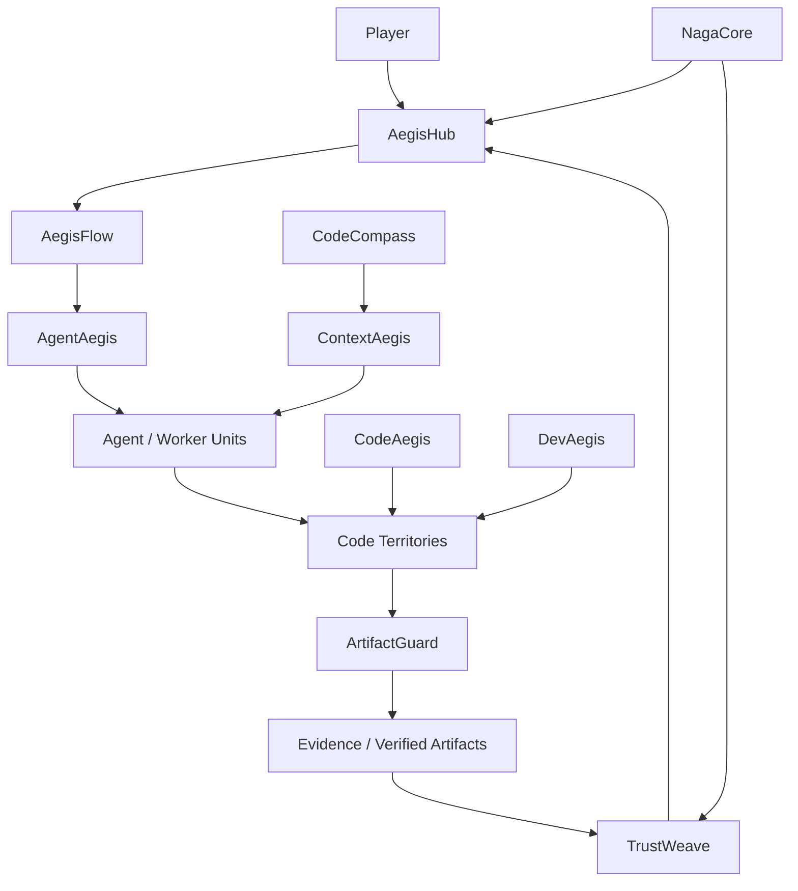

# Ananta Strategy Game

Das Ananta Strategy Game verbindet die reale Ananta-Architektur mit einem spielbaren Strategiesystem. Ziel ist nicht nur ein separates Spiel, sondern eine erklaerende und testbare Spielschicht ueber Code, Agenten, Kontext, Policies, Artefakte und Hub/Worker-Orchestrierung.

## Leitidee

Das Spiel bildet Softwareentwicklung mit KI-Agenten als strategisches System ab:

- Codebasen werden zu Territorien, Modulen, Ressourcen und Risiko-Zonen.
- Agenten werden zu steuerbaren Einheiten mit Rollen, Faehigkeiten und Grenzen.
- Policies werden zu Verteidigungs-, Zugangs- und Aktionsregeln.
- Artefakte, Tests und Evidence werden zu Fortschritts- und Siegbedingungen.
- Kontextzugriff wird zu einer begrenzten Ressource, die strategisch freigegeben werden muss.

## Namens- und Systemmapping

Die folgenden Namen sollen als direkte Verbindung zwischen realem Ananta-Code und dem Strategiespiel integriert werden.

| Name | Spielrolle | Code-/Architekturbezug |
| --- | --- | --- |
| **CodeAegis** | Schutzschild fuer Code-Territorien | Sichere KI-Entwicklung, Code-Schutz, Guardrails |
| **AegisFlow** | Aktions- und Workflow-System | Goal -> Plan -> Task -> Execution -> Verification -> Artifact |
| **AegisHub** | Hauptbasis / Kontrollzentrum | Zentraler Hub, Orchestrierung, Delegation, Approval |
| **AgentAegis** | Schutz- und Kontrollschicht fuer Agenten | Autonome Agenten, Worker-Rechte, sichere Ausfuehrung |
| **DevAegis** | Entwicklungs-Verteidigungssystem | Schutz von Dev-Workflows, Branches, Tests, CI |
| **ContextAegis** | Kontext-Barriere / Wissensschild | RAG, CodeCompass, Secrets, Cloud-Grenzen, Least Privilege |
| **ArtifactGuard** | Artefakt-Waechter / Evidence-System | Verification, Evidence, reproduzierbare Ergebnisse |
| **TrustWeave** | Vertrauensnetz zwischen Einheiten | Policy-Graph, Kontextgraph, Beziehungen, Freigaben |
| **CodeCompass** | Navigations- und Aufklaerungssystem | Codeanalyse, Repository-Verstaendnis, Kontextnavigation |
| **NagaCore** | mythischer Kern / Energiequelle | Ananta-nahe Mythologie, Kernsystem, Snake-/Infinity-Motiv |

## Spielmechanische Bedeutung

### CodeAegis

CodeAegis schuetzt Code-Zonen gegen unsichere oder unvollstaendig gepruefte Agentenaktionen.

Moegliche Mechaniken:

- blockiert riskante Schreibzugriffe
- verlangt Tests oder Reviews vor Gebietseroberung
- reduziert Schaden durch fehlerhafte Agentenaktionen
- visualisiert Security-Status eines Repository-Bereichs

### AegisFlow

AegisFlow ist die Spielmechanik fuer planbare Arbeitsschritte.

Moegliche Mechaniken:

- wandelt Ziele in Tasks um
- steuert Reihenfolge und Abhaengigkeiten
- macht Fortschritt sichtbar
- bestraft ungepruefte Abkuerzungen

### AegisHub

AegisHub ist das zentrale Kontrollzentrum des Spielers.

Moegliche Mechaniken:

- verteilt Aufgaben an Agenten
- vergibt Rechte und Kontextzugriff
- nimmt Evidence entgegen
- entscheidet ueber Approval, Retry oder Rollback

### AgentAegis

AgentAegis schuetzt vor unkontrollierter Agentenautonomie.

Moegliche Mechaniken:

- begrenzt Agentenfaehigkeiten pro Rolle
- erzwingt Default-Deny
- verhindert Worker-zu-Worker-Eskalation
- macht riskante Agenten sichtbar

### DevAegis

DevAegis schuetzt Entwicklungsablaeufe.

Moegliche Mechaniken:

- CI-/Test-Festungen
- Branch-Schutz
- Review-Tore
- Schutz gegen kaputte Deployments

### ContextAegis

ContextAegis begrenzt und schuetzt Kontextzugriff.

Moegliche Mechaniken:

- steuert, welcher Agent welche Karten-/Codebereiche sehen darf
- verhindert Secrets-Leaks
- trennt lokale und Cloud-Agenten
- macht Kontextfreigabe zu einer strategischen Ressource

### ArtifactGuard

ArtifactGuard stellt sicher, dass Fortschritt nicht nur behauptet, sondern belegt wird.

Moegliche Mechaniken:

- prueft erzeugte Artefakte
- verlangt Evidence fuer abgeschlossene Tasks
- verhindert Fake-Completion
- koppelt Siegbedingungen an reproduzierbare Ergebnisse

### TrustWeave

TrustWeave bildet Beziehungen, Vertrauen und Freigaben zwischen Systemteilen ab.

Moegliche Mechaniken:

- Graph aus Agenten, Artefakten, Codebereichen und Policies
- Vertrauen steigt durch erfolgreiche Evidence
- Vertrauen sinkt durch fehlerhafte oder riskante Aktionen
- Freigaben koennen ueber Beziehungen begrenzt werden

### CodeCompass

CodeCompass ist die Aufklaerung und Navigation im Code-Territorium.

Moegliche Mechaniken:

- scannt Codebereiche
- entdeckt Abhaengigkeiten
- zeigt relevante Kontextpfade
- hilft Agenten, bessere Aufgabenentscheidungen zu treffen

### NagaCore

NagaCore ist die mythische/spielerische Kernmetapher fuer Ananta.

Moegliche Mechaniken:

- zentrale Energie- oder Stabilitaetsquelle
- Snake-/Infinity-Animation als Spielidentitaet
- verbindet Strategie, Mythologie und technische Architektur
- kann als Tutorial-Guide oder KI-Snake auftreten

## Ziel der Integration

Das Spiel soll nicht nur dekorativ sein. Es soll reale Ananta-Konzepte erklaeren, testbar machen und spielerisch vermitteln:

- warum Hub-Kontrolle wichtig ist
- warum Agenten nicht alles sehen duerfen
- warum Artefakte wichtiger sind als reine LLM-Antworten
- warum Kontextzugriff eine Sicherheitsentscheidung ist
- warum Policies, Evidence und Verification zentrale Spielregeln sind

## Mermaid-Uebersicht

