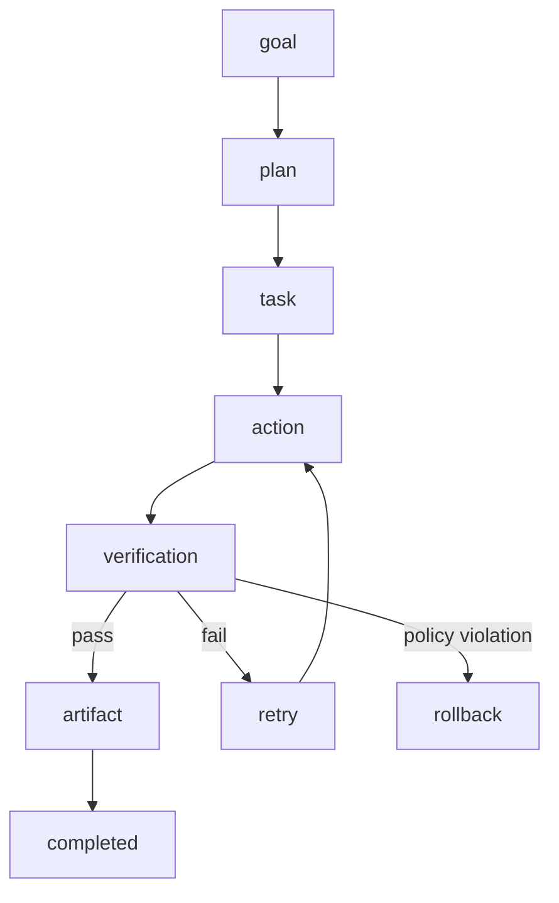

# AegisHub + AegisFlow

AegisFlow modelliert deterministische Zustandsuebergaenge; AegisHub bleibt der einzige Owner fuer Delegation und Outcome-Entscheidungen.

## Flow

## Hub-Regeln

1. Delegation-Owner ist immer der Hub.
2. Worker-zu-Worker-Orchestrierung ist verboten.
3. Outcomes sind explizit: `approve`, `retry`, `rollback`, `blocked`.
4. Approval braucht Verification + Artifact-Bedingungen.
