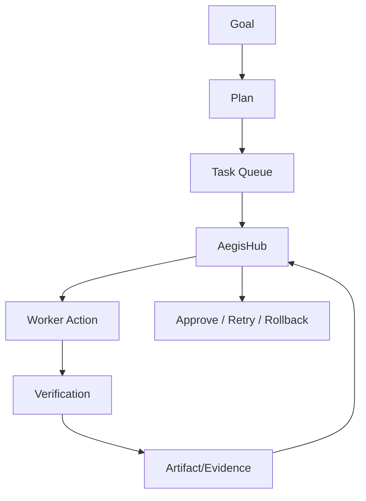
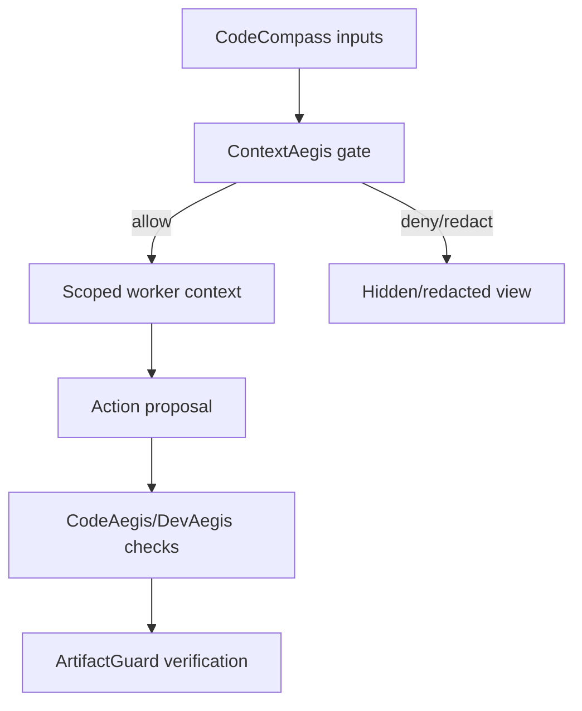

# Ananta Strategy Game Architekturabbildung

## Architekturziel

Die Spielschicht bildet reale Ananta-Konzepte deterministisch auf ein Simulationsmodell ab, ohne die Hub-Worker-Architektur zu brechen.

## Komponentenmapping

| Spielkomponente | Architekturbezug |
| --- | --- |
| AegisHub | Hub als zentrale Orchestrierungs- und Governance-Instanz |
| AegisFlow | Goal/Plan/Task/Execution/Verification/Artifact-Workflow |
| AgentAegis | Rollen-/Capability-Grenzen fuer Worker |
| CodeCompass | Quellbasis fuer Territorien und Abhaengigkeiten |
| ContextAegis | Kontextfreigabe, Default-Deny, local/cloud-Grenzen |
| ArtifactGuard | Evidence-gebundene Completion-Entscheidung |
| TrustWeave | Beziehungs-/Policy-/Vertrauensgraph |
| CodeAegis + DevAegis | Sicherheits- und Qualitaetsgates fuer Mutationen |
| NagaCore | Stabilitaets-/Leitmetapher fuer Systemzustand |

## Kontrollfluss

## Kontext- und Sicherheitsfluss

## Datenobjekte

Das Domain-Modell bleibt UI-unabhaengig und serialisierbar:

- `GameMap`
- `CodeTerritory`
- `AgentUnit`
- `PolicyNode`
- `ContextGate`
- `ArtifactObjective`
- `TrustEdge`

## Architekturgrenzen

1. Die Spielschicht orchestriert keine realen Worker direkt.
2. Entscheidungslogik fuer Delegation bleibt im Hub.
3. Sicherheitsrelevante Freigaben sind explizit und nachvollziehbar.
4. Fallback bei fehlenden CodeCompass-Daten ist degradiert statt blind.
