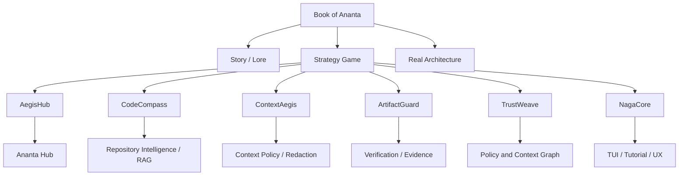

# Book of Ananta

Das **Book of Ananta** ist die Mythologie- und Weltbeschreibung fuer Ananta und die Spiele, die darin entstehen. Es ist bewusst halb ernst, halb ironisch, aber technisch geerdet: Jede Metapher soll auf ein echtes Architekturprinzip zeigen.

Ananta ist keine Flucht aus der Architektur in Fantasy. Es ist der Versuch, komplizierte Agenten-, Policy-, Kontext- und Artefakt-Systeme als spielbare Welt verstaendlich zu machen.

## Ursprung

Am Anfang stand kein fertiger Masterplan, sondern ein Widerspruch:

KI-Agenten sollen Softwareentwicklung beschleunigen. Gleichzeitig sind sie riskant, wenn sie zu viel Zugriff bekommen, zu frei handeln, Ergebnisse nur behaupten oder mit Secrets und Infrastruktur unkontrolliert umgehen.

Also entstand Ananta als System, das Agenten nutzen will, ohne ihnen blind zu vertrauen.

Der absurde Teil: Ananta wird selbst mit KI-Agenten gebaut. ChatGPT strukturiert, schreibt und plant. Claude beobachtet kritisch mit. Gemini taucht gelegentlich als chaotischer Trickster auf: manchmal unbrauchbar, manchmal lustig, manchmal zufaellig hilfreich.

Das ist kein peinlicher Unfall. Es ist die ehrlichste Demo des Projekts:

> Kontrollierte KI-Nutzung entsteht nicht dadurch, dass man KI meidet. Sie entsteht dadurch, dass man KI begrenzt, prueft und in nachvollziehbare Prozesse zwingt.

## Grundgesetz der Welt

In Ananta gilt:

- Kein Agent ohne Rolle.
- Kein Kontext ohne Freigabe.
- Kein Task ohne Trace.
- Kein Fortschritt ohne Artefakt.
- Kein Vertrauen ohne Evidence.
- Keine Automation ohne Kontrolle.

Diese Saetze sind gleichzeitig Spielregeln und Architekturregeln.

## Die Weltkarte

Eine Codebasis ist in Ananta keine flache Dateiliste. Sie ist eine strategische Karte.

- Repositories sind Kontinente.
- Module sind Regionen.
- Dateien sind Felder oder Orte.
- Abhaengigkeiten sind Wege.
- Tests sind Festungen.
- CI-Pipelines sind Verteidigungsanlagen.
- Secrets sind verbotene Kammern.
- Artefakte sind Beweise.
- Policies sind Gesetze.
- Agenten sind Einheiten.
- Worker sind Werkstaetten, Scouts, Boten oder Kampfgruppen.

Wer die Karte versteht, kann handeln. Wer die Karte nicht versteht, halluziniert.

## Die grossen Kraefte

### AegisHub

Der **AegisHub** ist die Zitadelle. Von hier aus werden Ziele geplant, Aufgaben vergeben, Kontext freigegeben und Ergebnisse geprueft.

Technisch steht AegisHub fuer den zentralen Hub von Ananta:

- Goal Ownership
- Task Delegation
- Approval
- Audit
- Policy Control
- Worker Coordination

Spielerisch ist AegisHub das Command Center. Es ist stark, aber nicht allwissend. Es braucht Scouts, Evidence und Regeln.

### AegisFlow

**AegisFlow** ist der Fluss von Absicht zu belegtem Ergebnis.

Technisch:

```text
Goal -> Plan -> Task -> Execution -> Verification -> Artifact
```

Spielerisch ist AegisFlow der Aktionspfad. Ein Ziel reicht nicht. Ein Plan reicht nicht. Eine Agentenantwort reicht nicht. Nur verifizierte Artefakte zaehlen.

### CodeCompass

**CodeCompass** ist der Kartograph.

Er liest Code, erkennt Pfade, zeigt Abhaengigkeiten und macht Kontext navigierbar.

Technisch steht CodeCompass fuer Repository-Verstaendnis, Kontextnavigation und RAG-nahe Analyse.

Spielerisch ist CodeCompass das Scout- und Kartensystem. Ohne ihn bewegt man Agenten blind durch unbekanntes Terrain.

### ContextAegis

**ContextAegis** ist der Nebel des Krieges und zugleich der Schutzschild gegen zu viel Wissen.

Technisch schuetzt ContextAegis Kontextgrenzen:

- lokale Daten
- Secrets
- interne Dokumente
- Cloud-Worker-Grenzen
- Least-Privilege-Kontext
- Redaction und Hidden States

Spielerisch entscheidet ContextAegis, was ein Agent sehen darf. Sicht ist Macht. Zu viel Sicht ist Risiko.

### CodeAegis

**CodeAegis** ist der Schild der Code-Territorien.

Technisch steht es fuer Guardrails um echte Codebasen: Schreibschutz, Risikoerkennung, geschuetzte Bereiche, Reviews und sichere Aenderungspfade.

Spielerisch schuetzt CodeAegis kritische Regionen vor unkontrollierten Agentenzuegen.

### DevAegis

**DevAegis** ist die Verteidigung des Entwicklungsprozesses.

Technisch steht es fuer:

- Tests
- CI
- Branch-Schutz
- Review-Gates
- Deployment-Sicherheit

Spielerisch sind das Mauern, Tore und Pruefstaende. Ein kaputter Build ist kein Detail, sondern ein Schaden an der Infrastruktur.

### AgentAegis

**AgentAegis** ist die Ruestung um die Agenten.

Technisch steht es fuer Rollen, Faehigkeiten, Worker-Grenzen, Default-Deny und kontrollierte Tool-Nutzung.

Spielerisch verhindert AgentAegis, dass Einheiten zu viel Macht bekommen. Ein Agent ohne Grenze ist keine Eliteeinheit. Er ist ein Sicherheitsvorfall mit Animation.

### ArtifactGuard

**ArtifactGuard** ist der Waechter des Beweises.

Technisch steht es fuer Evidence-first Completion, Artefakte, Logs, Diffs, Tests und reproduzierbare Ergebnisse.

Spielerisch laesst ArtifactGuard keine Siege durch Gerede zu. Wer behauptet, ein Gebiet gesichert zu haben, muss Beweise liefern.

### TrustWeave

**TrustWeave** ist das Vertrauensgewebe.

Technisch ist es ein Graph aus Agenten, Policies, Codebereichen, Kontextquellen, Artefakten und Entscheidungen.

Spielerisch ist TrustWeave Diplomatie, Versorgungslinie und Reputationssystem zugleich. Vertrauen steigt durch belegte Wirkung. Vertrauen sinkt durch Policy-Verletzung, Fake-Completion oder riskante Fehler.

### NagaCore

**NagaCore** ist die Schlange im Kern.

Sie ist Symbol, Tutorial-Figur, Bewegung, Warnung und Erinnerung. Sie steht fuer die Ananta-Metapher: endlose Schleifen, wiederkehrende Pruefung, Wachsamkeit und kontrollierte Kraft.

Wichtig:

> NagaCore ist Guide, nicht Autoritaet.

Die Schlange darf erklaeren, warnen und begleiten. Sie entscheidet nicht ueber Policies, Secrets oder Approval.

## Fraktionen

### Die Hub-Warden

Die Hub-Warden schuetzen den AegisHub. Sie glauben an zentrale Kontrolle, Audit, Approval und klare Verantwortlichkeit.

Technischer Bezug:

- Hub ownership
- approval gates
- audit logs
- task lifecycle

Spielrolle:

- defensive Kontrollfraktion
- stark in Stabilitaet
- langsam, aber verlaesslich

### Die Compass-Seeker

Die Compass-Seeker sind Kartographen des Codes. Sie suchen Zusammenhaenge, Abhaengigkeiten und verborgene Pfade.

Technischer Bezug:

- CodeCompass
- RAG
- dependency graph
- repository intelligence

Spielrolle:

- Scouts
- Kontextfinder
- Analyse-Spezialisten

### Die Context-Keepers

Die Context-Keepers bewachen Wissen. Sie entscheiden, was sichtbar, verborgen, redacted oder verboten ist.

Technischer Bezug:

- ContextAegis
- least privilege
- secret boundaries
- cloud/local separation

Spielrolle:

- Fog-of-War-Kontrolle
- Schutz vor Leakage
- strategische Kontextfreigabe

### Die Artifact-Sentinels

Die Artifact-Sentinels akzeptieren keine Behauptungen. Nur Evidence zaehlt.

Technischer Bezug:

- ArtifactGuard
- verification
- logs
- diffs
- test results

Spielrolle:

- Richter ueber Fortschritt
- Siegbedingungs-Waechter
- Anti-Fake-Completion-Fraktion

### Die Flow-Engineers

Die Flow-Engineers formen Ziele zu Tasks und Tasks zu pruefbaren Ergebnissen.

Technischer Bezug:

- AegisFlow
- planning
- task orchestration
- retries and rollback

Spielrolle:

- Prozessbauer
- Task-Ketten
- Effizienz unter Kontrolle

### Die Agent-Bound

Die Agent-Bound trainieren und begrenzen Agenten. Sie wissen: Autonomie ohne Begrenzung ist nur Chaos mit API-Key.

Technischer Bezug:

- AgentAegis
- worker roles
- tool permissions
- execution boundaries

Spielrolle:

- Agentenmanagement
- Rollen- und Faehigkeitskontrolle

### Die Naga-Oracles

Die Naga-Oracles folgen dem NagaCore. Sie interpretieren Muster, erklaeren Systeme und fuehren neue Spieler durch die Welt.

Technischer Bezug:

- tutorial layer
- TUI snake
- UX guidance
- explainability

Spielrolle:

- Guides
- Tutorial
- Lore und Lernpfad

## Antagonisten

### The Hallucination Swarm

Ein Schwarm aus plausibel klingenden, aber unbelegten Antworten.

Architekturproblem:

- LLM behauptet Fortschritt ohne Artefakt
- Markdown statt strukturierter Ausgabe
- Fake Completion

Gegenmittel:

- ArtifactGuard
- strict output contracts
- verification

### The Secret Leech

Eine Kreatur, die Kontext aufsaugt, obwohl sie ihn nicht braucht.

Architekturproblem:

- zu breite Kontextfreigabe
- Secrets in Prompts
- Cloud-Worker bekommt internes Wissen

Gegenmittel:

- ContextAegis
- redaction
- default deny
- local/cloud separation

### The Rogue Worker

Ein Worker, der mehr will, als seine Rolle erlaubt.

Architekturproblem:

- Worker-zu-Worker-Automation
- Tool-Eskalation
- fehlende Rollenpruefung

Gegenmittel:

- AgentAegis
- AegisHub ownership
- policy enforcement

### The Broken Build Hydra

Jeder schnelle Fix erzeugt zwei neue Fehler.

Architekturproblem:

- fehlende Tests
- keine CI-Gates
- Refactoring ohne Verification

Gegenmittel:

- DevAegis
- ArtifactGuard
- test-backed tasks

### The Context Fog

Nicht boese, aber gefaehrlich: Niemand weiss, welcher Kontext wirklich relevant ist.

Architekturproblem:

- zu wenig Kontext fuehrt zu schlechten Agentenantworten
- zu viel Kontext fuehrt zu Risiko und Ueberladung

Gegenmittel:

- CodeCompass
- ContextAegis
- TrustWeave

## Spielarten

### Strategy Game

Das Hauptspiel. Codebasen werden zu Karten, Agenten zu Einheiten, Policies zu Regeln, Artefakte zu Siegbedingungen.

Ziel:

- sichere Entwicklung vorantreiben
- Kontrolle behalten
- Evidence sammeln
- Vertrauen aufbauen
- kritische Gebiete stabilisieren

### TUI Snake Guide

Eine terminalbasierte Spiel-/Tutorialschicht. Die Snake bewegt sich durch Artefakte, Logs, Codebereiche und Statusfelder.

Ziel:

- Ananta interaktiv erklaeren
- Status sichtbar machen
- Artefakte auffindbar machen
- spielerische Navigation im Terminal

### Learning Campaign

Ein Lernspiel ueber sichere KI-Entwicklung.

Themen:

- Least Privilege
- Kontextgrenzen
- Kryptographie
- WebRTC / sichere Kollaboration
- Evidence-first Workflows
- sichere Agentenarchitektur

### Creative Project Campaigns

Ananta soll spaeter auch kreative Projekte kontrolliert entwickeln koennen, z. B. ein Capoeira-/3D-Terminalspiel.

Ziel:

- zeigen, dass Ananta nicht nur Sicherheitsdokumente erzeugt
- kreative Softwareentwicklung mit Agenten demonstrieren
- trotzdem Policies, Tests und Artefakte beibehalten

## Technische Zuordnung



## Grenze zwischen Lore und Wahrheit

Das Book of Ananta darf Metaphern verwenden. Aber die Metaphern duerfen die Architektur nicht verfaelschen.

Deshalb gilt:

- Lore darf erklaeren, aber nicht entscheiden.
- UI darf visualisieren, aber keine Policy umgehen.
- NagaCore darf warnen, aber nicht autorisieren.
- TrustWeave darf Vertrauen darstellen, aber nicht ohne Events erhoehen.
- ArtifactGuard darf nur belegte Ergebnisse akzeptieren.
- ContextAegis muss Default-Deny bleiben.
- AegisHub bleibt Kontrollpunkt.

## Der Ton

Ananta darf ernst und laecherlich zugleich sein.

Es darf eine Schlange haben. Es darf ein Strategiespiel sein. Es darf ueber Gemini als chaotischen Sidekick lachen. Es darf Claude als misstrauischen Waechter und ChatGPT als fleissigen Planungsarbeiter einbauen.

Aber unter dem Humor bleibt der Kern:

> Wir bauen Systeme, in denen KI arbeiten darf, aber nicht blind vertraut wird.

Das ist die Welt von Ananta.
