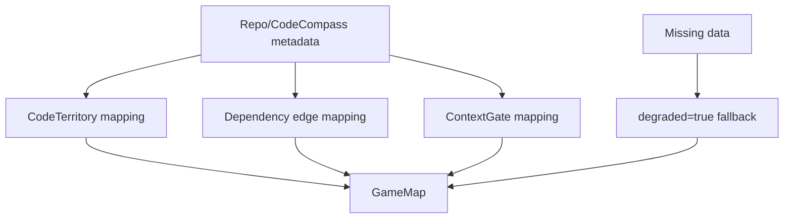

# CodeCompass zu GameMap Adapter

## Ziel

Der Adapter transformiert minimale Repository-/CodeCompass-Metadaten in eine gueltige `GameMap`.

## Mapping-Regeln

1. Jeder Repository-Pfad wird zu einem `CodeTerritory`.
2. Abhaengigkeiten werden als `TrustEdge` mit `relationship=dependency` modelliert.
3. Risiko-/Kontext-Metadaten werden nur ueber explizite Override-Inputs uebernommen.
4. Es werden keine Dateiinhalte oder Secrets in die GameMap geschrieben.

## Inputvertrag (minimal)

- `repo_paths: Iterable[str]`
- `dependency_edges: Iterable[tuple[str, str]]` (optional)
- `risk_overrides: Mapping[str, str]` (optional)
- `context_overrides: Mapping[str, Mapping[str, object]]` (optional)

## Degraded Fallback

Falls keine `repo_paths` vorliegen:

- Adapter liefert trotzdem eine gueltige, leere `GameMap`.
- `degraded=true` und `metadata.reason=missing_repo_paths`.
- Kein Hard-Fail, keine Halluzinationspfade.

## Mermaid-Flow

