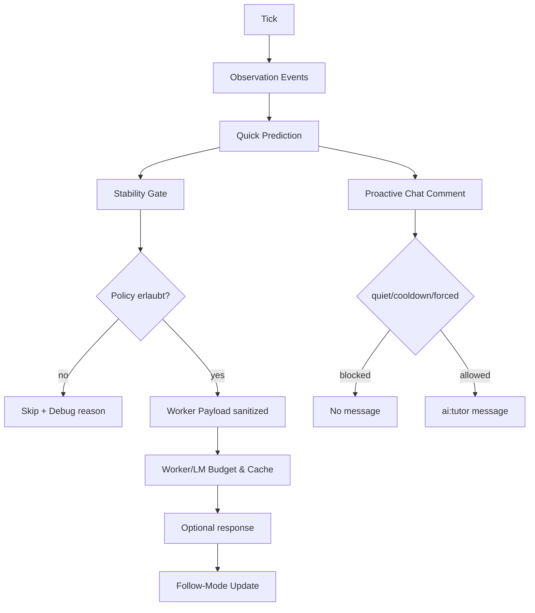

# AI-Snake Lurking Prediction – Architektur

## Module

| Modul | Verantwortung |
|---|---|
| `ai_snake_follow.py` | Lokaler Follow/Lurk-State, deterministische Tick-Übergänge |
| `ai_snake_observation.py` | Ringbuffer lokaler Signale (redacted) |
| `ai_snake_prediction.py` | Quick-Prediction + Stability-Gate |
| `ai_snake_prediction_cache.py` | TTL-Cache zur Request-Reduktion |
| `ai_snake_policy.py` | Boundary-Checks + Payload-Sanitizing |
| `interactive.py` | Tick-Orchestrierung, Runtime-Status, Chat-Kommentar-Gating |
| `chat_state.py` | Cooldown/Quiet/Forced Routing proaktiver Kommentare |

## Datenfluss

## Invarianten

1. Ohne stabile lokale Signale kein Worker-Request.
2. Notes-Inhalt verlässt ohne Freigabe nie den lokalen Kontext.
3. `quiet` verhindert proaktive Kommentare (außer `forced` durch `:ai explain`).
4. Follow/Lurk funktioniert unabhängig von LLM-Verfügbarkeit.

## SOLID-Check

- **SRP**: Follow, Policy, Prediction und Chat-Routing sind getrennte Module.
- **OCP**: Neue Policy-Boundaries können ohne Tick-Refactor ergänzt werden.
- **DIP**: Interaktive Orchestrierung hängt von abstrahierten Modul-Outputs, nicht von Provider-Implementierungen.
