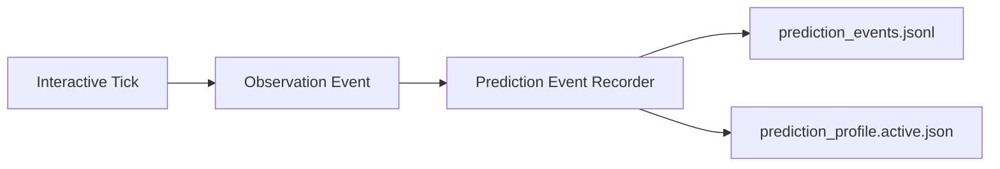
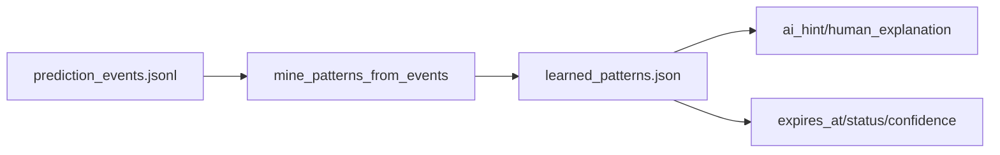
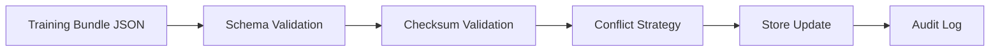
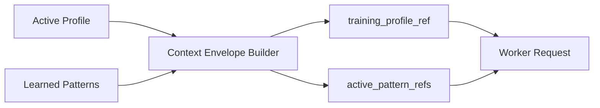
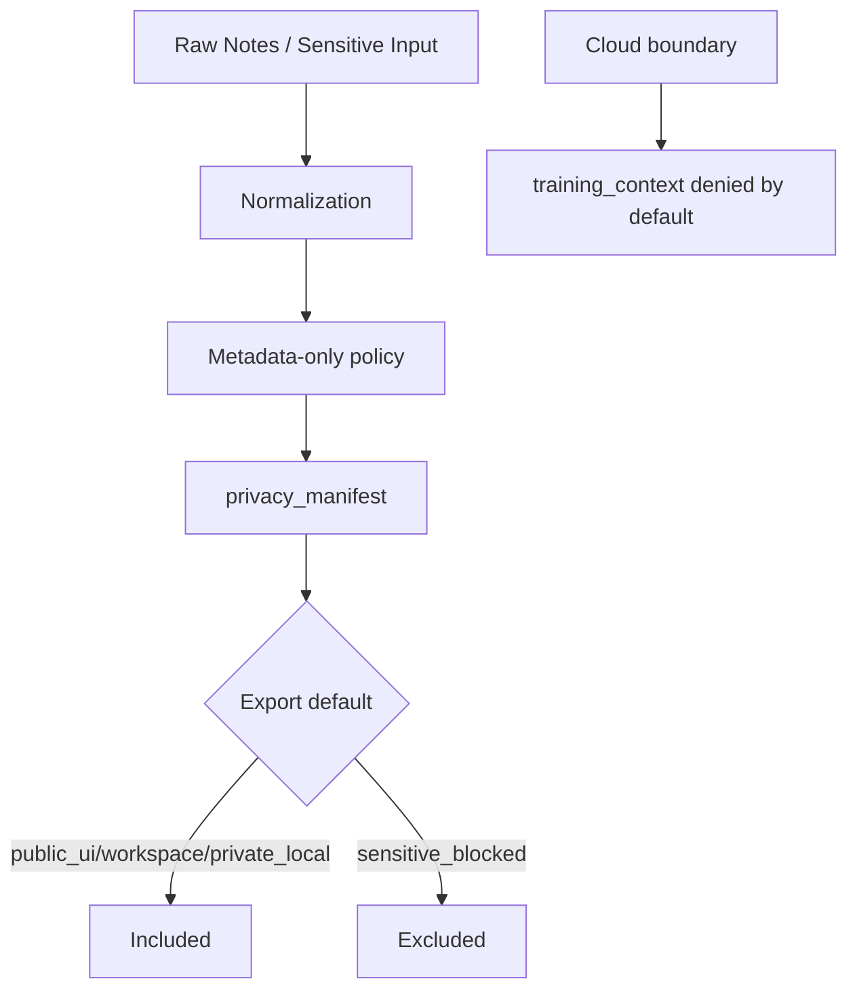

# AI-Snake Training Data Architecture

Diese Architektur beschreibt den local-first Trainingsdatenfluss der Operator-TUI AI-Snake.

## 1) Event Recording

## 2) Pattern Mining

## 3) Import/Export mit Validierung

## 4) Worker Context + ai_hint

## 5) Security/Privacy Invarianten

## Invarianten

- Local-first Speicherung im Benutzerprofilverzeichnis.
- Keine automatische Cloud-Übertragung von Trainingsdaten.
- `sensitive_blocked` wird im Standard-Export ausgeschlossen.
- Checksum-Mismatch blockiert Import außer bei explizitem `--ignore-checksum` (mit Audit-Log).
