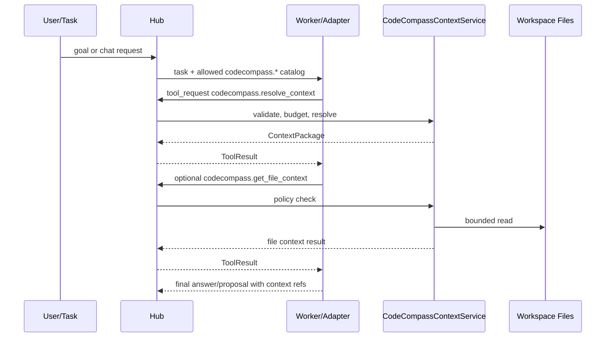

# CodeCompass Context Tool Provider

CodeCompass is the project map, search index, symbol graph and context navigation layer. It is not the authoritative source for code changes or reviews. Original files, tests, configs and explicitly read artifacts remain authoritative.

The provider exposes read-only `codecompass.*` tools through the hub. Workers and external adapters request context; the hub validates scope, budgets and policy, then returns structured ToolResults or ContextPackages. Workers do not exchange context directly and do not receive implicit repository access through these tools.

## Tool Contract

Schema: `codecompass_context_tools.v1`

Primary tools:

- `codecompass.resolve_context`: returns `codecompass_context_package.v1` with candidate files, optional file excerpts, graph/domain metadata, provenance, policy and selection traces.
- `codecompass.search_symbols`: searches symbol, file, domain and normalized CodeCompass records.
- `codecompass.expand_graph`: expands bounded graph neighborhoods from paths, symbols or node seeds.
- `codecompass.get_file_context`: returns policy-checked original file excerpts. This is read-only but stricter than metadata tools because it can expose source content.
- `codecompass.get_domain_map`: returns a compact subsystem/domain map.

Compatibility tools remain valid:

- `codecompass.search`
- `codecompass.plan_context`
- `codecompass.architecture_query`

These older tools are not removed. New clients should prefer `resolve_context` and `get_file_context` when they need a complete ContextPackage flow.

## Security Rules

- All calls execute through the hub-side tool executor.
- Path traversal, absolute paths and paths outside the workspace are denied.
- `get_file_context` requires a reason by default.
- External cloud scope defaults to metadata-only unless policy explicitly allows original content.
- Raw JSONL records are disabled by default; normalized records are preferred.
- Tool results carry provenance, warnings and denied items instead of leaking host paths or throwing uncaught exceptions to workers.

## Flow

## Migration Notes

`worker_context_bundle.v1` and `codecompass_context_bundle.v1` remain supported. The new `codecompass_context_package.v1` is an additive contract for backend-neutral context packages and external adapter handoff.
