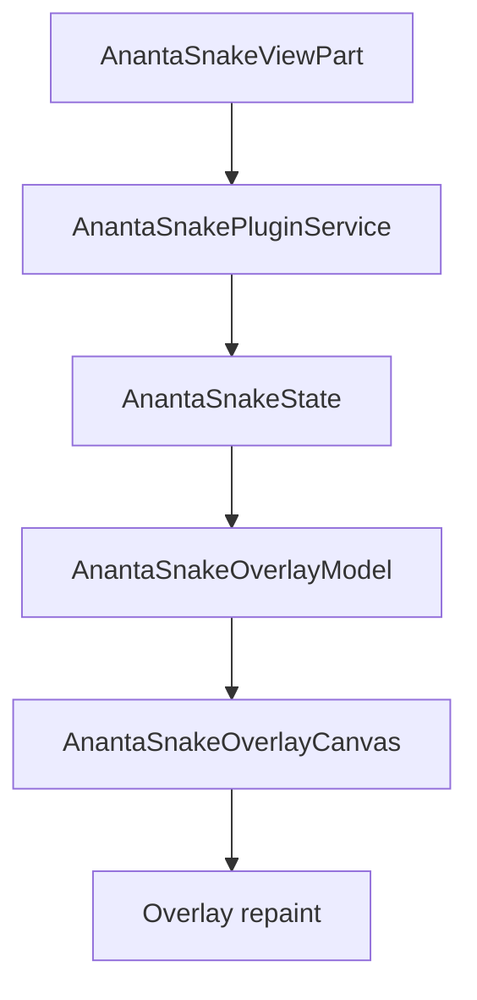
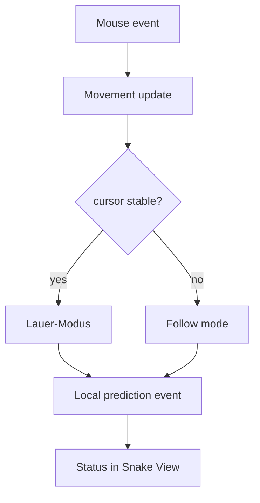

# Eclipse Ananta Snake Architektur

## Zielbild

Die Eclipse-Snake-Integration bleibt Hub-zentriert, privacy-safe und input-pass-through: Visualisierung im IDE-Surface, Kontextexport nur unter expliziten Regeln.

## Flow 1: Eclipse UI -> Snake Overlay -> Movement State



## Flow 2: Mausposition -> Lauer-Modus -> lokale Prediction



## Flow 3: ContextEnvelope -> Hub -> Worker -> Antwort

```mermaid
flowchart TD
    Trigger[Ask / Context dispatch] --> Policy[Privacy + policy gate]
    Policy -->|allow| Envelope[ContextEnvelope (metadata-focused)]
    Policy -->|deny| LocalOnly[local_only / denied reason]
    Envelope --> Hub[Hub API]
    Hub --> Worker[Delegated worker]
    Worker --> Response[Response payload]
    Response --> SnakeView[Ask result + context status]
```

## Security-Invarianten

1. Default-Deny fuer sensible Kontextteile (Dateiinhalte nur per expliziter Freigabe).
2. External-provider Kontext bleibt ohne Freigabe blockiert.
3. Do-Not-Disturb/Presentation reduzieren proaktive Aktionen und Kontextversand.
4. Overlay faengt keine Editor-Eingaben ab (input passthrough).
5. Hub-offline faellt auf lokalen/offline Status zurueck statt unkontrolliert zu senden.

## Testmatrix

| Bereich | Datei | Zweck |
| --- | --- | --- |
| UI/Runtime Integration | `client_surfaces/eclipse_runtime/ananta_eclipse_plugin/src/test/java/io/ananta/eclipse/runtime/integration/EclipseRuntimeIntegrationUiTest.java` | View/Descriptor/Overlay-Sicherheit |
| Plugin-Service Unit | `.../snake/AnantaSnakePluginServiceTest.java` | Mode-Flags, Privacy-Gates, Ask-Verhalten |
| Hub-Integration | `.../snake/AnantaSnakeHubIntegrationRuntimeTest.java` | Register/Offline-Fallback/Denied-Reasons |
| Overlay Unit | `.../snake/AnantaSnakeOverlayCanvasTest.java` | Opacity-Clamp, input passthrough |
| Golden Path E2E | `tests/e2e/test_eclipse_plugin_golden_path.py` + `scripts/eclipse_ui_golden_path_runner.py` | Snake-Command/View-Surface im Plugin-Artefakt |
