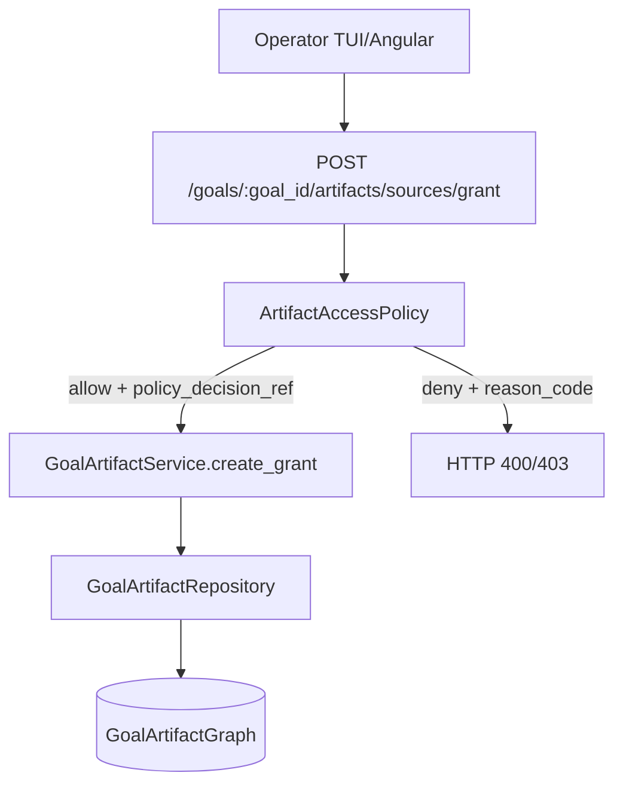
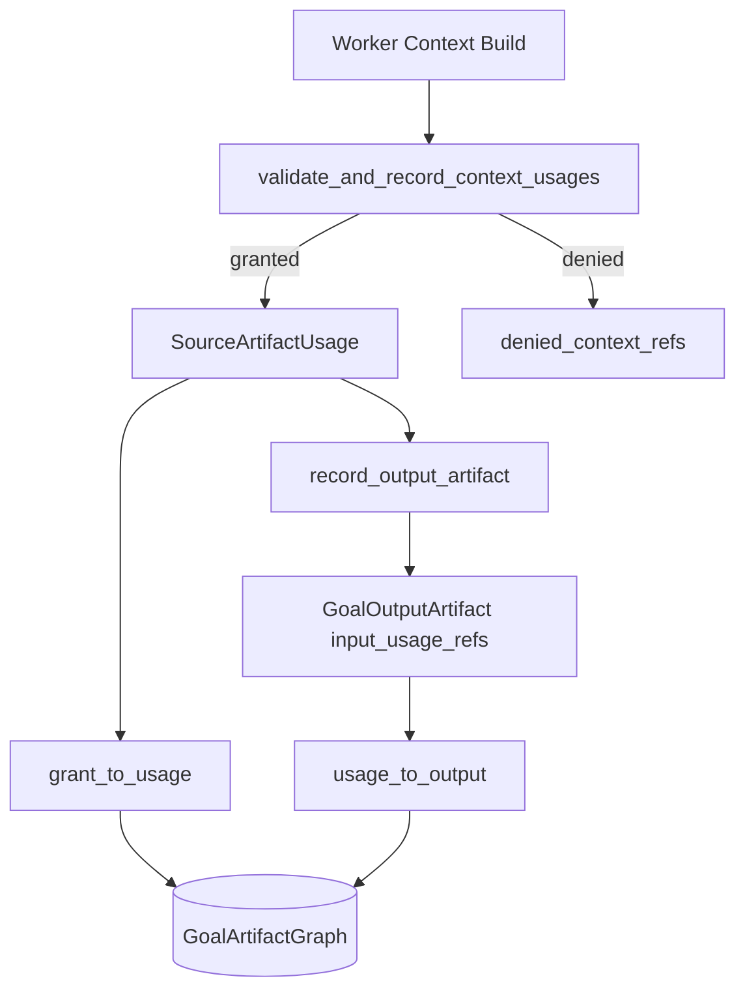
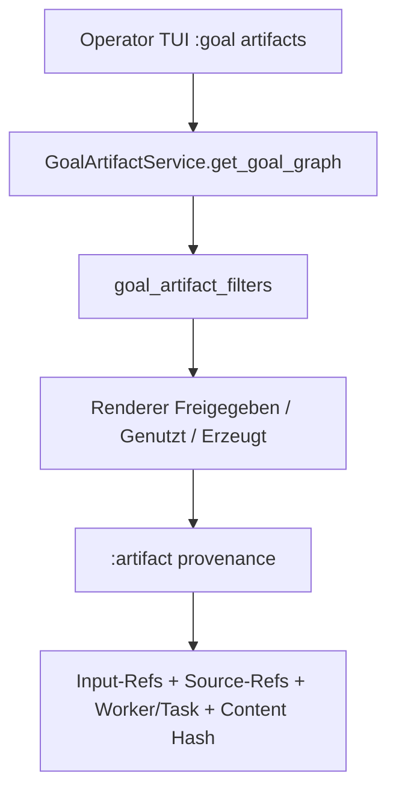

# Goal Artifact Source/Output Management

## Ist/Soll-Abgleich

**Ist**
- Goal-Artefakte werden als Graph aus `source_grants`, `source_usages`, `output_artifacts`, `edges` gespeichert.
- Freigabe (`grant`) und tatsächliche Nutzung (`usage`) sind getrennt.
- Output-Artefakte tragen `input_usage_refs` und Provenance-Metadaten.
- TUI und Angular können den Goal-Graph laden und darstellen.

**Soll**
- Für jedes Goal ist transparent nachvollziehbar, welche Quelle freigegeben war, welche wirklich genutzt wurde und welcher Output daraus entstand.
- Policy-Entscheidungen sind bei Freigaben und Nutzungen über `policy_decision_ref` auditierbar.
- Nicht freigegebene Quellen erscheinen als denied context, aber nicht als legitime Input-Referenz eines Outputs.

## Architekturfluss: Grant-Erstellung



## Architekturfluss: Worker-Nutzung und Output-Registrierung



## Architekturfluss: TUI-Anzeige



## Security-Invarianten

1. Ohne aktiven Grant keine valide `SourceArtifactUsage`.
2. Revoked oder abgelaufene Grants blockieren neue Usage (`grant_revoked` / `grant_expired`).
3. `data_boundary=local_only` darf nicht an Remote/Cloud ausgegeben werden.
4. `approved_cloud` verlangt explizite Freigabeentscheidung.
5. Outputs dürfen nur dokumentierte `input_usage_refs` enthalten; denied Quellen sind nicht als Input-Usage zulässig.

## Beispiel-JSON

### SourceArtifactGrant

```json
{
  "schema": "source_artifact_grant.v1",
  "grant_id": "grant-123",
  "goal_id": "goal-42",
  "artifact_ref": "sources:keycloak:snap_7",
  "granted_by": "operator_tui",
  "granted_at": "2026-05-26T12:00:00Z",
  "allowed_usages": ["read", "use_as_context"],
  "data_boundary": "project_private",
  "sensitivity": "internal",
  "policy_decision_ref": "artifact-policy-abc123"
}
```

### SourceArtifactUsage

```json
{
  "schema": "source_artifact_usage.v1",
  "usage_id": "usage-987",
  "grant_id": "grant-123",
  "goal_id": "goal-42",
  "task_id": "task-11",
  "worker_id": "worker-2",
  "artifact_ref": "sources:keycloak:snap_7",
  "usage_kind": "embedded",
  "used_at": "2026-05-26T12:01:00Z",
  "context_hash": "cafebabe00112233",
  "policy_decision_ref": "artifact-policy-abc123"
}
```

### GoalOutputArtifact

```json
{
  "schema": "goal_output_artifact.v1",
  "output_artifact_id": "out-555",
  "goal_id": "goal-42",
  "task_id": "task-11",
  "worker_id": "worker-2",
  "artifact_type": "report",
  "created_at": "2026-05-26T12:02:00Z",
  "input_usage_refs": ["usage-987"],
  "artifact_ref": "artifacts:report:555",
  "content_hash": "aaaaaaaaaaaaaaaaaaaaaaaaaaaaaaaaaaaaaaaaaaaaaaaaaaaaaaaaaaaaaaaa",
  "status": "created",
  "provenance_summary": "report generated from approved source usage"
}
```
