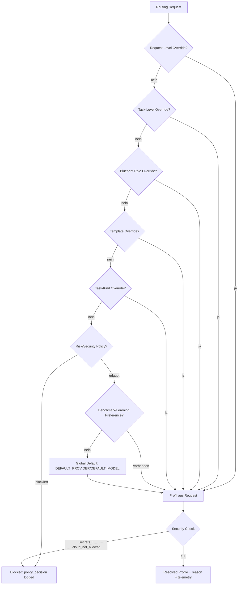

# Model Routing — Zielarchitektur: Profiles, Policy und Resolver (AMR-002)

## Kernprinzipien

- **Policy-first**: Sicherheitsklasse und Kontext-Sensitivität werden vor der Modellwahl geprüft
- **Deterministisch**: Keine implizite Heuristik als Default — jede Entscheidung hat einen dokumentierten Grund
- **Least Privilege**: Cloud-Provider, Tools und Kontext-Zugriff werden explizit erlaubt
- **Abwärtskompatibel**: `DEFAULT_PROVIDER`/`DEFAULT_MODEL` bleiben als unterster Fallback lauffähig
- **Nachvollziehbar**: Jede Routing-Entscheidung erzeugt `reason`, `policy_decisions`, `blocked_candidates`

## Konzepte

### Model Profile
Beschreibt **einen** Provider+Modell-Kombination mit Capabilities, Limits und Security-Flags:

```json
{
  "profile_id": "ollama-qwen-7b-local",
  "provider_id": "ollama",
  "model": "qwen2.5-coder:7b",
  "local": true,
  "cloud": false,
  "cloud_allowed": false,
  "block_secret_context": false,
  "supports_tools": false,
  "supports_json": true,
  "supports_streaming": true,
  "context_tokens": 32768,
  "cost_class": "free",
  "quality_class": "medium"
}
```

### Model Role
Fachliche Bezeichnung für eine Aufgabe, unabhängig von konkretem Provider:
`planner`, `coder`, `reviewer`, `embedder`, `summarizer`, `chat`

### Routing Rule
Verknüpft eine Model Role mit einem oder mehreren Model Profiles über Bedingungen:
`blueprint_id`, `task_kind`, `template_id`, `risk_class`, `team_id`

### Security Policy
Überschreibt jede andere Routing-Entscheidung:
- Cloud-Provider werden blockiert wenn `block_secret_context=true` und Secrets im Kontext
- OpenAI-kompatible externe Provider nur wenn explizit erlaubt

## Deterministische Resolver-Reihenfolge



## Precedence-Ränge (MPM)

| Rang | Typ | Quelle |
|------|-----|--------|
| 0 | security_policy | Immer — blockiert wenn nötig |
| 1 | request_override | Expliziter Caller-Override |
| 2 | task_override | Task-spezifisches Profil |
| 3 | blueprint_role_override | Blueprint-definierte Rolle |
| 4 | team_override | Team/Projekt-Override |
| 5 | template_override | Template-spezifisch |
| 6 | task_kind_override | Routing nach Task-Art |
| 7 | risk_class_policy | Risikoklassen-basiertes Routing |
| 8 | benchmark_preference | Gelerntes Modell-Ranking |
| 9 | planning_profile | Planning-Model-Profile-Match |
| 10 | global_default | DEFAULT_PROVIDER/DEFAULT_MODEL |
| 11 | legacy_fallback | Letzter Ausweg — immer lokal |

## Provider-Beispiele

### Lokal (Ollama)
```yaml
provider_id: ollama
base_url: http://localhost:11434
cloud: false
cloud_allowed: false
api_key_env: null
```

### Lokal (LM Studio)
```yaml
provider_id: lmstudio
base_url: http://localhost:1234
cloud: false
cloud_allowed: false
```

### Cloud (OpenRouter)
```yaml
provider_id: openrouter
base_url: https://openrouter.ai/api/v1
cloud: true
cloud_allowed: true            # muss explizit gesetzt sein
block_secret_context: true     # verhindert Secret-Leaks in Cloud-Calls
api_key_env: OPENROUTER_API_KEY
```

### Cloud (OpenAI)
```yaml
provider_id: openai
base_url: https://api.openai.com/v1
cloud: true
cloud_allowed: true
block_secret_context: true
api_key_env: OPENAI_API_KEY
```

## Neue Dateien (AMR-003–AMR-009)

| Datei | Zweck |
|-------|-------|
| `config/schemas/model_profiles.schema.json` | JSON-Schema für Profiles |
| `config/schemas/model_routing.schema.json` | JSON-Schema für Routing-Regeln |
| `config/models/examples/*.yaml` | Beispiele für Ollama, hybrid, cloud |
| `agent/services/model_profile_loader.py` | Lädt und validiert Profile |
| `agent/services/model_profile_resolver.py` | Deterministischer Resolver |
| `agent/services/model_override_normalization_service.py` | Legacy-Normalisierung |

---

## Implementierter Precedence-Matrix (MPM — final)

Die folgende Tabelle beschreibt das **aktuell implementierte** Verhalten in
`agent/services/model_profile_resolver.py`. Sie ersetzt das obige Planungs-Diagramm als
kanonische Referenz.

| Rang | Name | Auslöser | Implementierung |
|------|------|----------|-----------------|
| 0 | `security_policy` | `cloud=True` + Secrets in `context_text` | `SecurityPolicyChecker` regex-Scan; blockiert Cloud-Profiles |
| 1 | `task_override` | `RoutingContext.env_profile_id` gesetzt | Direktes Profil-Lookup nach ID |
| 2 | `blueprint` | `RoutingContext.blueprint_id` gesetzt | `BlueprintModelPolicyService.extract()` |
| 3 | `template` | `RoutingContext.template_id` gesetzt | `TemplateModelPolicyService.resolve()` |
| 4 | `team` | `RoutingContext.team_id` gesetzt | Team-Level-Profil-Konfiguration |
| 5 | `risk_class` | `RoutingContext.risk_class` gesetzt | Risk-Class→Profile-Mapping |
| 6 | `model_role` | `RoutingContext.model_role != "any"` | Erstes Profil mit passendem `model_role` |
| 7 | `global` | immer als Fallback (vor env/user) | Erstes Profil in der Profile-Liste |
| 8 | `env` | `RoutingContext.env_profile_id` (zweite Chance) | Wie Rang 1, aber nach global |
| 9 | `user_runtime` | `RoutingContext.user_profile_id` gesetzt | Benutzerdefiniertes Profil |
| 10 | `capability_match` | `requires_tools`, `requires_json`, `requires_streaming` | Iteriert Profile; überspringt unhealthy Provider |
| 11 | `fallback_chain` | Kein Profil gefunden | Legacy `DEFAULT_PROVIDER` / `DEFAULT_MODEL` |

### Security Policy Detail (Rang 0)

Der `SecurityPolicyChecker` erkennt Secrets via Regex:
- Env-Variablen-Muster: `SECRET=`, `API_KEY=`, `PASSWORD=`
- PEM-Header: `-----BEGIN`
- Token-Präfixe: `sk-`, `ghp_`, `ghs_`, `xoxb-`
- Base64-artige lange Strings (>40 Zeichen, keine Spaces)

Bei Erkennung wird der Cloud-Provider blockiert und `policy_decisions` um einen Eintrag erweitert.

### Provider Health Cache

`ProviderHealthCache` hält einen 60-Sekunden-TTL-Cache pro `provider_id`:

```python
resolver.report_provider_failure("openai")   # markiert 60s unavailable
resolver.report_provider_recovery("openai")  # sofortiges Reset
```

`capability_match` (Rang 10) überspringt Provider mit `is_available() == False`.

### TaskRoutingContract-Felder

Nach der Auflösung werden folgende Felder in `TaskRoutingContract` befüllt:

| Feld | Typ | Beschreibung |
|------|-----|--------------|
| `model_profile_id` | `str?` | Aufgelöstes Profil |
| `model_role` | `str?` | Verwendete Rolle |
| `model_resolver_source` | `str?` | Gewinnender Rang-Name |
| `model_resolver_rank` | `int?` | Numerischer Rang |
| `model_policy_decisions` | `list[str]` | Audit-Trail |
| `model_blocked_candidates` | `list[str]` | Übersprungene Profile |
| `model_cloud_allowed` | `bool?` | Cloud erlaubt |
| `model_block_secret_context` | `bool?` | Secret-Blocking aktiv |

### Migration von Legacy-Env-Vars

```bash
# Alt
DEFAULT_PROVIDER=lmstudio
DEFAULT_MODEL=qwen2.5-coder-7b

# Neu
MODEL_PROFILES_PATH=/etc/ananta/profiles.yaml
# beide gesetzt → Deprecation-Warning, Profile-Resolver hat Vorrang
```

Legacy-Provider-Aliasse werden normalisiert (`lm_studio`, `lm-studio`, `local` → `lmstudio`)
durch `ModelOverrideNormalizationService`.

### Diagnostics-Endpunkt

```http
GET /config/model-routing/read-model
```

Gibt Resolver-Status, geladene Profile, Template-Policies und Legacy-Config zurück.

### Vollständige Datei-Referenz

| Datei | Rolle |
|-------|-------|
| `agent/services/model_profile_loader.py` | Load + Validierung |
| `agent/services/model_profile_resolver.py` | Resolver + RoutingContext + ProviderHealthCache |
| `agent/services/model_override_normalization_service.py` | Legacy-Alias-Normalisierung |
| `agent/services/blueprint_model_policy_service.py` | Blueprint-Policy-Extraktion |
| `agent/services/template_model_policy_service.py` | Template-Policy-Extraktion |
| `agent/models.py` | `TaskRoutingContract`-Felder |
| `agent/services/model_invocation_service.py` | `_get_resolver()`, `_make_chat_call()` |
| `agent/routes/config/read_models.py` | GET /config/model-routing/read-model |
| `tests/test_model_profile_loader.py` | Loader-Unit-Tests |
| `tests/test_model_profile_resolver.py` | Resolver-Unit-Tests |
| `tests/test_model_routing_security_policy.py` | Security-Policy-Tests |
| `tests/test_model_routing_e2e.py` | E2E-Integrationstests |
