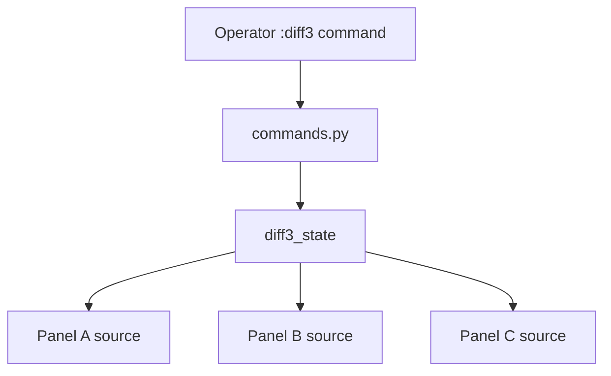
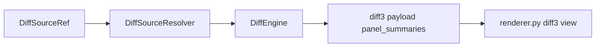
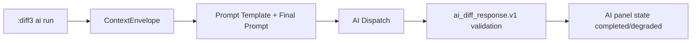
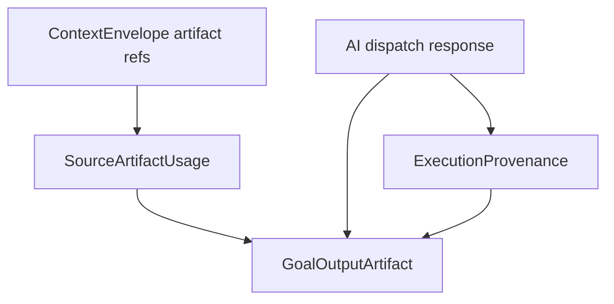

# Architektur: Operator TUI Drei-Wege-Diff + KI-Panel

## 1) Panel-Quellenauswahl

## 2) Resolver -> Engine -> Renderer

## 3) KI-Panel Pipeline

## 4) GoalArtifact + ExecutionProvenance Integration

## Testmatrix

| Bereich | Abdeckung |
|---|---|
| State/Sources/Engine | `test_three_way_diff_state_schema.py`, `test_tui_diff_sources.py`, `test_tui_diff_source_resolver.py`, `test_tui_diff_engine.py` |
| Commands/Renderer | `test_tui_diff3_commands.py`, `test_tui_diff3_renderer.py` |
| AI Mock/Dispatch | `test_tui_ai_diff_panel_state.py`, `test_tui_ai_diff_context_dispatch.py` |
| E2E | `scripts/e2e/diff3_two_current_plus_ai_e2e.py`, `scripts/e2e/diff3_flexible_sources_e2e.py` |

