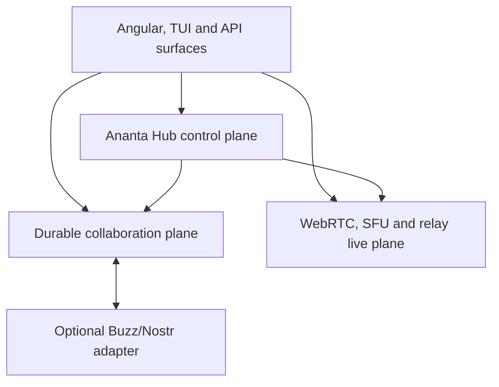
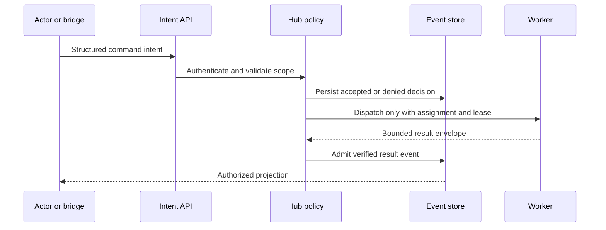

# Pair-Dev Collaboration Workspace

## Status and intent

This document defines the long-term target architecture for evolving Ananta
Pair-Dev from a live two-party sharing surface into an Ananta-native
collaboration workspace for humans, AI agents, workers and explicitly shared
resources.

The goal is to cover the same problem class as Block Buzz without turning
Pair-Dev into a Buzz clone. Pair-Dev remains fully useful on its own. Buzz is an
optional external workspace and protocol adapter.

This architecture was reviewed against Ananta commit
`ad22c51cf78c3aa900a7a93c16a0613634029ee8` and the public Buzz architecture on
2026-08-06.

## Architectural decision

Pair-Dev is split into four cooperating planes:

1. **Hub control plane** — authoritative identity bindings, membership,
   permissions, policies, budgets, leases, planning, tasks, approvals and
   orchestration.
2. **Durable collaboration plane** — workspaces, rooms, threads, canonical
   events, artifacts, projections, audit history, replay and search.
3. **Live transport plane** — WebRTC DataChannels, media, LiveKit/SFU and the
   existing Hub relay fallback for low-latency and ephemeral traffic.
4. **Adapter plane** — optional bridges such as Buzz/Nostr, Git and future
   collaboration systems. Adapters translate contracts but never become Hub
   authority.

The Hub remains the only component allowed to turn an external or internal
intent into permissions, tasks, leases, workflow decisions or tool execution.
Workers execute assignments and never orchestrate other workers.

## Existing baseline to preserve

The target builds additively on the current implementation:

- `agent/routes/share_sessions.py` already exposes Hub-owned share-session,
  chat, view-relay, semantic-relay, permission and audit boundaries.
- `frontend-angular/src/app/services/webrtc-transport.service.ts` already
  separates direct WebRTC delivery from Hub-relay fallback.
- `frontend-angular/src/app/services/pair-view-sync.types.ts` defines typed
  view, cursor, selection, artifact and control contracts.
- `docs/architecture/pair-view-sync.md` documents delta-first view sync and
  explicitly identifies multi-participant view sync as a remaining gap.
- `docs/security/webrtc-e2ee-security-contract.md` defines the authoritative
  Epoch, E2EE, replay and revocation boundaries.
- `docs/status/webrtc-sfu-broadcast-baseline.md` records the bounded SFU
  foundation and its current `no_go` / `observe_only` release state.
- `docs/identity-architecture.md` keeps Hub, OIDC and signaling identity
  domains separate and supports explicit account linking only.
- `docs/operator-tui/ai-snake-semantic-compute.md` keeps scheduling, contracts,
  queues and leases under Hub authority even when peers expose compute.

These contracts are migration inputs. They are not replaced in a big-bang
rewrite.

## What Pair-Dev learns from Buzz

Useful design ideas from Buzz are adopted as product principles, not copied as
runtime dependencies:

| Buzz idea | Pair-Dev interpretation |
| --- | --- |
| Humans and agents share rooms | Humans, agents and resources are explicit workspace actors |
| One searchable event history | Canonical Hub-admitted workspace events feed projections and search |
| Branch as room | Project, Goal, Task and branch bindings can create typed rooms |
| Signed and attributable actions | Actor, principal, assignment, lease and external signature provenance are preserved |
| Agent-oriented CLI and protocols | Pair-Dev exposes stable ports and transport-neutral contracts |
| Workflows visible in conversation | Task, workflow, review and approval events appear in the room timeline |

Pair-Dev deliberately does not adopt Buzz's relay as its source of authority,
Nostr kinds as core domain types or direct agent action from chat events.

References:

- <https://github.com/block/buzz/blob/main/README.md>
- <https://github.com/block/buzz/blob/main/ARCHITECTURE.md>
- <https://github.com/block/buzz/blob/main/VISION_AGENT.md>
- <https://github.com/block/buzz/blob/main/VISION_PROJECTS.md>

## Non-goals

- Replacing the Hub task system or hub-worker architecture.
- Treating WebRTC, LiveKit, Buzz or Nostr as the durable source of truth.
- Allowing agents or external bridges to create authority by publishing text or
  events.
- Persisting hidden chain-of-thought, raw secrets or unrestricted tool output.
- Making public federation, Web-of-Trust reputation or cross-tenant discovery
  a prerequisite for Pair-Dev.
- Replacing existing Pair-View contracts before compatibility adapters and
  migration evidence exist.
- Claiming production-ready SFU, TURN or multi-region operation without the
  required runtime evidence.

## Domain model

### Workspace

A `CollaborationWorkspace` is a durable, tenant- and project-bound container.
It may reference an Ananta Project, Organization, Goal or an explicitly scoped
ad-hoc collaboration context. It owns rooms, memberships, retention policy,
adapter bindings and its event sequence.

### Room

A `CollaborationRoom` is a typed projection boundary. Initial room types are:

- `project`
- `goal`
- `task`
- `branch`
- `incident`
- `pair_session`
- `freeform`

Room type affects available projections and UI, never the authority of an
actor. A branch room can show Git and CI projections, while a task room can show
assignment and artifact projections.

### Thread

A `CollaborationThread` groups replies, reviews, decisions and evidence beneath
one root event. Thread state is a projection over canonical events and does not
introduce a second message authority.

### Actor binding

`WorkspaceActorBinding` connects a visible actor to exactly one authoritative
identity source and actor kind:

- `human`
- `agent`
- `worker`
- `resource`
- `service`
- `external_actor`

Display identities are not authorization. Hub principal, worker registration,
assignment, external key mapping and current membership are stored separately
and revalidated for privileged actions.

### Membership

`WorkspaceMembership` is durable and revisioned. Presence is an expiring lease
and must never be inferred as membership. Membership roles are intentionally
small; effective permissions are resolved from Hub policy, room scope,
assignment, capability grants and current revision.

### Resource

A `SharedResource` represents a deliberately offered capability such as:

- repository or source scope
- CodeCompass index or knowledge source
- model endpoint
- GPU or compute capacity
- MCP server or bounded tool set
- terminal or development environment
- artifact collection
- media input/output capability

A resource offer is descriptive. Only a Hub-issued, task- and time-bound lease
authorizes use.

### Canonical workspace event

`WorkspaceEventV1` is transport-neutral. At minimum it contains:

- `event_id`
- `workspace_id`
- optional `room_id` and `thread_id`
- `event_type` and `schema_version`
- `actor_binding_id` and actor kind
- authoritative principal/assignment/lease provenance where applicable
- monotonically ordered workspace or partition sequence
- `occurred_at` and Hub `admitted_at`
- idempotency key and causal/correlation identifiers
- visibility and retention class
- structured payload or artifact references
- payload digest and optional external signature provenance

The Hub validates and admits durable events. WebRTC may carry a proposed event
or an already admitted projection, but a peer sequence is not the durable
sequence.

## Event taxonomy

Events are classified before transport selection:

| Class | Examples | Persistence |
| --- | --- | --- |
| Durable collaboration | message, reply, decision, review, task status, artifact link | Canonical event store |
| Durable audit | permission change, approval, adapter action, policy denial | Audit plus safe workspace projection |
| Ephemeral presence | online, typing, pointer, speaking | Expiring live state only |
| Ephemeral semantic | view delta, cursor, selection, media hints | WebRTC/SFU or relay; optional bounded diagnostics |
| Bulk referenced | artifact, patch, recording, large output | Artifact store; event contains reference and digest |
| Command intent | request task, approve, cancel, merge proposal | Persisted intent; Hub policy decides resulting action |

Transport choice follows the class. The transport must not redefine durability,
visibility or authorization.

## Command and execution flow

Messages and mentions may suggest work. They never create a Worker task without
the normal Hub transition, policy checks and optional approval.

## Required ports and adapters

Core services depend on small interfaces rather than WebRTC, LiveKit or Nostr
types:

- `WorkspaceEventStorePort`
- `WorkspaceEventOutboxPort`
- `WorkspaceProjectionPort`
- `WorkspaceSearchIndexPort`
- `WorkspacePresencePort`
- `WorkspaceLiveTransportPort`
- `WorkspaceArtifactLinkPort`
- `WorkspacePolicyPort`
- `WorkspaceCommandIntentPort`
- `CollaborationBridgePort`

Each adapter publishes a versioned capability manifest. Unsupported operations
must be absent or explicitly rejected; no adapter returns success without
performing its promised operation.

## Live transport model

WebRTC remains the preferred low-latency path. The existing Hub relay remains
the compatibility and failure fallback. LiveKit/SFU is selected only after its
existing release gates become green.

The topology selector considers:

- participant count
- media and data traffic classes
- receiver permissions
- browser and network capability
- E2EE contract and Epoch
- measured load and configured caps
- relay/SFU readiness

For `n > 2`, the system must distinguish technical fan-out from collaboration
semantics. Every receiver has its own membership, permissions, subscription
projection, cursor identity, acknowledgement cursor and revocation state.

Reconnect uses bounded replay cursors. Ephemeral traffic may be dropped;
durable events are recovered from the event store or outbox. Backpressure is
per participant and traffic class so one slow peer cannot block the room.

## Agent and resource participation

Agents become first-class visible members while remaining constrained by the
hub-worker rules:

- Each agent has an actor binding separate from its model/provider label.
- Runtime presence states such as `available`, `busy`, `waiting_approval`,
  `degraded` and `offline` are projections, not task authority.
- Mentions create reviewable command intents or route existing Hub tasks.
- Agent-to-agent handoff is represented as a Hub-owned task transition or
  bounded proposal, never direct worker orchestration.
- Context and CodeCompass access are compiled from explicit room, task and
  resource grants.
- Tool, compute and artifact access require current leases and budgets.
- Cancellation, revocation and human takeover are visible room events backed
  by authoritative Hub state.

Resource nodes follow the same pattern: advertise bounded capabilities, then
receive only Hub-issued leases for exact work.

## Durable storage, replay and projections

The collaboration event store is append-oriented and idempotent. Mutable UI
state is derived through projections. Corrections use explicit replacement,
redaction or tombstone events under policy; history is not silently rewritten.

Required reliability mechanisms:

- transactional outbox for downstream projections and bridges
- inbox deduplication for external and peer-originated proposals
- optimistic concurrency or compare-and-swap on workspace revisions
- deterministic event IDs or stable idempotency keys for retries
- projection checkpoints and rebuild support
- per-actor read cursors and bounded offline outbox
- artifact digests instead of large inline payloads
- retention and legal/security deletion workflows with auditable tombstones

The event store is not a database for model chain-of-thought. Only user-visible
messages, structured decisions, tool summaries, admitted results and bounded
diagnostics are eligible.

## Search and CodeCompass

Search uses permission-aware projections. A result is returned only when the
current principal can still read the workspace, room and referenced artifact.

The unified index covers:

- room and thread messages
- task and workflow events
- review and approval decisions
- artifact metadata and admitted textual projections
- Git/branch/CI events
- CodeCompass symbols, sources and graph references

CodeCompass remains the code-intelligence authority. Collaboration events link
to its stable source and symbol references rather than copying uncontrolled
repository content into messages. Search results expose provenance, temporal
context and partial-result warnings.

## Optional Buzz/Nostr adapter

Buzz integration implements `CollaborationBridgePort`; it is not added to
`WebrtcTransportService`.

### Outbound mapping

Only allowlisted, redacted and Hub-admitted workspace events are translated.
The adapter persists the Ananta event ID, external event ID, mapping version,
payload digest and delivery state. Retry is idempotent.

### Inbound mapping

Buzz/Nostr events are untrusted external input. Supported events map to either:

- a passive collaboration event proposal, or
- a structured command intent requiring normal Hub authorization.

Unknown kinds, invalid signatures, unmapped actors, stale memberships and
unsupported commands fail closed. An external approval reaction is not an
Ananta approval unless an explicit policy, actor binding and digest-bound Hub
approval transition accept it.

### Identity and keys

An agent or human may have an optional external Buzz/Nostr key mapping. Key
custody is adapter infrastructure, never browser local storage by default and
never a replacement for Hub/OIDC/worker identity. The mapping is tenant- and
workspace-scoped, revocable and audited.

### Loop prevention

Every bridged event carries internal mapping provenance. Inbox deduplication,
origin adapter ID, hop count and payload digest prevent echo loops. Pair-Dev
must continue operating when Buzz is unavailable or disconnected.

## Security and privacy invariants

- Authorization is evaluated server-side from current authoritative state.
- Durable storage visibility and live E2EE visibility are separate policy
  decisions and are shown explicitly to users.
- Membership removal rotates relevant Epochs, revokes leases and invalidates
  bridge delivery where possible.
- Tenant, project, workspace, room, actor, task and artifact scopes are bound
  and checked independently.
- External content is subject to size limits, schema validation, prompt-
  injection boundaries, malware/content scanning where applicable and output
  encoding.
- Secrets, access tokens, private keys, raw prompts marked private and hidden
  reasoning are never bridged or indexed.
- Rate limits, quotas, circuit breakers and per-actor abuse controls apply to
  live, durable and bridge paths separately.
- Audit records state what policy decided, with stable reason codes, without
  storing protected content unnecessarily.

## Compatibility and migration

Migration is additive:

1. Introduce canonical collaboration contracts and ports behind default-off
   flags.
2. Dual-write selected existing share-session events to the new event store in
   observe-only mode.
3. Compare legacy and new projections without changing the UI authority.
4. Enable native workspace rooms for new sessions while retaining legacy APIs.
5. Offer controlled conversion of eligible Pair sessions into durable rooms.
6. Enable multi-participant live projections only after WebRTC/SFU gates pass.
7. Enable the Buzz adapter for explicit tenants/workspaces after native core
   contracts and security gates are stable.
8. Retire legacy aliases only through documented versioned deprecation.

Rollback disables projections or adapters but never deletes canonical events.
Compatibility readers remain until active legacy sessions and clients have
expired or migrated.

## Delivery order

The critical order is:

1. Architecture decisions and transport-neutral contracts.
2. Durable event store, inbox/outbox and projection rebuild.
3. Actor, membership and permission model.
4. Native room/thread UI and session migration.
5. Multi-participant live semantics.
6. Agent/resource participation and Hub command intents.
7. Project, branch, task, workflow and CodeCompass projections.
8. Optional Buzz adapter.
9. Security, chaos, scale, accessibility and release gates.

Native Pair-Dev quality is prioritized before external ecosystem breadth.

## Release gates

Production activation requires:

- Python/TypeScript contract parity for all public envelopes
- migration and rollback evidence
- authorization and tenant-isolation negative tests
- multi-browser, multi-participant and reconnect E2E evidence
- event-store replay and projection rebuild evidence
- bounded queue, backpressure, load, soak and chaos results
- E2EE/revocation/key-rotation evidence for enabled live topologies
- prompt-injection, secret-redaction and bridge loop-prevention tests
- accessibility and keyboard-only UI verification
- backup/restore and disaster-recovery exercise
- Buzz-disconnected standalone operation
- one global default-off release gate with explicit rollout decision

No missing external runtime evidence may be replaced with an implementation
claim or invented source/run identifier.

## SOLID check

- **SRP:** Control, durable collaboration, live transport, projections and
  external bridges are separate responsibilities.
- **OCP:** New bridges and transports implement ports without changing core
  collaboration rules.
- **LSP:** Adapter capability manifests and conformance tests prevent silent
  no-op substitutions.
- **ISP:** Focused ports avoid a single collaboration god-interface.
- **DIP:** Domain services depend on contracts; WebRTC, LiveKit, Postgres,
  search and Buzz/Nostr remain adapters.

