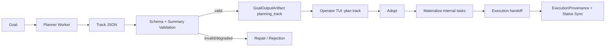

# Planning Track Contract

## Why `todo.track.schema.json` is the planning output contract

Planning in Ananta is contract-first: planner output is accepted only when it matches `todos/todo.track.schema.json`.
This ensures deterministic validation, comparable outputs in TUI, and safe handoff from planning to executable tasks.

## End-to-end flow



## PlanningTrack artifact vs executable task

- **PlanningTrack artifact**: versioned plan snapshot (`artifact_type=planning_track`) with payload, quality issues, source/context references, and provenance.
- **Executable task**: internal `TaskDB` entity created/reused from adopted plan-task mapping and executed by worker/runtime.

The artifact is the planning truth source; executable tasks are runtime projections derived from it.

## Validation and repair pipeline

1. Extract JSON payload from planner output (including fenced JSON).
1. Validate payload against `todo.track.schema.json`.
1. Recompute derived summary blocks deterministically from `tasks[]` and repair summary mismatch when possible.
1. Apply planning quality gates (critical path/milestone integrity, large-goal constraints).
1. Persist output artifact + execution provenance.
1. Mark invalid or degraded outputs as non-adoptable.

Repair is bounded (single repair attempt) and cannot silently promote invalid outputs to active plans.

Derived summary set:

- `tasks_status_summary`
- `tasks_type_summary`
- `progress_summary`
- `weighted_progress_summary`
- `milestone_progress_summary`
- `derived_summary_metadata`

`derived_summary_metadata.source_hash` is recomputed from normalized `tasks[]`, `milestones[]`, and `critical_path_tasks`.
Mismatch indicates stale or planner-provided summary content and triggers recomputation/repair before persistence.

## Count-based vs weighted progress

- **Count-based** (`progress_summary.count_based_percent`) uses done task count over total tasks.
- **Weighted** (`weighted_progress_summary.weighted_percent`) uses deterministic task weights (priority, risk, critical path, task type).
- Both are shown in TUI and both are derived from `tasks[]` (never trusted from raw planner output).

## Recalculation status and adoption safety

Planning outputs carry summary recompute metadata:

- `summary_recalculation_status`: `not_needed | recalculated | repaired | failed`
- `old_summary_hash`, `new_summary_hash`
- `repaired_fields`

Only valid outputs with fresh derived summaries are adoptable. Invalid/degraded outputs remain non-adoptable.

## Example planning track JSON

```json
{
  "version": "1.0.0",
  "owner": "ananta-worker/planner",
  "track": "goal-track",
  "status_scale": ["todo", "in_progress", "blocked", "done"],
  "priority_scale": ["P1", "P2", "P3"],
  "risk_scale": ["low", "medium", "high"],
  "milestones": [
    {
      "id": "M01",
      "title": "Bootstrap",
      "status": "todo",
      "task_ids": ["T01", "T02"]
    }
  ],
  "tasks": [
    {
      "id": "T01",
      "title": "Define contract",
      "status": "todo",
      "priority": "P1",
      "risk": "medium",
      "type": "schema",
      "milestone_id": "M01",
      "acceptance_criteria": [
        "Schema includes required planning fields.",
        "Validation rejects missing acceptance_criteria."
      ]
    }
  ],
  "critical_path_tasks": ["T01"],
  "tasks_status_summary": {
    "total": 1,
    "by_status": {
      "todo": 1,
      "in_progress": 0,
      "partial": 0,
      "blocked": 0,
      "done": 0
    },
    "progress_percent_done": 0.0,
    "by_priority": {"P1": 1},
    "by_risk": {"medium": 1},
    "critical_path": {"total": 1, "done": 0, "remaining": 1},
    "milestones": {"total": 1, "todo": 1, "in_progress": 0, "blocked": 0, "done": 0}
  }
}
```
