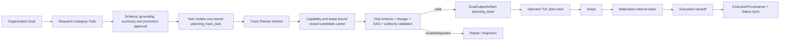

# Planning Track Contract

## Why `todo.track.schema.json` is the planning output contract

Planning in Ananta is contract-first: planner output is accepted only when it matches `todos/todo.track.schema.json`.
This ensures deterministic validation, comparable outputs in TUI, and safe handoff from planning to executable tasks.

## End-to-end flow


```mermaid
flowchart LR
    G[Organization Goal] --> C[Research Category-Todo]
    C --> CP[Schema, grounding, summary and promotion approval]
    CP --> PT[Hub creates one bound planning_track_task]
    PT --> P[Track Planner Worker]
    P --> O[Capability and lease-bound closed candidate carrier]
    O --> V[Hub schema + lineage + DAG + authority validation]
    V -->|valid| A[GoalOutputArtifact planning_track]
    V -->|invalid/degraded| R[Repair / Rejection]
    A --> T[Operator TUI :plan track]
    T --> AD[Adopt]
    AD --> M[Materialize internal tasks]
    M --> EX[Execution handoff]
    EX --> PR[ExecutionProvenance + Status Sync]
```

## Stage one: Category-Todo

For organization-bound Goals the first planning artifact conforms to
`todos/todo.schema.json`. It captures research-grounded categories/items,
dependencies and portfolio intent but materializes no Worker Task. The Hub
validates the exact artifact, recomputes its summaries and verifies every
claim/evidence reference against the assignment-provided source catalog and
`allowed_source_refs`/`allowed_run_refs`. Unknown, missing, orphaned or merely
free-text `SRC_*`/`RUN_*` identifiers make promotion non-adoptable.

Promotion is a dedicated, one-shot approval bound to organization, Goal,
artifact ID, revision and canonical digest. It is distinct from Track adoption
and later materialization.

The approval-intent key is unique in persistence. Concurrent request creation
uses a nested transaction: the losing writer rolls back only its savepoint,
rereads the authoritative row, and accepts it only when tool, tenant, project,
organization, Goal, canonical arguments, argument digest, and target fingerprint
all match. Any mismatch fails closed.

Planning revisions persist a canonical, namespace-qualified creator identity
(`principal:<subject>` or `worker:<worker>`), separate from the human-readable
`created_by` label. Promotion, adoption, and materialization compare that
identity with the approval decider. Legacy revisions are accepted only when an
equally unambiguous creator can be recovered from execution provenance;
ambiguous rows require operator remediation instead of bypassing separation of
duties.

## Category-to-Track lineage

Only an exactly promoted Category revision may be partitioned into Planning
Tracks. In the normal delegated path the Hub creates exactly one deterministic
`planning_track_task` bound to the revision, organization Goal, unit, team,
role slot, policy/prompt hashes, source catalog and the complete sorted set of
non-deferred Category item IDs. A replay returns that Task; a conflicting scope
or an already derived Track set fails closed.

The delegated organization phase uses the version-controlled
`prompts/planning/organization_track_planning.j2` template; the legacy direct
planner continues to use `prompts/planning/track_planning.j2`.

The Planner Worker receives no orchestration authority. It submits one closed
`organization_track_planning_result.v1` carrier through the Worker-result
capability issued for its exact Task, assignment and current WorkerJob/dispatch
lease. `payload_digest` is `sha256:` over canonical compact JSON of every
carrier field except `payload_digest`: keys are sorted, separators are `,` and
`:`, non-ASCII characters are JSON-escaped, non-finite numbers are forbidden,
and the result is UTF-8 encoded. The Hub re-verifies the lease and Task binding
inside the same unit of work that persists Track revisions. A logical Task
result uses a deterministic idempotency key, so response-loss retries replay
the same revision set while a different result digest conflicts.

Each candidate Track is validated against `todos/todo.track.schema.json` and
stores the source Category artifact/revision/digest, result Task,
assignment/lease/digest and mapped Category item IDs. Every non-deferred item
has exactly one authoritative mapping or a non-empty exclusion reason;
cross-Track dependencies preserve the original Category DAG and cycles,
inversions, overlap, scope expansion or omissions fail closed. Worker fields
that claim routing, organization/team/role assignment, tools, capability
expansion, context-right expansion or budget control are rejected.

The existing direct Hub-admin and versioned reference-workflow derivation
paths remain available, but call the same validation/persistence service. No
derivation path adopts a Track or materializes an executable Task.

Track summary caches are recomputed as described below. Adoption and Task
materialization each revalidate the Category binding, Track revision/digest,
approval/grant, dependency graph and current policy immediately before their
writes. Stable `plan_task_id -> internal_task_id` mappings and dispatch receipts
make retries idempotent.

`execute-next` is the only productive Track-to-Worker handoff. It first locks
the mapped Task, resolves the exact active role assignment through the
Organization routing policy, and atomically persists Task status,
Organization/unit/team/role-slot/assignment/Agent decision, dispatch intent,
attempt, and lease. Only after commit may the outbox adapter contact a Worker.
An expired delivery lease can be reclaimed; an already persisted WorkerJob is
accepted as a crash replay. The downstream Worker task ID is deterministic for
the dispatch intent, so a transport retry remains one logical execution.

The generic delegation layer re-reads the Task, outbox row, immutable mapping,
adopted Track policy, and active assignment before honoring the selected
Agent. Planner- or caller-supplied target fields never substitute for this
binding.

## Worker-discovered follow-up work

An assigned Worker may return a closed task proposal through its restricted,
assignment/lease-bound result capability. The Hub validates scope, role,
depth, policy, budget and evidence, treats targeting fields only as hints, and
classifies accepted work as a Track amendment. A proposal cannot write the
Hub TaskDB/queue, invoke AutoPlanner or force a Worker. Exact proposal revision
and digest are required for approval/rejection. Status then rolls up from the
materialized Task to Track, Category and Organization Goal without erasing
completed lineage.

## PlanningTrack artifact vs executable task

- **PlanningTrack artifact**: versioned plan snapshot (`artifact_type=planning_track`) with payload, quality issues, source/context references, and provenance.
- **Executable task**: internal `TaskDB` entity created/reused from adopted plan-task mapping and executed by worker/runtime.

The artifact is the planning truth source; executable tasks are runtime projections derived from it.

## Validation and repair pipeline

1. Extract JSON payload from planner output (including fenced JSON).
1. Validate payload against `todo.track.schema.json`.
1. Recompute derived summary blocks deterministically from `tasks[]` and repair summary mismatch when possible.
1. Apply planning quality gates (critical path/milestone integrity, large-goal constraints).
1. Persist output artifact + execution provenance.
1. Mark invalid or degraded outputs as non-adoptable.

Repair is bounded (single repair attempt) and cannot silently promote invalid outputs to active plans.

Derived summary set:

- `tasks_status_summary`
- `tasks_type_summary`
- `progress_summary`
- `weighted_progress_summary`
- `milestone_progress_summary`
- `derived_summary_metadata`

`derived_summary_metadata.source_hash` is recomputed from normalized `tasks[]`, `milestones[]`, and `critical_path_tasks`.
Mismatch indicates stale or planner-provided summary content and triggers recomputation/repair before persistence.

## Count-based vs weighted progress

- **Count-based** (`progress_summary.count_based_percent`) uses done task count over total tasks.
- **Weighted** (`weighted_progress_summary.weighted_percent`) uses deterministic task weights (priority, risk, critical path, task type).
- Both are shown in TUI and both are derived from `tasks[]` (never trusted from raw planner output).

## Recalculation status and adoption safety

Planning outputs carry summary recompute metadata:

- `summary_recalculation_status`: `not_needed | recalculated | repaired | failed`
- `old_summary_hash`, `new_summary_hash`
- `repaired_fields`

Only valid outputs with fresh derived summaries are adoptable. Invalid/degraded outputs remain non-adoptable.

## Example planning track JSON

```json
{
  "version": "1.0.0",
  "owner": "ananta-worker/planner",
  "track": "goal-track",
  "status_scale": ["todo", "in_progress", "blocked", "done"],
  "priority_scale": ["P1", "P2", "P3"],
  "risk_scale": ["low", "medium", "high"],
  "milestones": [
    {
      "id": "M01",
      "title": "Bootstrap",
      "status": "todo",
      "task_ids": ["T01", "T02"]
    }
  ],
  "tasks": [
    {
      "id": "T01",
      "title": "Define contract",
      "status": "todo",
      "priority": "P1",
      "risk": "medium",
      "type": "schema",
      "milestone_id": "M01",
      "acceptance_criteria": [
        "Schema includes required planning fields.",
        "Validation rejects missing acceptance_criteria."
      ]
    }
  ],
  "critical_path_tasks": ["T01"],
  "tasks_status_summary": {
    "total": 1,
    "by_status": {
      "todo": 1,
      "in_progress": 0,
      "partial": 0,
      "blocked": 0,
      "done": 0
    },
    "progress_percent_done": 0.0,
    "by_priority": {"P1": 1},
    "by_risk": {"medium": 1},
    "critical_path": {"total": 1, "done": 0, "remaining": 1},
    "milestones": {"total": 1, "todo": 1, "in_progress": 0, "blocked": 0, "done": 0}
  }
}
```
