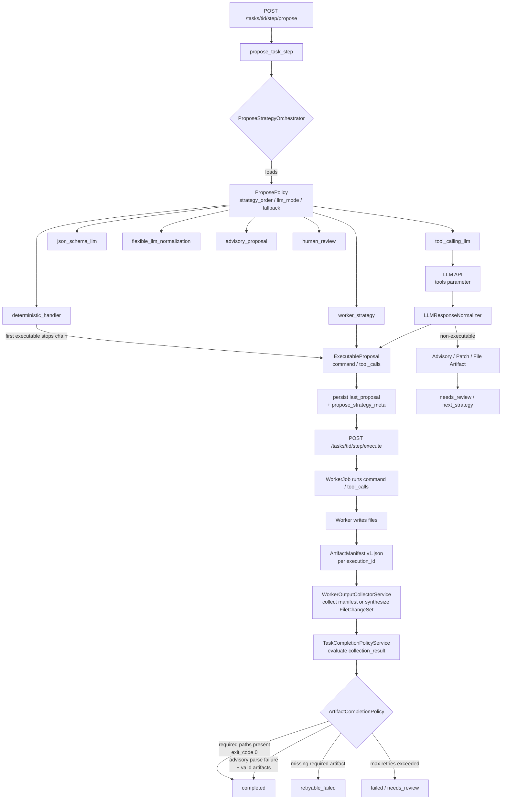

# Propose Strategy Orchestrator

## Original Root Cause

`ananta new-project 'Fibonacci API'` triggered this failure chain:

1. `propose_task_step` found no registered handler for `new_software_project`
2. Fell back to `_propose_single_task_step` → `run_sgpt_command` → LM Studio without real API `tools` parameter
3. Model returned Markdown prose, not a machine-parseable action
4. `parse_structured_action_payload` returned `None`
5. Repair path repeated the same call with the same weakness
6. Result: `autopilot_no_executable_step` / `llm_failed`

The root cause was not "never use LLMs". It was: **raw LLM text was used as executable control state** without normalization, schema enforcement, or a safe fallback path.

---

## Architecture: Task → Complete



---

## Strategy Chain

Strategies run in `ProposePolicy.strategy_order`. The first `executable` result stops the chain.

| Strategy | When it runs | Output |
|---|---|---|
| `deterministic_handler` | Always first; fast path via `TaskHandlerRegistry` | `ExecutableProposal` (command or tool_calls) |
| `worker_strategy` | When an OpenCode/Hermes/native worker is available | `ExecutableProposal` or `PatchProposalArtifact` |
| `tool_calling_llm` | When provider supports real `tools` API parameter | `ExecutableProposal` (tool_calls) |
| `json_schema_llm` | When provider supports `response_format.json_schema` | `ExecutableProposal` (command or tool_calls) |
| `flexible_llm_normalization` | Any LLM output, all formats accepted | `ExecutableProposal` or advisory artifact |
| `advisory_proposal` | Stores rich advisory for human review | `AdvisoryProposalArtifact` |
| `human_review` | Terminal: escalates to human | `needs_review` |

Declined result → next strategy. Advisory result → stored, advance. Failed/policy_denied → terminal.

---

## LLM Response Normalization

`LLMResponseNormalizer` accepts any text and returns a typed result:

| Input format | Output | Executable? |
|---|---|---|
| OpenAI-compatible `tool_calls` JSON | `ExecutableProposal.tool_calls` | Yes |
| Fenced JSON `{"command":...}` or `{"tool_calls":...}` | `ExecutableProposal` | Yes |
| Fenced shell ` ```bash ... ``` ` | `ExecutableProposal.command` | Yes |
| Unified diff | `PatchProposalArtifact` | No — needs apply/approval |
| File blocks ` ```filename.py ... ``` ` | `FileProposalArtifact` | No — needs apply/approval |
| Sub-task plan | `PlannerProposalArtifact` | No |
| Plain prose | `AdvisoryProposalArtifact` | No |

**Invariant:** Only `ExecutableProposal` (with `command` or `tool_calls`) may be passed to the execute step. Prose can never become runnable control state.

---

## Execute Boundary

`execute_task_step` only consumes `last_proposal` when it carries a normalized `ExecutableProposal`.

- Advisory, patch-only, file-proposal-only, or `needs_review` results **cannot** be executed directly.
- `last_proposal.routing.propose_strategy_meta` carries `attempted_strategies`, `selected_strategy`, `proposal_status`, and `normalization_format` for observability.

---

## Artifact-First Completion

Task completion is decided by **real outputs**, not model text:

1. Worker writes files and optionally an `ArtifactManifest.v1.json`
2. `WorkerOutputCollectorService` reads the manifest or synthesizes a `FileChangeSet` from workspace diff
3. `TaskCompletionPolicyService` evaluates `collection_result` via `ArtifactCompletionPolicy`
4. Advisory parse failure of the model's final text → **ignored** when artifacts are valid (`advisory_parse_failed_ignored` in `reason_codes`)
5. `TaskRetryPolicyService` classifies `REASON_ADVISORY_JSON_PARSE_FAILED` + `has_valid_artifacts=True` as **not retryable** — prevents infinite retry loops

---

## ProposePolicy Configuration

Store under `BlueprintRoleDB.config["propose_policy"]` or `TeamDB.config["propose_policy"]`.
Merge precedence: `system_default` → `project` → `blueprint_role` → `task_kind_override`.

```json
{
  "propose_policy": {
    "strategy_order": ["deterministic_handler", "tool_calling_llm", "flexible_llm_normalization"],
    "llm_mode": "assisted",
    "allow_legacy_sgpt": false,
    "allow_unstructured_text_as_execution": false,
    "max_strategy_attempts": 3,
    "on_all_strategies_declined": "needs_review"
  }
}
```

Bundle import/export (`/api/blueprints/<id>/bundle`) preserves the full `config` blob, so `propose_policy` survives round-trips.

---

## Key Files

| File | Role |
|---|---|
| `worker/core/propose.py` | `ExecutableProposal`, `ProposeStrategyResult`, all artifact types |
| `worker/core/propose_orchestrator.py` | `ProposeStrategyOrchestrator`, `ProposeContext`, `ProposeStrategy` ABC |
| `agent/services/propose_policy.py` | `ProposePolicy` dataclass with validation |
| `agent/services/propose_policy_service.py` | Policy merging (system → project → blueprint → task_kind) |
| `worker/core/deterministic_handler_strategy.py` | Wraps `TaskHandlerRegistry` |
| `worker/core/template_propose_handler.py` | Deterministic baseline for `new_software_project` / `coding` |
| `agent/services/llm_response_normalizer.py` | All 6 normalization paths |
| `agent/services/propose_strategies/llm_repair_strategy.py` | Bounded single-attempt repair |
| `worker/core/artifact_manifest.py` | Manifest builder/writer/loader |
| `worker/core/artifact_completion_policy.py` | Decision: completed / needs_review / retryable_failed |
| `agent/services/task_retry_policy_service.py` | Retry classification, advisory-parse-ignored rule |
| `agent/routes/tasks/artifact_status.py` | GET `/api/tasks/<tid>/artifact-status` — all observability fields |
