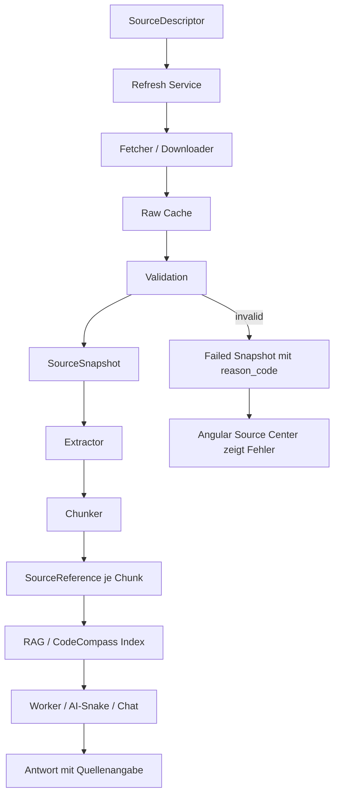
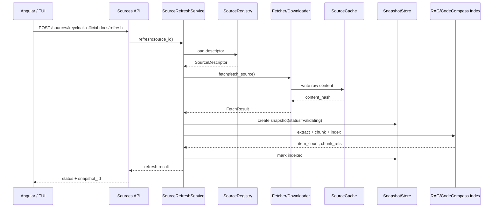
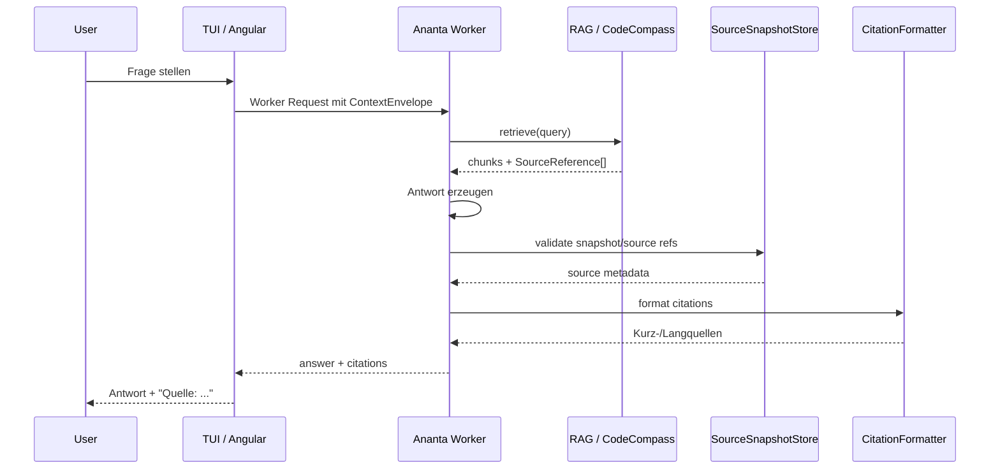
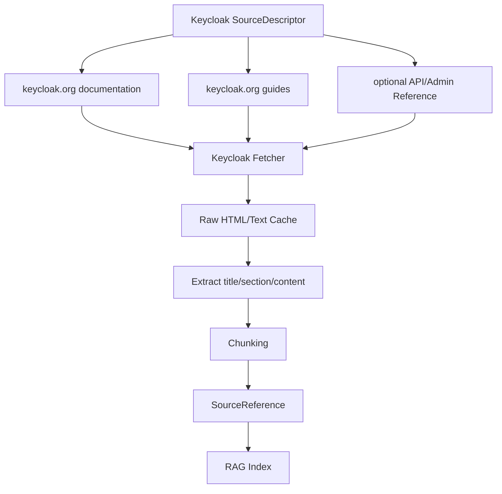
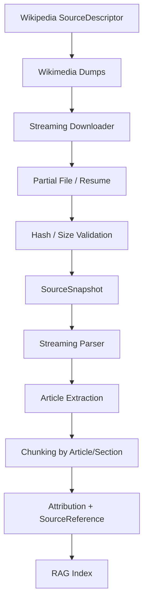
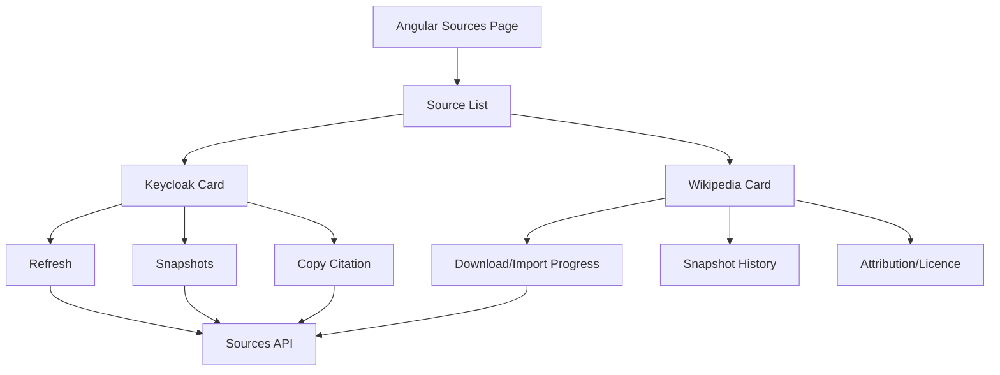
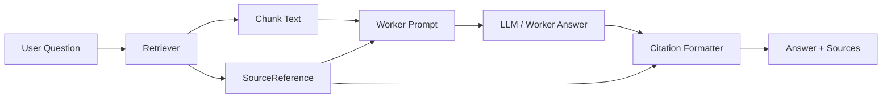
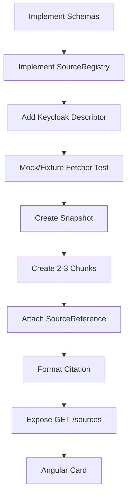

# Reliable Source Ingestion & Citation Flow

Ziel dieser Architektur ist simpel, aber wichtig:

> Ananta soll Wissen schnell nachladen können und trotzdem später sauber sagen können: **Woher kam diese Aussage genau?**

Dafür reicht es nicht, nur Text in einen Vektorindex zu werfen. Jeder importierte Wissensbrocken braucht eine nachvollziehbare Herkunft: Quelle, Snapshot, Hash, Lizenz, URL, Abschnitt, Zeitpunkt und Importzustand.

Diese Datei dokumentiert den geplanten Ablauf für Keycloak-Quellen und einen ersten Wikipedia/Wikimedia-Dump.

---

## 1. Kurzfassung

Ananta trennt künftig zwei Dinge, die oft fälschlich vermischt werden:

```text
fetch_source
  = technische Nachladequelle
  = schnell, cachebar, aktualisierbar
  = z. B. keycloak.org documentation URL oder Wikimedia dump URL

citation_source
  = dokumentierte Quellenangabe
  = stabil, zitierfähig, nachvollziehbar
  = z. B. Publisher, canonical URL, Lizenz, retrieved_at, snapshot_id, hash
```

Daraus entsteht pro Import ein unveränderlicher Snapshot.

```text
SourceDescriptor
  -> Fetch
  -> SourceSnapshot
  -> ExtractedDocument
  -> SourceChunk
  -> RAG/CodeCompass Index
  -> Answer with SourceReference
```

---

## 2. Ist-Zustand im Projekt

Aktuell existiert im Repo bereits die Planungs-TODO:

```text
todos/todo.reliable-source-ingestion-keycloak-wikipedia-angular.json
```

Diese definiert bereits die Zielrichtung:

- `SourceDescriptor-v1`
- `SourceSnapshot-v1`
- `SourceReference-v1`
- Keycloak als offizielle technische Quelle
- Wikipedia/Wikimedia als erster Dump
- schneller Refresh-Service
- Angular Source Center
- API-Endpunkte für Sources
- E2E-Tests mit Offline-Fixtures

### Noch nicht als fertiger Code vorhanden

Nach aktuellem Stand sind folgende Module als Soll-Zustand geplant, aber noch nicht als belastbare Implementierung vorhanden:

```text
agent/sources/source_registry.py
agent/sources/source_snapshot_store.py
agent/sources/source_refresh_service.py
agent/sources/source_cache.py
agent/sources/citation_formatter.py
agent/sources/keycloak_fetcher.py
agent/sources/keycloak_ingest.py
agent/sources/wikimedia_downloader.py
agent/sources/wikipedia_ingest.py
agent/routes/sources.py
schemas/sources/source_descriptor.v1.json
schemas/sources/source_snapshot.v1.json
schemas/sources/source_reference.v1.json
```

### Vorhandene Anschlussstellen

Die Architektur soll an bestehende Konzepte anschließen:

- `rag_helper/` bzw. CodeCompass als Kontext-/RAG-/Repo-Wissensschicht
- Worker-/Context-Konzepte wie `context_hash`, `retrieval_refs`, `ContextEnvelopeRef`
- Artefakte mit Referenzen statt rohem unkontrolliertem Text
- Angular-Frontend als sichtbare Bedienoberfläche
- Ananta-Worker als geregelter Ausführungsweg für AI-/RAG-Antworten

---

## 3. Soll-Zustand: Datenobjekte

### 3.1 SourceDescriptor

Der `SourceDescriptor` beschreibt **eine Quelle als Konfiguration**.

Beispiel: Keycloak-Dokumentation.

```json
{
  "schema_version": "source_descriptor.v1",
  "source_id": "keycloak-official-docs",
  "source_type": "keycloak_docs",
  "display_name": "Keycloak Official Documentation",
  "trust_level": "official_vendor_project",
  "fetch_source": {
    "url": "https://www.keycloak.org/documentation",
    "method": "GET",
    "expected_format": "html",
    "refresh_interval": "P7D",
    "cache_policy": "etag_or_hash"
  },
  "citation_source": {
    "canonical_url": "https://www.keycloak.org/documentation",
    "title": "Keycloak Documentation",
    "publisher": "Keycloak Project",
    "version_label": "detected-or-manual",
    "retrieved_at": null,
    "license_ref": "project-license-or-unknown",
    "citation_text": "Keycloak Project, Keycloak Documentation, retrieved from https://www.keycloak.org/documentation"
  },
  "snapshot_policy": {
    "immutable_snapshots": true,
    "deduplicate_by_content_hash": true
  }
}
```

Wichtig:

- `fetch_source` darf aktualisiert werden.
- `citation_source` beschreibt, wie später sauber zitiert wird.
- Importierte Chunks dürfen nie ohne `source_id` weitergegeben werden.

### 3.2 SourceSnapshot

Ein `SourceSnapshot` beschreibt **einen konkreten Importzeitpunkt**.

```json
{
  "schema_version": "source_snapshot.v1",
  "snapshot_id": "snap_keycloak_2026_05_26_abcd1234",
  "source_id": "keycloak-official-docs",
  "status": "indexed",
  "retrieved_at": "2026-05-26T18:30:00Z",
  "content_hash": "sha256:...",
  "metadata_hash": "sha256:...",
  "byte_size": 123456,
  "item_count": 42,
  "descriptor_hash": "sha256:..."
}
```

Snapshots sind unveränderlich.

Wenn Keycloak morgen aktualisiert wird, entsteht ein neuer Snapshot:

```text
snap_keycloak_2026_05_26_abcd1234
snap_keycloak_2026_06_02_ef567890
```

So kann eine alte Antwort auch später noch nachvollzogen werden.

### 3.3 SourceReference

Jeder Chunk im RAG/CodeCompass-Index enthält eine `SourceReference`.

```json
{
  "schema_version": "source_reference.v1",
  "source_id": "keycloak-official-docs",
  "snapshot_id": "snap_keycloak_2026_05_26_abcd1234",
  "chunk_id": "chunk_000123",
  "canonical_url": "https://www.keycloak.org/documentation",
  "title": "Keycloak Documentation",
  "section_title": "Server Administration",
  "license_ref": "project-license-or-unknown",
  "retrieved_at": "2026-05-26T18:30:00Z",
  "content_hash": "sha256:..."
}
```

Das ist der entscheidende Punkt:

> Nicht nur der Text wird gespeichert, sondern auch seine belegbare Herkunft.

---

## 4. Gesamtfluss



---

## 5. Ablauf: schnelles Nachladen

Schnelles Nachladen bedeutet:

1. Quelle ist bekannt.
2. Refresh-Service prüft, ob Quelle fällig ist.
3. Fetcher lädt nur, wenn nötig.
4. Inhalt wird gehasht.
5. Wenn Hash identisch: kein neuer Index nötig.
6. Wenn Hash neu: neuer Snapshot + Reindex.



---

## 6. Ablauf: Antwort mit sauberer Quellenangabe

Wenn später ein Worker, eine AI-Snake oder ein Chat eine Frage beantwortet, darf er nicht nur Text aus dem Index holen.

Er muss die SourceReferences mitführen.



Beispielausgabe im Chat:

```text
Keycloak verwendet Realms als getrennte Sicherheitsbereiche.

Quellen:
[1] Keycloak Documentation, snapshot snap_keycloak_2026_05_26_abcd1234,
    section: Server Administration, retrieved 2026-05-26
```

Oder kompakt in der AI-Snake:

```text
src: keycloak-official-docs@snap_keycloak_2026_05_26 +2
```

---

## 7. Keycloak-Quelle konkret

### 7.1 Ist

Aktuell gibt es im Repo die TODO für Keycloak-Quellenimport.

Noch zu bauen:

```text
sources/keycloak/source_descriptor.json
agent/sources/keycloak_fetcher.py
agent/sources/keycloak_ingest.py
tests/test_keycloak_fetcher.py
tests/test_source_ingestion_keycloak_e2e.py
```

### 7.2 Soll

Keycloak wird als offizielle Projektquelle behandelt.



### 7.3 Keycloak Chunk Beispiel

```json
{
  "chunk_id": "keycloak_docs_00042",
  "source_reference": {
    "source_id": "keycloak-official-docs",
    "snapshot_id": "snap_keycloak_2026_05_26_abcd1234",
    "canonical_url": "https://www.keycloak.org/documentation",
    "title": "Keycloak Documentation",
    "section_title": "Server Administration",
    "retrieved_at": "2026-05-26T18:30:00Z"
  },
  "content": "... extracted section text ..."
}
```

### 7.4 Warum Keycloak getrennt behandeln?

Keycloak ist für Ananta sicherheitsrelevant:

- OIDC
- Realms
- Clients
- Rollen
- Tokens
- Admin API
- Identity Provider
- Berechtigungs-/Login-Flows

Daher braucht Keycloak eine höhere Vertrauensklasse als zufällige Webseiten.

```text
trust_level: official_vendor_project
```

---

## 8. Wikipedia/Wikimedia Dump konkret

### 8.1 Ist

Aktuell ist der Wikipedia-Dump als TODO geplant.

Noch zu bauen:

```text
sources/wikipedia/source_descriptor.json
agent/sources/wikimedia_downloader.py
agent/sources/wikipedia_ingest.py
docs/sources/wikipedia_initial_dump.md
tests/fixtures/sources/wikipedia/
tests/test_source_ingestion_wikipedia_e2e.py
```

### 8.2 Soll

Wikipedia wird nicht wie eine kleine Webseite behandelt, sondern als große Dump-Quelle.



### 8.3 Erster sinnvoller Dump

Der erste Import sollte nicht sofort „alles maximal groß“ sein.

Empfohlenes MVP:

```text
1. kleiner Fixture-Dump im Repo für Tests
2. kleiner echter Wikimedia-Subset- oder Abstract-Dump
3. danach optional dewiki pages/articles
4. später enwiki oder weitere Sprachen
```

Warum?

- große Wikipedia-Dumps sind riesig
- Parsing dauert
- Fehlerhandling muss vorher stabil sein
- Attribution/Lizenz muss sauber funktionieren
- UI muss Fortschritt und Fehler darstellen können

### 8.4 Wikipedia Chunk Beispiel

```json
{
  "chunk_id": "dewiki_000000123_section_02",
  "source_reference": {
    "source_id": "wikimedia-wikipedia-initial-dump",
    "snapshot_id": "snap_dewiki_2026_05_26_abcd1234",
    "canonical_url": "https://de.wikipedia.org/wiki/Beispiel",
    "title": "Beispiel",
    "section_title": "Geschichte",
    "license_ref": "CC BY-SA / Wikimedia attribution required",
    "retrieved_at": "2026-05-26T18:30:00Z"
  },
  "content": "... extracted article section ..."
}
```

---

## 9. Angular Frontend: Source Center

Das Angular-Frontend soll nicht nur Daten importieren, sondern Quellen transparent sichtbar machen.

### 9.1 Ist

Es gab bereits Entwicklung im Angular-Frontend, auch im Smartphone/Android-Modus.

Die neue Source-Ansicht soll deshalb von Anfang an mobile-tauglich sein:

```text
client_surfaces/angular/src/app/sources/
```

Falls diese Struktur noch nicht existiert, soll sie neu angelegt werden.

### 9.2 Soll UI



### 9.3 Mobile Layout

Desktop:

```text
Sources Table
  Name | Type | Status | Snapshot | Last Refresh | Actions
```

Smartphone:

```text
[Keycloak Official Docs]
status: indexed
snapshot: snap_keycloak_...
last: 2026-05-26
[Refresh] [Citation] [Snapshots]

[Wikipedia Initial Dump]
status: downloading 34%
size: 1.2 GB
[Pause] [Details]
```

Acceptance:

- keine breite Tabelle auf Smartphone
- Cards statt horizontalem Scrollen
- große Dump-Aktionen mit Warnhinweis
- Attribution sichtbar
- Copy Citation möglich

---

## 10. Backend API

Geplante API:

```text
GET  /sources
GET  /sources/{source_id}
GET  /sources/{source_id}/snapshots
POST /sources/{source_id}/refresh
GET  /sources/{source_id}/citation
```

### 10.1 GET /sources

Antwort:

```json
{
  "sources": [
    {
      "source_id": "keycloak-official-docs",
      "display_name": "Keycloak Official Documentation",
      "source_type": "keycloak_docs",
      "trust_level": "official_vendor_project",
      "latest_snapshot_id": "snap_keycloak_2026_05_26_abcd1234",
      "latest_status": "indexed",
      "retrieved_at": "2026-05-26T18:30:00Z"
    }
  ]
}
```

### 10.2 GET /sources/{id}/citation

Antwort:

```json
{
  "source_id": "keycloak-official-docs",
  "snapshot_id": "snap_keycloak_2026_05_26_abcd1234",
  "short": "Keycloak Documentation, snapshot 2026-05-26",
  "long": "Keycloak Project, Keycloak Documentation, retrieved 2026-05-26, snapshot snap_keycloak_2026_05_26_abcd1234, content hash sha256:...",
  "canonical_url": "https://www.keycloak.org/documentation"
}
```

---

## 11. Code-Sollstruktur

```text
agent/
  sources/
    __init__.py
    source_registry.py
    source_snapshot_store.py
    source_refresh_service.py
    source_cache.py
    citation_formatter.py
    keycloak_fetcher.py
    keycloak_ingest.py
    wikimedia_downloader.py
    wikipedia_ingest.py

  routes/
    sources.py

schemas/
  sources/
    source_descriptor.v1.json
    source_snapshot.v1.json
    source_reference.v1.json

sources/
  keycloak/
    source_descriptor.json
  wikipedia/
    source_descriptor.json

docs/
  sources/
    reliable_sources.md
    keycloak.md
    wikipedia_initial_dump.md

client_surfaces/
  angular/
    src/app/sources/
      sources-page.component.ts
      sources-page.component.html
      sources-page.component.scss
      source-card.component.ts
      source-detail.component.ts
      source.service.ts
```

---

## 12. Antwortgenerierung mit Quellenkette

Wichtig ist die vollständige Kette:



Der Worker darf die Quellen nicht verlieren.

Falsch:

```json
{
  "answer": "Keycloak Realms trennen Sicherheitsbereiche."
}
```

Richtig:

```json
{
  "answer": "Keycloak Realms trennen Sicherheitsbereiche.",
  "source_refs": [
    {
      "source_id": "keycloak-official-docs",
      "snapshot_id": "snap_keycloak_2026_05_26_abcd1234",
      "chunk_id": "keycloak_docs_00042"
    }
  ]
}
```

Danach kann die UI daraus eine lesbare Quellenangabe machen.

---

## 13. Ist/Soll-Abgleich

| Bereich | Ist | Soll |
|---|---|---|
| Quellenmodell | TODO vorhanden | `SourceDescriptor`, `SourceSnapshot`, `SourceReference` implementiert |
| Keycloak | geplant | offizieller Fetcher + Chunker + Citation |
| Wikipedia | geplant | Streaming Dump Downloader + Parser + Attribution |
| Refresh | geplant | `SourceRefreshService` mit Hash/Dedupe |
| RAG-Verweise | teilweise konzeptionell | jeder Chunk trägt SourceReference |
| UI | Angular vorhanden, Source Center geplant | mobile-taugliche Sources-Ansicht |
| API | geplant | `/sources` Endpunkte |
| Tests | geplant | Offline-Fixture E2E für Keycloak und Wikipedia |
| Zitierfähigkeit | noch nicht umgesetzt | Antwort enthält source_refs + formatierte Quellen |

---

## 14. Minimaler erster Implementierungsschnitt

Der erste sinnvolle Schnitt sollte klein, aber vollständig sein.



### MVP-Akzeptanz

Ein einzelner Test muss beweisen:

```text
Keycloak Fixture
  -> SourceDescriptor geladen
  -> Snapshot erzeugt
  -> Chunk erzeugt
  -> SourceReference vorhanden
  -> Citation formatiert
  -> API liefert Quelle
```

Erst danach Wikipedia-Dump.

---

## 15. Warum das so wichtig ist

Ohne SourceReference weiß Ananta später nur:

```text
Irgendwo im Index stand etwas über Keycloak.
```

Mit SourceReference weiß Ananta:

```text
Diese Aussage basiert auf:
- Quelle: keycloak-official-docs
- Snapshot: snap_keycloak_2026_05_26_abcd1234
- Chunk: keycloak_docs_00042
- Abschnitt: Server Administration
- URL: https://www.keycloak.org/documentation
- Retrieved: 2026-05-26T18:30:00Z
- Hash: sha256:...
```

Das ist der Unterschied zwischen:

```text
KI behauptet etwas.
```

und:

```text
Ananta kann nachvollziehbar belegen, woher die Aussage kam.
```

---

## 16. Offene Designentscheidungen

Diese Punkte müssen beim Implementieren bewusst entschieden werden:

1. **Wikipedia Startdump**
   - Abstracts?
   - kleiner Testsubset?
   - dewiki pages/articles?
   - OpenZIM/Kiwix?

2. **Speicherbackend**
   - Dateien zuerst?
   - SQLite?
   - bestehende DB?

3. **Indexbackend**
   - bestehender CodeCompass/RAG-Index?
   - separater Knowledge-Index?

4. **Angular App Struktur**
   - neue Route `/sources`?
   - Integration in bestehende Knowledge-/CodeCompass-Seite?

5. **Lizenz-/Attributionstiefe**
   - Kurzform in Chat?
   - Langform in Detailpanel?
   - Exportierbare Quellenliste?

---

## 17. Umsetzungsempfehlung

Reihenfolge:

```text
1. Schemas bauen
2. SourceRegistry + SnapshotStore bauen
3. Keycloak Fixture E2E bauen
4. CitationFormatter bauen
5. API `/sources` bauen
6. Angular Source Center MVP bauen
7. echten Keycloak Refresh bauen
8. Wikipedia Fixture Parser bauen
9. kleinen echten Wikipedia/Wikimedia Dump importieren
10. großen Dump erst nach stabiler Streaming-/Progress-UI
```

Damit bekommt Ananta früh einen vollständigen, beweisbaren End-to-End-Flow, statt direkt an einem riesigen Wikipedia-Dump zu scheitern.
