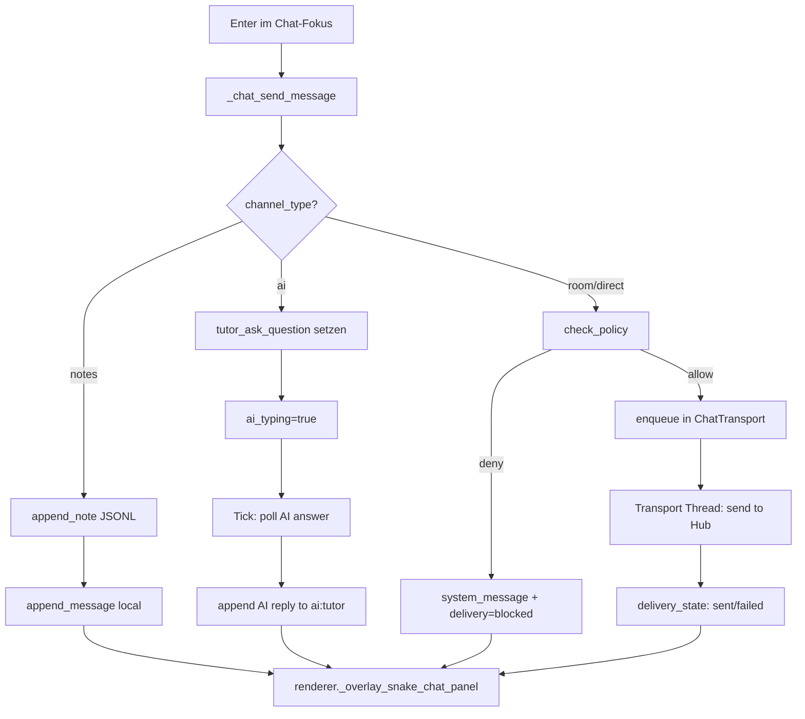
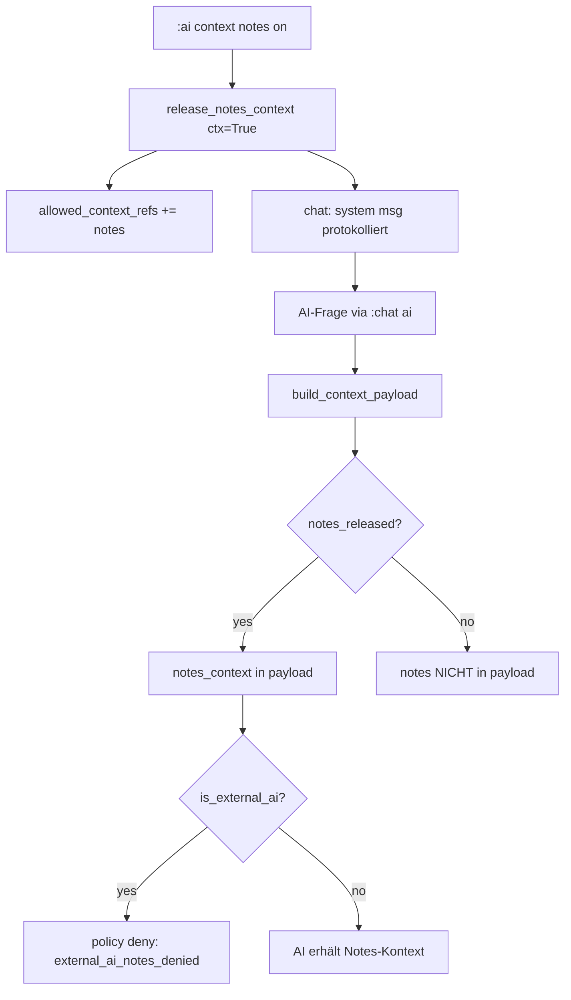
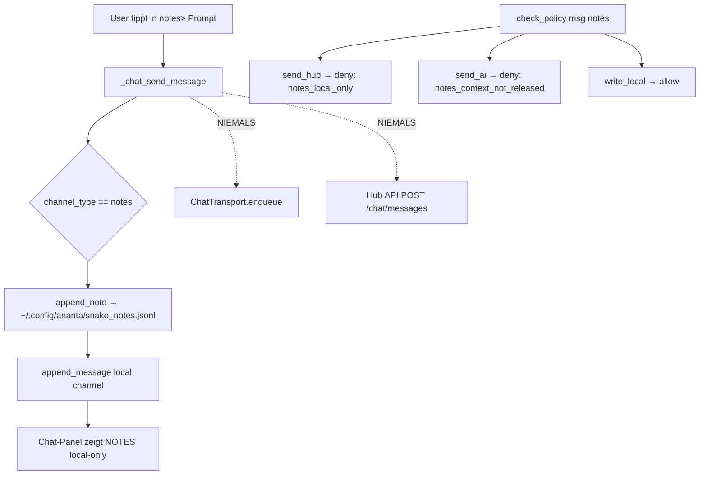

# Snake Chat + Notes – Architektur

## Module und Verantwortlichkeiten

| Modul | Verantwortung |
|-------|---------------|
| `chat_state.py` | Channel-Modell, ChatMessage-v1, Unread, Deduplication |
| `chat_policy.py` | Sicherheitsgrenzen, Sensitive-Data-Filter, Audit |
| `chat_transport.py` | Non-blocking Hub-Polling + Outbox-Queue mit Retry |
| `snake_notes.py` | JSONL-Persistenz für Notes (local-only) |
| `ai_snake_context.py` | AI-Kontext-Modell, Notes-Release, Artefakt-Ref |
| `renderer.py` | Chat-Panel-Rendering im Snake-Split-View |
| `interactive.py` | Tastatur-Routing, Chat-Focus, Notes-Ops im Tick |
| `commands.py` | `:chat`, `:notes`, `:channels`, `:ai context` |
| `agent/routes/snakes.py` | Hub-API: ChatMessage-v1, Cursor-Polling, ACK |

## Nachricht senden (input → policy → state → transport → render)

## AI-Kontextfreigabe (Notes → AI)

## Notes local-only Boundary

## Testmatrix

| Bereich | Datei | Tests |
|---------|-------|-------|
| Channel-Modell | `test_tui_snake_chat_state.py` | 32 Tests |
| Policy-Grenzen | `test_tui_snake_chat_policy.py` | 20 Tests |
| Hub-API Chat | `test_snakes_chat_api.py` | 14 Tests |
| E2E-Cast | `scripts/e2e/snake_chat_notes_e2e.py` | 70s, 7 Kapitel |

## Wichtige Invarianten

1. `channel_type == "notes"` → `visibility == "local_only"` → niemals in Transport-Queue
2. Notes-Nachrichten werden nur von `check_policy(msg, "write_local")` als `allow` bewertet
3. `is_external_ai=True` + notes → `deny: external_ai_notes_denied` (unabhängig von release)
4. Sensitive Patterns (tokens, passwords) werden am Boundary blockiert oder redacted
5. Audit-Events enthalten keinen vollständigen Nachrichtentext (nur `message_hash`)
6. Transport-Thread ist daemonized und blockiert weder Rendering noch Snake-Bewegung
