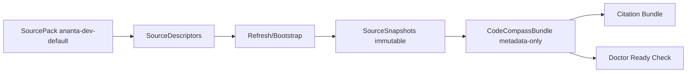
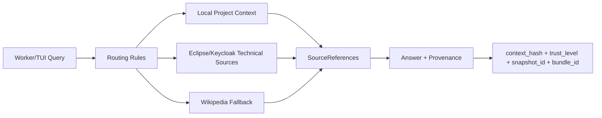
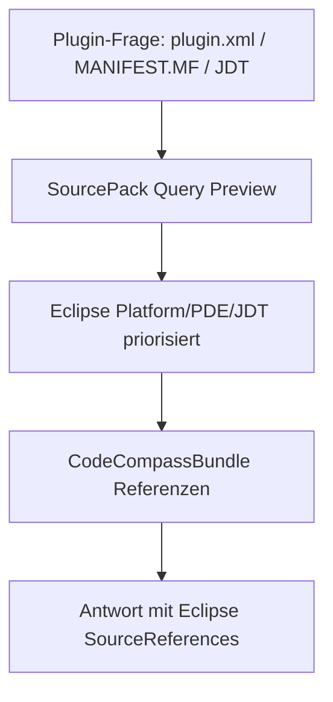

# SourcePack + CodeCompass Architektur

## Überblick

Der Flow bleibt hub-zentriert: Source Packs liefern verwaltete Quellen, Snapshots und Bundle-Metadaten; Worker konsumieren nur kontrollierte Referenzen.

## Flow 1: SourcePack -> Descriptor -> Snapshot -> CodeCompassBundle

## Flow 2: Worker Request -> Retrieval Routing -> SourceReferences -> Provenance

## Flow 3: Eclipse Plugin Development Context

## Prioritätsregeln

1. Lokale Projektquellen
2. Offizielle technische Quellen (Eclipse/Keycloak)
3. Allgemeines Wissen (Wikipedia) als Ergänzung

## Testmatrix

| Bereich | Testfokus |
|---|---|
| Schema/Descriptor | SourcePack-Schema, Eclipse/Keycloak/Wikipedia-Referenzen, duplicate source_id rejection |
| Fixture-Bootstrap | Offline, deterministisch, Snapshot- und Bundle-Erzeugung |
| Routing | SWT/JFace -> Eclipse, JDT AST -> JDT, Realm/OIDC -> Keycloak, Allgemein -> optional Wikipedia |
| E2E | CLI/TUI Bootstrap + Doctor + Query Preview mit SourceReferences/Provenance |
