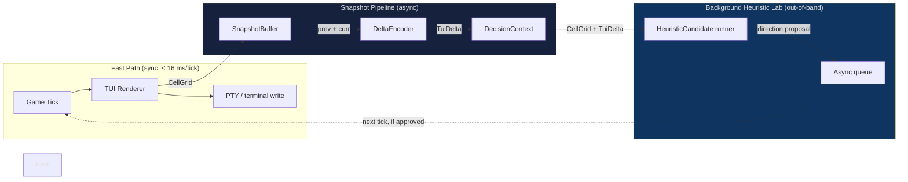
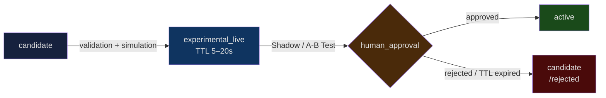

# TUI Snake — Background Heuristics Architecture

## Current State

The snake in the operator TUI is rendered via a fast render path that owns the
game loop entirely. The LLM is intentionally **not allowed to steer the snake
directly** — direct LLM control would introduce unbounded latency into a
real-time rendering loop.

The existing `DecisionContext` (see `client_surfaces/operator_tui/ai_snake_context.py`)
carries observation data, but it **lacks** the two primitives required for a
background heuristic lab:

- **CellGrid** — a deterministic, hashable snapshot of the full TUI screen.
  Without it, heuristics cannot reason about what is actually visible.
- **DirtyRegions** — per-frame deltas that identify which cells changed between
  ticks.  Without them, a background process must either poll the entire screen
  (expensive) or fly blind.

This gap means any heuristic candidate today can only see logical game state
(`body`, `direction`, `score`) but never the rendered surface.  The snapshot/
delta pipeline introduced by M01/M02 closes this gap.

---

## Fast Path vs. Background Heuristic Lab

Key invariant: the background heuristic lab **never writes into the game loop
directly**.  Proposals arrive via an async queue and are consumed at the next
safe tick boundary.  A TTL on every `experimental_live` heuristic ensures that
a stuck experiment cannot hold the snake indefinitely.

---

## Glossar

| Begriff | Definition |
|---------|-----------|
| snapshot | Vollständige CellGrid-Aufnahme des sichtbaren TUI-Screens zu einem Zeitpunkt |
| delta | Zelluläre Änderung zwischen zwei aufeinanderfolgenden Snapshots |
| semantic_overlay | Logische Panels, Artifacts, Mouse und Snake-Positionen, extrahiert aus OperatorState |
| heuristic_candidate | LLM-generierter DSL-Vorschlag, der noch nicht aktiviert ist |
| experimental_live | Zeitlich begrenzter Test einer neuen Heuristik mit hartem TTL-Limit |

---

## Relevante Code-Dateien

| Datei | Zweck |
|-------|-------|
| `client_surfaces/operator_tui/snapshot.py` | CellGrid-Modell, ANSI-Strip, deterministisches Hashing |
| `client_surfaces/operator_tui/snapshot_delta.py` | DeltaEncoder, TuiDelta, DirtyRegion, apply() |
| `client_surfaces/operator_tui/ansi_replay.py` | ANSI-State-Tracker für Cast-Replay → CellGrid |
| `client_surfaces/operator_tui/semantic_overlay.py` | SemanticOverlay aus OperatorState, PanelBBox, SemanticEntity |
| `client_surfaces/operator_tui/ai_snake_context.py` | Bestehender DecisionContext (zu erweitern mit CellGrid/DirtyRegions) |
| `client_surfaces/operator_tui/renderer.py` | Fast-Path-Renderer (erzeugt rendered lines, Feed zu snapshot.py) |
| `heuristics/FORMAT_POLICY.md` | Heuristic-Format-Policy inkl. Glossar |
| `schemas/tui/tui_snapshot.v1.json` | JSON Schema für TuiSnapshot |
| `schemas/tui/tui_delta.v1.json` | JSON Schema für TuiDelta |

---

## Gerenderte Demo-Casts vs. echte PTY-E2E-Casts

Diese Unterscheidung ist wichtig für den Testaufbau:

**Gerenderte Demo-Casts** (`tests/operator_tui/`)
- Basieren auf vorberechneten `list[str]`-Outputs des Renderers.
- ANSI-Codes können enthalten sein, werden aber via `_ANSI_STRIP` normalisiert.
- Deterministisch und schnell — geeignet für Unit-Tests des CellGrid-Modells.
- Kein echtes PTY, kein Prozess-Spawn.

**Echte PTY-E2E-Casts** (`tests/e2e/`)
- Schreiben tatsächlich in ein Pseudo-Terminal (via `pexpect`, `ptyprocess` o.ä.).
- Lesen rohe Byte-Streams zurück — ANSI-Sequenzen sind Teil des Outputs.
- `AnsiReplayState` ist das Bindeglied: Er konsumiert den rohen PTY-Stream und
  produziert ein `CellGrid`, das mit dem Demo-Cast-Grid verglichen werden kann.
- Langsamer, abhängig von der Laufzeitumgebung — nur in E2E-Suites ausführen.

Demo-Casts sind für die Snapshot/Delta-Pipeline-Tests ausreichend.
PTY-E2E-Casts sind nötig, sobald Timing-Verhalten oder Terminal-Emulation
selbst Teil des Testobjekts ist.

---

## DSL v2 Lebenszyklus

Schritte:
1. **candidate** — LLM-generierter DSL-Vorschlag, gespeichert in `heuristics/candidates/`
2. **experimental_live** — Nach bestandener Validation + Simulation; läuft maximal 20 Sekunden im Shadow Mode
3. **Shadow / A-B Test** — `HeuristicExperimentRunner` berechnet Entscheidungen parallel, ohne sichtbare Snake-Beeinflussung
4. **human_approval** — `HeuristicActivationGate.activate()` erfordert manuellen Eingriff
5. **active** — Stabil aktiv; kein automatischer Übergang aus `experimental_live`

---

## Sichere Defaults

| Einstellung | Default | Beschreibung |
|-------------|---------|--------------|
| `LabConfig.enabled` | `False` | Background Lab ist deaktiviert |
| `LabConfig.auto_experiment_mode` | `False` | Shadow-only; kein automatisches Experimental |
| LLM im Fast Path | verboten | `decide()` ruft NIE LLM auf |
| `experimental_live` TTL | max 20s | Hartes Limit, läuft automatisch ab |
| Übergang zu `active` | manuell | Erfordert `HeuristicActivationGate.activate()` |

---

## Hauptdateien (M07–M09)

| Datei | Zweck |
|-------|-------|
| `agent/services/heuristic_runtime/heuristic_experiment_runner.py` | Shadow-Mode A/B-Test Runner |
| `agent/services/heuristic_runtime/metrics.py` | UI-Latenz, LLM-Latenz, Jitter, Rollback-Count |
| `agent/services/heuristic_runtime/background_heuristic_lab.py` | LLM-Kandidaten-Erzeugung im Hintergrund |
| `agent/services/heuristic_runtime/heuristic_simulator.py` | DSL-Kandidaten-Simulation gegen Snapshots |
| `agent/services/heuristic_runtime/heuristic_proposal_store.py` | Kandidaten-Speicherung (niemals `active`) |
| `agent/services/heuristic_runtime/heuristic_registry_service.py` | Registry mit `experimental_live` Support |
| `agent/services/heuristic_runtime/lease_reevaluation_service.py` | TTL-Leases inkl. `experimental_live` |
| `client_surfaces/operator_tui/snapshot.py` | CellGrid-Modell |
| `client_surfaces/operator_tui/snapshot_delta.py` | DeltaEncoder, TuiDelta |
| `client_surfaces/operator_tui/ansi_replay.py` | ANSI-Stream zu CellGrid |
| `client_surfaces/operator_tui/renderer.py` | Heuristik-Status-Badge in Score-Header |
