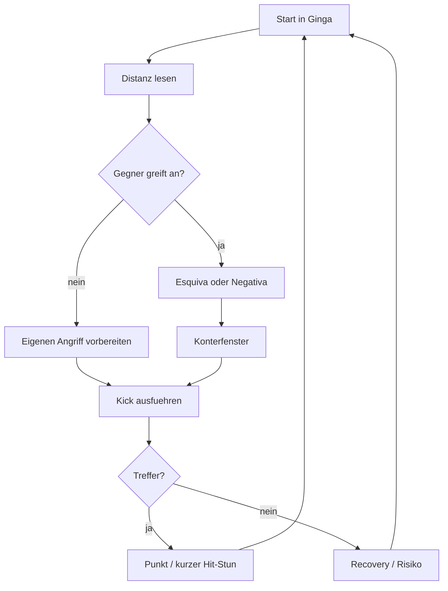
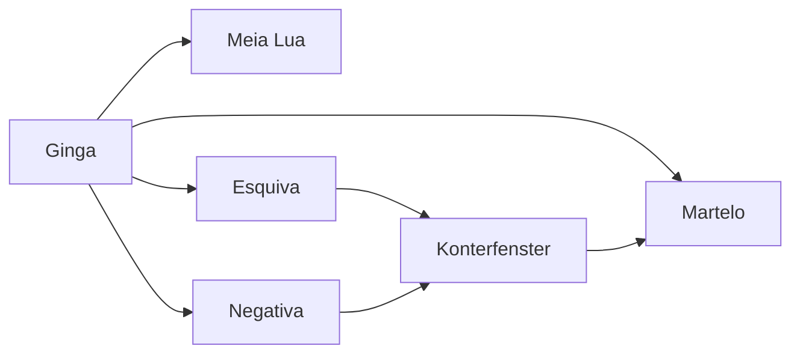
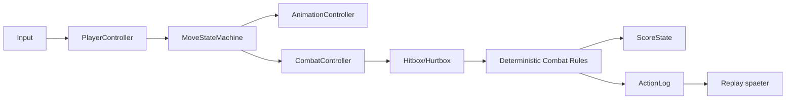
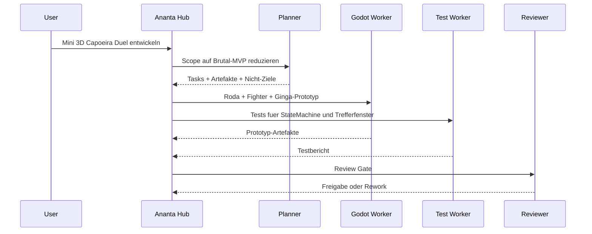

# Ananta Capoeira Duel

**Status:** neues Mini-Spiel-/Prototyp-Szenario fuer Ananta  
**Zweck:** extrem kleiner 3D-Capoeira-Duell-Prototyp als kontrolliertes Entwicklungsbeispiel  
**Technikziel:** zuerst Godot 4, spaeter optional Web/VR/MR  
**Scope-Regel:** erst Spielgefuehl beweisen, dann Content erweitern.

## 1. Grundidee

`Ananta Capoeira Duel` ist ein sehr kleiner 3D-Fighting-Prototyp: 1 gegen 1 in einer Roda, inspiriert von Street Fighter, aber nicht als klassischer Combo-Pruegler. Der Kern liegt auf Capoeira-typischen Bewegungen: Ginga, Distanz, Rhythmus, Ausweichen und kurze Trefferfenster.

```text
Nicht: 20 Figuren, 100 Moves, Story, Online, perfekte Animationen.
Sondern: Ginga + Distanz + Esquiva + ein sauberer Kick.
```

## 2. Brutal-MVP

| Bereich | Entscheidung |
| --- | --- |
| Spieler | 1 Spieler gegen Dummy, spaeter lokal 2 Spieler |
| Arena | kleine runde 3D-Roda |
| Kamera | seitlich/leicht erhoeht, Street-Fighter-lesbar, aber mit Tiefe |
| Engine | Godot 4 |
| Figuren | Platzhalter-Kapseln oder Low-Poly-Dummies |
| Animation | einfache Keyframe-/Tween-Animationen, noch kein Mocap |
| Moves | Ginga, Meia Lua, Martelo, Esquiva, Negativa |
| Kampf | Hitbox/Hurtbox, Punkte statt komplexem Lebensbalken |
| Ziel | pruefen, ob Capoeira-Bewegung als kleines 3D-Duell Spass macht |

## 3. Bewusst nicht im ersten Schritt

- Online-Multiplayer
- KI-Gegner mit Taktik
- Story/Kampagne
- viele Charaktere
- komplexe Combos
- Motion Capture
- realistische Physik
- VR/MR/Quest
- Musik-/Rhythmus-System als Pflichtmechanik
- Asset-Polish
- Shop/Progression

Diese Themen bleiben geparkt, bis der Kern spielbar ist.

## 4. Kern-Loop



## 5. Minimaler Move-Satz



| Move | Rolle im MVP |
| --- | --- |
| Ginga | Grundrhythmus, Idle, Bewegungsbasis |
| Meia Lua | weiter Rundtritt, gut sichtbar, laengeres Risiko |
| Martelo | schneller Kick, kuerzeres Fenster |
| Esquiva | hohes/mittleres Angriffsfeld ausweichen |
| Negativa | tiefes Ausweichen, Vorbereitung fuer Konter |

## 6. Technische Zielarchitektur



Wichtig: Kampfregeln bleiben deterministisch. Die Animation darf visuell weich sein, aber Trefferfenster muessen klar und testbar bleiben.

## 7. Godot-Prototyp-Struktur

```text
prototypes/ananta-capoeira-duel/
  project.godot
  scenes/
    Main.tscn
    RodaArena.tscn
    Fighter.tscn
    DummyOpponent.tscn
  scripts/
    player_controller.gd
    move_state_machine.gd
    combat_controller.gd
    hitbox.gd
    hurtbox.gd
    score_state.gd
    action_log.gd
  tests/
    test_move_state_machine.gd
    test_hit_detection.gd
    test_score_rules.gd
```

## 8. Ananta-Integration als Entwicklungsbeispiel

Der Prototyp soll nicht blind gebaut werden. Ananta soll ihn wie ein kontrolliertes Projekt behandeln.



## 9. Erfolgskriterien fuer den ersten Prototyp

Der erste MVP ist erfolgreich, wenn:

- eine kleine 3D-Roda laeuft,
- eine Figur kontrollierbar ist,
- Ginga als Grundzustand sichtbar ist,
- mindestens ein Kick mit Hitbox funktioniert,
- mindestens eine Esquiva/Hurtbox-Verschiebung funktioniert,
- ein Dummy getroffen werden kann,
- Punkte deterministic gezaehlt werden,
- der Scope nicht in Content/Online/VR explodiert.

## 10. Leitregel

Bis der Mini-Prototyp Spass macht:

> Keine neuen Figuren, keine neuen Systeme, keine Polishing-Orgie.

Erlaubt sind:

- Bewegungsgefuehl verbessern,
- Timing-Fenster anpassen,
- Trefferlogik klaeren,
- Tests ergaenzen,
- schlechte Moves streichen.

Nicht erlaubt:

- neue Charaktere,
- Online,
- Story,
- komplexe Combos,
- VR/MR,
- grosses Asset-System.
