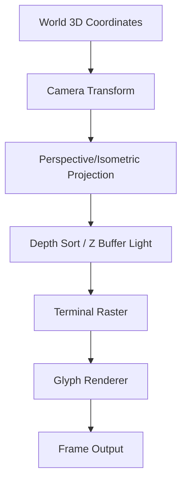
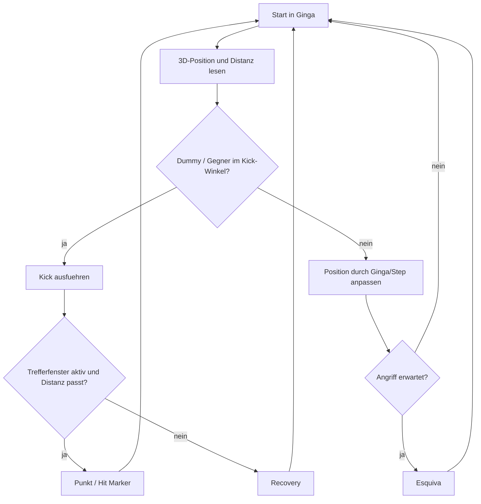
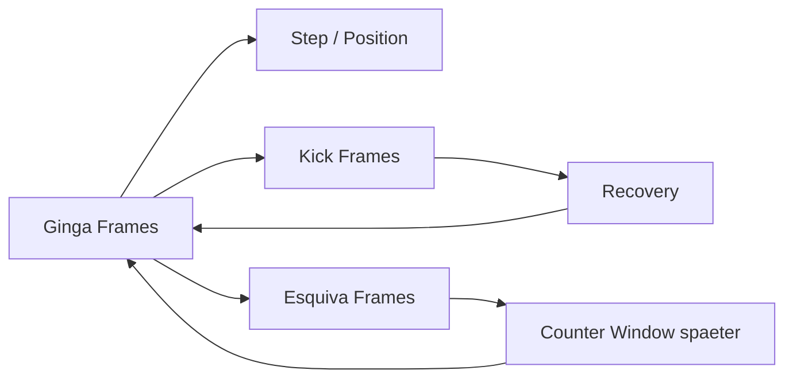
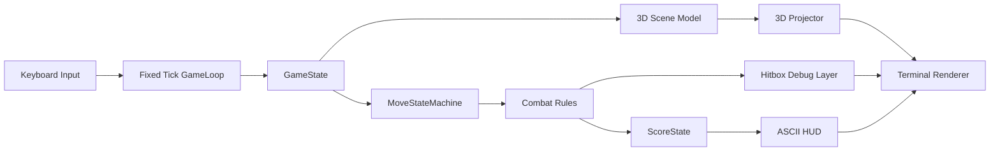
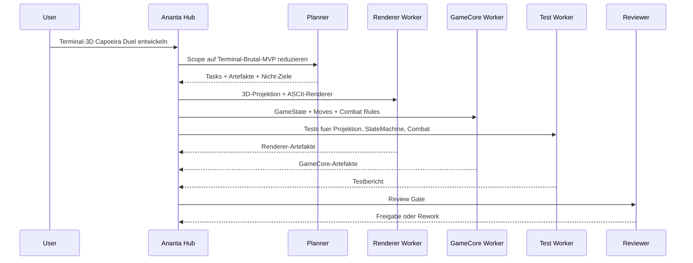

# Ananta Capoeira Terminal Duel

**Status:** neues Mini-Spiel-/Prototyp-Szenario fuer Ananta  
**Zweck:** extrem kleiner 3D-Terminal-/ASCII-Capoeira-Duell-Prototyp als kontrolliertes Entwicklungsbeispiel  
**Technikziel:** zuerst Terminal/TUI mit 3D-Projektion, spaeter optional echter 3D-Renderer  
**Scope-Regel:** erst 3D-Terminal-Spielgefuehl beweisen, dann Engine/Assets/VR.

## 1. Grundidee

`Ananta Capoeira Terminal Duel` greift die bestehende 3D-Terminal-/ASCII-Idee auf. Es ist kein Godot-First-Projekt. Der erste Prototyp soll im Terminal laufen und eine kleine 3D-Roda mit ASCII-/Unicode-Figuren darstellen.

Die Idee ist: Street-Fighter-artiges Duell, aber als stilisierte Terminal-3D-Simulation mit Capoeira-Bewegungen.

```text
Nicht: Godot-Game, Asset-Pipeline, VR, komplexe Engine.
Sondern: Terminal-3D-Roda + Ginga + Distanz + Esquiva + Kick.
```

## 2. Brutal-MVP

| Bereich | Entscheidung |
| --- | --- |
| Darstellung | Terminal/TUI mit ASCII/Unicode |
| 3D | einfache eigene 3D-zu-2D-Projektion |
| Spieler | 1 Spieler gegen Dummy |
| Arena | kleine runde Roda als projizierter Kreis/Bodenraster |
| Kamera | feste isometrische oder seitlich erhoehte Terminal-Kamera |
| Figuren | ASCII-/Unicode-Skelett oder einfache Glyph-Silhouette |
| Animation | Frame-basierte ASCII-Keyframes |
| Moves | Ginga, ein Kick, eine Esquiva |
| Kampf | deterministische Distanz-/Winkel-/Hitbox-Regeln |
| Ziel | pruefen, ob Capoeira-Bewegung im Terminal lesbar und spielbar wird |

## 3. Bewusst nicht im ersten Schritt

- Godot/Unity/Unreal
- echte 3D-Modelle
- Motion Capture
- VR/MR/Meta Quest
- Online-Multiplayer
- KI-Gegner mit Taktik
- Story/Kampagne
- komplexe Combos
- realistische Physik
- Asset-Polish
- Musik-/Rhythmus-System als Pflichtmechanik

Diese Themen bleiben geparkt, bis der Terminal-Core funktioniert.

## 4. Terminal-3D-Core



Wichtig: Der Renderer muss klein bleiben. Kein vollstaendiger 3D-Engine-Nachbau. Es reicht ein stabiler Mini-Renderer fuer Punkte, Linien, Kreise, einfache Figuren und Hitbox-Debug.

## 5. Kern-Loop



## 6. Minimaler Move-Satz



| Move | Rolle im MVP |
| --- | --- |
| Ginga | animierter Grundrhythmus, leichte Positionsverschiebung |
| Kick | erster lesbarer Angriff, z. B. Martelo oder Meia Lua stark vereinfacht |
| Esquiva | Ausweichen durch Pose-/Hurtbox-Aenderung |

## 7. Technische Zielarchitektur



Kampf und Rendering bleiben getrennt. Der Renderer zeigt nur den Zustand. Die Regeln entscheiden deterministisch.

## 8. Vorgeschlagene Python-Struktur

```text
prototypes/ananta-capoeira-terminal-duel/
  README.md
  pyproject.toml
  src/ananta_capoeira_terminal_duel/
    main.py
    game_loop.py
    input.py
    state.py
    moves.py
    combat.py
    projection.py
    renderer.py
    glyphs.py
    hud.py
    action_log.py
  tests/
    test_projection.py
    test_move_state_machine.py
    test_combat_rules.py
    test_renderer_smoke.py
```

Moegliche Libraries, aber optional:

- `rich` fuer Terminal-Ausgabe,
- `textual` spaeter fuer TUI,
- zuerst notfalls plain ANSI.

## 9. Ananta-Integration als Entwicklungsbeispiel



## 10. Erfolgskriterien fuer den ersten Prototyp

Der erste MVP ist erfolgreich, wenn:

- ein Terminal-Fenster eine kleine 3D-Roda zeigt,
- 3D-Punkte/Objekte stabil in 2D-Terminalkoordinaten projiziert werden,
- eine Fighter-Glyph-Figur sichtbar und steuerbar ist,
- Ginga als einfache Frame-Animation sichtbar ist,
- ein Kick als Animation/Hitbox-Debug sichtbar ist,
- eine Esquiva als Pose-/Hurtbox-Aenderung sichtbar ist,
- Treffer deterministisch nach Distanz/Winkel/Fenster erkannt werden,
- Punkte/HUD im Terminal angezeigt werden,
- Tests fuer Projektion, MoveState und Combat existieren.

## 11. Leitregel

Bis der Terminal-Prototyp Spass macht:

> Keine Engine-Flucht.

Erlaubt sind:

- bessere ASCII-Lesbarkeit,
- stabilere Projektion,
- bessere Keyframes,
- klarere Hitbox-Debug-Ausgabe,
- Tests ergaenzen,
- schlechte Moves streichen.

Nicht erlaubt:

- Godot-Umstieg als Ausrede,
- neue Charaktere,
- Online,
- Story,
- VR/MR,
- grosses Asset-System.
