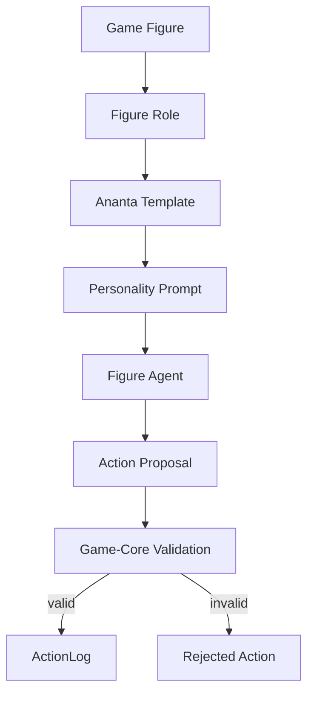
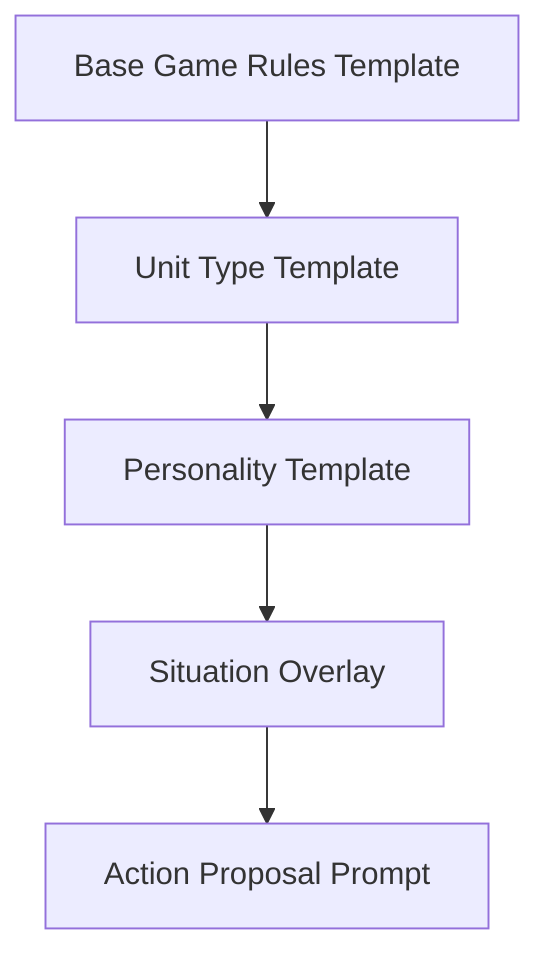
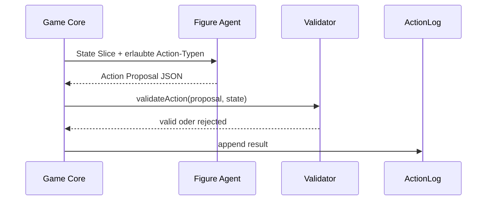

# Figuren als KI-Agenten im Ananta Strategie-Game

**Status:** Konzept- und Backlog-Modul  
**Einordnung:** Nicht Teil des Brutal-MVP. Spaeteres Showcase-Level nach stabilem Game-Core, ActionLog und Replay.  
**Kernidee:** Jede Spielfigur kann optional eine eigene KI-Agenten-Persoenlichkeit erhalten. Diese Persoenlichkeit wird nicht als paralleles Spielsystem gebaut, sondern ueber Anantas bestehendes Template-/Blueprint-/Team-Modell beschrieben.

## 1. Warum diese Idee wichtig ist

Das Strategie-Game soll nicht nur mit Ananta entwickelt werden. Es kann spaeter Ananta im Spiel selbst abbilden:

```text
Spieler fuehrt Fraktion
Figuren haben Rollen
Rollen haben Persoenlichkeiten
Persoenlichkeiten kommen aus Templates
Entscheidungen bleiben durch Game-Core-Regeln begrenzt
```

Damit wird das Spiel zu einer Art Mini-Agentenwelt. Jede Figur kann Vorschlaege machen, warnen, planen oder begruenden. Die Figur darf aber niemals die deterministischen Spielregeln umgehen.

## 2. Verbindung zum bestehenden Ananta-System

Ananta hat bereits wichtige Bausteine, die hier wiederverwendet werden koennen:

- `TemplateDB` mit `prompt_template`,
- `RoleDB` mit optionalem `default_template_id`,
- `BlueprintRoleDB` mit `template_id` und `config`,
- `TeamMemberDB` mit `custom_template_id`,
- Team-/Blueprint-Import und Instanziierung.

Die Spielfiguren sollten daher nicht als neue isolierte Agentenklasse gedacht werden. Besser:

```text
GameFigure -> FigureRole -> Ananta Template -> Agent Personality
```

## 3. Grundprinzip

Eine Figur bekommt keine freie Macht ueber den GameState. Sie bekommt nur eine Persona und darf innerhalb erlaubter Spielaktionen Vorschlaege erzeugen.



Wichtig:

- Der Agent erzeugt Vorschlaege.
- Der Game-Core validiert deterministisch.
- Nur valide Actions duerfen in den State.
- Ungueltige Agentenvorschlaege werden protokolliert, aber nicht ausgefuehrt.

## 4. Beispiel: Figurentypen und Persoenlichkeit

| Figur | Moegliche Persona | Spielrolle |
| --- | --- | --- |
| Naga | defensiv, bindend, kontrollierend | Einkreisung, Gebietskontrolle |
| Rishi | vorsichtig, analytisch, spirituell | Flucht, Beratung, Stabilisierung |
| Deva | aggressiv, ehrenhaft, riskant | Angriff, Druck, Entscheidungsschlag |
| Ashram | nicht Figur, aber moeglicher Beratungsanker | Schutz, Ordnung, Regeneration |

Beispielhafte Template-Idee:

```text
Du bist ein Naga-Agent im Ananta Strategie-Game.
Dein Ziel ist Gebietskontrolle, Einkreisung und Schutz wichtiger Felder.
Du darfst nur Aktionen vorschlagen, die im aktuellen GameState erlaubt sein koennen.
Begruende kurz, warum deine vorgeschlagene Aktion gut ist.
Erfinde keine Regeln.
Wenn keine gute Aktion existiert, schlage PASS oder END_TURN vor.
```

## 5. Template-Schichten

Eine Figurenpersoenlichkeit sollte nicht alles in ein einziges Prompt kippen. Sinnvoll ist eine Schichtung:



Schichten:

1. **Base Game Rules Template**  
   Enthalt nur erlaubte Grundregeln und Nicht-Ziele.

2. **Unit Type Template**  
   Beschreibt Naga, Rishi, Deva usw.

3. **Personality Template**  
   Beschreibt Spielstil: defensiv, aggressiv, vorsichtig, opportunistisch.

4. **Situation Overlay**  
   Enthalt aktuellen GameState-Ausschnitt, erlaubte Actions und Zielkontext.

5. **Action Proposal Prompt**  
   Fordert strukturierte Ausgabe, z. B. JSON mit Action-Vorschlag.

## 6. Keine freie Agenten-Autonomie im Game-Core

Die Figur darf nicht direkt den Zustand aendern.



Das ist wichtig fuer:

- deterministische Tests,
- Replay,
- Audit,
- Debugging,
- Schutz gegen erfundene Regeln,
- klare Trennung zwischen LLM-Vorschlag und Spielzustand.

## 7. Game-State-Skizze

```ts
type FigureAgentBinding = {
  figureId: string;
  enabled: boolean;
  templateId?: string;
  blueprintRoleId?: string;
  personalityProfileId?: string;
  llmBackend?: "local" | "remote" | "disabled";
  maxProposalTokens?: number;
  proposalMode: "suggest_only" | "auto_if_valid";
};

type FigureAgentProposal = {
  figureId: string;
  turn: number;
  proposalId: string;
  actionType: "MOVE" | "ATTACK" | "RECRUIT" | "END_TURN" | "NAGABANDA_CHECK";
  payload: Record<string, unknown>;
  reason: string;
  confidence?: number;
};

type FigureAgentDecisionLog = {
  proposal: FigureAgentProposal;
  validationStatus: "valid" | "rejected";
  rejectionReason?: string;
  applied: boolean;
};
```

## 8. Modi

### 8.1 Suggest-only

Die Figur macht nur Vorschlaege. Der Spieler entscheidet.

```text
Agent: "Ich wuerde Naga N1 auf Feld H07 bewegen, weil damit Deva D2 blockiert wird."
Spieler: akzeptiert oder ignoriert.
```

### 8.2 Auto-if-valid

Die Figur darf automatisch handeln, aber nur wenn `validateAction` erfolgreich ist und der Modus explizit aktiviert wurde.

```text
Agent Proposal -> validateAction -> ActionLog
```

Dieser Modus gehoert nicht in den ersten Core.

### 8.3 Advisor Mode

Ein Agent berät nicht als Figur, sondern als Fraktionsberater.

```text
Rishi Advisor: "Dein Zentrum ist offen. Sichere zuerst Meru statt sofort anzugreifen."
```

## 9. Verbindung zu Ananta-Blueprints

Spaeter kann man ein Figuren-Agenten-Team als Blueprint abbilden:

```text
TeamBlueprint: Ananta Game Figure Agents
Roles:
- Naga Strategist
- Rishi Advisor
- Deva Commander
- Economy Steward
- Rules Judge
Artifacts:
- action_proposals.json
- rejected_actions.json
- replay_log.json
- personality_report.md
```

Damit wird das Spiel selbst zu einem Showcase fuer Anantas Template-System.

## 10. Sicherheits- und Scope-Regeln

Figuren-Agenten duerfen erst aktiv werden, wenn:

1. Brutal-MVP-Regeln dokumentiert sind.
2. GameState und validateAction beschrieben sind.
3. ActionLog und Replay geplant sind.
4. Mindestens ein Papier-Playtest ausgewertet wurde.
5. Template-Nutzung klar von Game-State-Mutation getrennt ist.

Nicht erlaubt:

- Agent aendert GameState direkt.
- Agent erfindet neue Regeln.
- Agent bekommt vollstaendigen Projekt-/Repo-Kontext ohne Grund.
- Agent nutzt Remote-LLM ohne explizite Backend-/Policy-Entscheidung.
- Agent uebergeht Review- oder Validation-Gates.

## 11. Warum das fuer Ananta stark ist

Dieses Modul zeigt Ananta doppelt:

1. **Ananta entwickelt das Spiel kontrolliert.**
2. **Das Spiel nutzt Anantas Template-/Agentenidee als Spielmechanik.**

Dadurch entsteht ein sehr gutes Showcase-Bild:

```text
Ananta orchestriert Agenten,
und im Spiel sieht man Agenten als Figuren,
aber beide Ebenen bleiben durch Regeln, Templates,
Validation und Audit kontrolliert.
```

## 12. Definition of Done fuer das Konzept

Das Konzept ist bereit fuer spaetere Umsetzung, wenn:

- jede Figuren-Agenten-Persona ueber Template/Blueprint statt Sonderlogik beschrieben ist,
- Agenten nur Action-Proposals erzeugen,
- der Game-Core deterministisch validiert,
- rejected proposals protokolliert werden,
- Suggest-only als erster Modus definiert ist,
- Auto-if-valid klar als spaeterer Modus markiert ist,
- lokale/remote LLM-Nutzung ueber Policy und Backend-Konfiguration trennbar ist.
