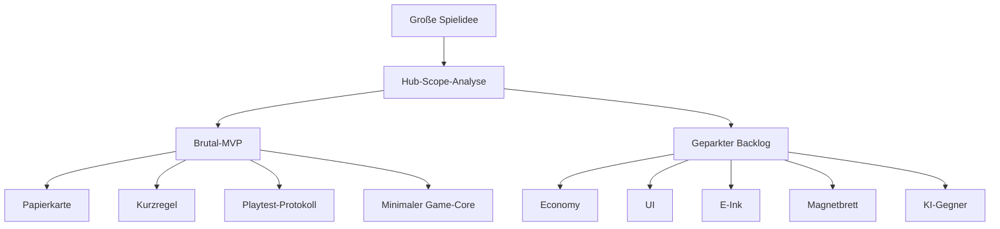
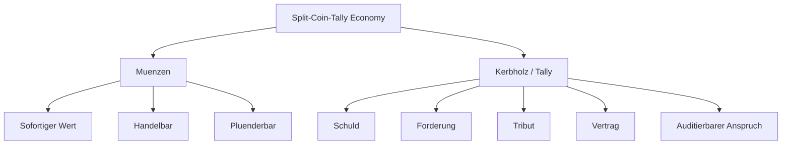
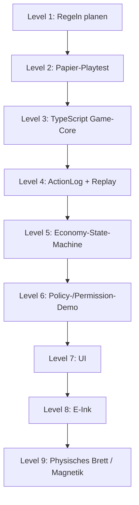
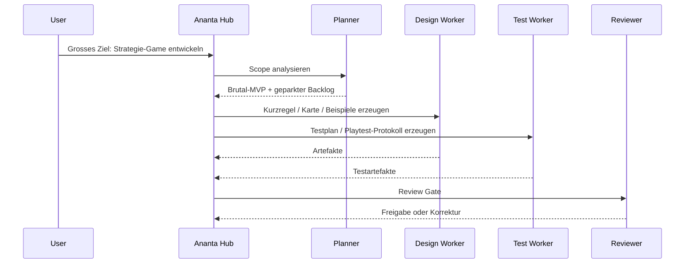

# Ananta Strategie-Game als Plattform-Showcase

**Status:** Zentrale Einordnung fuer das Spielbeispiel im Ananta-Hauptprojekt  
**Rolle:** Showcase, Entwicklungsbeispiel und Stresstest fuer Ananta selbst  
**Wichtig:** Das Spiel ist nicht als ungeplanter zweiter Produktstrang gedacht. Es ist ein kontrolliertes Beispiel, um Anantas Hub-Worker-Orchestrierung an einem komplexen, realistischen Projekt zu zeigen.

## 1. Warum dieses Spiel im Ananta-Projekt liegt

Das Ananta Strategie-Game ist ein bewusst komplexes Beispielprojekt. Es kombiniert Brettspielregeln, Simulation, deterministische Aktionen, Playtesting, spaetere UI, moegliche E-Ink-/Hardware-Ziele und ein wachsendes Economy-/Policy-Modell.

Gerade deshalb ist es ein gutes Beispiel fuer Ananta:

- Ein einzelner LLM-Agent wuerde leicht zu viel gleichzeitig bauen.
- Der Scope ist verlockend gross: Risiko, Catan, Go, Schach, E-Ink, Magnetbrett, KI-Gegner, Economy, Mythologie.
- Ohne Kontrolle entstehen schnell untestbare Regeln, halbfertige UI und Feature-Wildwuchs.
- Ananta soll dagegen zeigen, wie ein grosser Wunsch in kleine, reviewbare, testbare Artefakte zerlegt wird.

Kurz gesagt:

```text
Das Spiel ist nicht nur ein Spiel.
Es ist ein Demonstrator fuer kontrollierte KI-Softwareentwicklung.
```

## 2. Was Ananta daran beweisen soll

Ananta soll am Strategie-Game zeigen, dass es nicht einfach eine Chatbot-Tool-Schleife ist, sondern eine kontrollierte Plattform fuer goal-basierte Arbeit.

Zielkette:

```text
Goal -> Plan -> Task -> Execution -> Verification -> Artifact
```

Das Spielbeispiel prueft besonders:

- Scope-Reduktion,
- Feature-Parking,
- kleine sequenzierte Tasks,
- getrennte Worker-Rollen,
- deterministische Regelmodellierung,
- Artefakt-first Entwicklung,
- Review-Gates vor Umsetzung,
- Tests vor UI,
- Replay- und Audit-Faehigkeit,
- spaetere Policy- und Berechtigungslogik auf Objektzustandsebene.

## 3. Grundprinzip: Nicht alles auf einmal

Der wichtigste Punkt ist die kontrollierte Reduktion.



Der erste Durchlauf darf nicht versuchen, das ganze Spiel zu bauen. Er soll zeigen, dass Ananta den Scope bewusst verkleinert.

## 4. Aktiver First-Step: Brutal-MVP

Der aktive Kern bleibt klein:

| Bereich | Entscheidung |
| --- | --- |
| Spieler | 2 lokal |
| Karte | bevorzugt 19 Hexfelder |
| Regionen | 3 Lokas |
| Einheiten | Naga, Rishi, Deva |
| Gebaeude | Ashram |
| Ressource | Soma |
| Aktionspunkte | 6 AP testweise |
| Kampf | deterministisch |
| Kernmechanik | Nagabanda / Einkreisung |
| Technik | zuerst reiner TypeScript-Game-Core |
| UI | spaeter |
| Hardware | spaeter |

Erste Artefakte:

- `paper_map_19_hex.md`
- `brutal_mvp_rules.md`
- `nagabanda_examples.md`
- `playtest_protocol_template.md`
- `game_core_model.md`
- `test_plan.md`

## 5. Bewusst geparkte Themen

Diese Themen sind wichtig, aber nicht im ersten aktiven Spielkern:

- Yaksha,
- Asura,
- Durg/Durga,
- Patalas-Sonderregeln,
- Tirtha-Mehrfachbonus,
- Trade,
- Fog of War,
- komplexe Produktion,
- E-Ink-Optimierung,
- Magnetbrett-Hardware,
- Online-Multiplayer,
- KI-Gegner,
- erweitertes Geldsystem.

Diese Sperre ist kein Verlust, sondern Teil der Demo: Ananta muss zeigen, dass es Features parken kann.

## 6. Economy als spaeteres starkes Modul

Das neue Economy-Modul verbindet zwei historische Inspirationen:

- chinesisches Muenzmodell als mobile Wertseite,
- Kerbholz-/Tally-System als Schuld-, Anspruchs- und Vertrauensseite.

Das ergibt ein zweischichtiges Geldsystem:

```text
Muenze   = mobiler Werttraeger
Kerbholz = pruefbarer Anspruch / Schuldnachweis
System   = Wert + Vertrag + Vertrauen + Audit
```

Referenz:

- `README.split-coin-tally-economy.md`
- `todo.split-coin-tally-economy.json`



Dieses Economy-Modul darf erst nach stabilerem Spielkern aktiviert werden. Sonst verwässert es den Brutal-MVP.

## 7. Verbindung zu Policy, Object Graph und Berechtigungen

Das Spiel eignet sich nicht nur fuer Game-Design. Es kann spaeter auch als harmloses Beispiel fuer objektbasierte Rechtepruefung dienen.

Spielobjekte:

- `TallyContract`,
- `CoinAccount`,
- `PlayerTrust`,
- `Territory`,
- `Unit`,
- `ActionLog`.

Business-Software-Analogien:

- Rechnung,
- Zahlungsforderung,
- Benutzerrecht,
- Organisation,
- Objektzustand,
- AuditLog.

Beispiel im Spiel:

```text
REDEEM_TALLY ist nur erlaubt, wenn:
- der Tally active ist,
- die Glaeubigerhaelfte beim richtigen Besitzer liegt,
- die Faelligkeit erreicht ist,
- der Schuldner zahlen kann,
- der Status noch nicht redeemed/broken/void ist.
```

Aehnliches Muster in Business-Software:

```text
UPDATE invoice.status ist nur erlaubt, wenn:
- alter Status offen ist,
- neuer Status erlaubt ist,
- der User Zugriff auf die Organisation hat,
- relevante Feldrechte vorhanden sind,
- die Aenderung auditierbar ist.
```

Damit wird das Spiel zum Modell fuer:

- alte Daten vs. neue Daten,
- Feld- und Objektzustandspruefung,
- deterministische Action Validation,
- Replay,
- Audit,
- Policy Enforcement ohne Heuristik.

## 8. Entwicklungsstufen



Diese Reihenfolge ist bewusst. UI und Hardware kommen erst, wenn Regeln und Core tragfaehig sind.

## 9. Hub-Worker-Demo am Spiel



Wichtig:

- Worker fuehren nur delegierte Aufgaben aus.
- Worker erweitern den Scope nicht eigenmaechtig.
- Der Hub bleibt Owner von Planung, Queue, Review und Policy.
- Apply/Umsetzung erfolgt erst nach Review.

## 10. Warum das als Demo besser ist als einfache Beispiele

Kleine Beispiele wie Fibonacci oder Todo-Apps pruefen kaum echte Agentensteuerung. Das Strategie-Game provoziert echte Probleme:

- zu grosser Scope,
- uneindeutige Regeln,
- Feature-Sucht,
- Abhaengigkeiten zwischen Design, Code und Tests,
- Risiko von unreviewter Umsetzung,
- unklare Done-Kriterien,
- spaetere technische Zielkonflikte zwischen Core, UI und Hardware.

Genau daran kann Ananta zeigen, ob es als Orchestrierungssystem taugt.

## 11. Geplante Dateistruktur

```text
docs/examples/ananta-game/
  README.md
  README.split-coin-tally-economy.md
  brutal_mvp_rules.md
  paper_map_19_hex.md
  nagabanda_examples.md
  playtest_protocol_template.md
  game_core_model.md
  test_plan.md
  economy_coin_rules.md
  economy_tally_rules.md
  economy_examples.md
  economy_game_state_model.md
  economy_test_plan.md
  policy_object_permission_examples.md
  action_validation_examples.md
```

Die zentrale Szenario-Referenz bleibt:

- `docs/examples/ananta-strategy-game-development-scenario.md`
- `docs/examples/todo.ananta-strategy-game-development-scenario.json`

## 12. Definition of Done fuer diesen Showcase

Der Showcase ist sinnvoll nutzbar, wenn:

- klar dokumentiert ist, warum das Spiel im Ananta-Projekt liegt,
- der Brutal-MVP von geparkten Features getrennt ist,
- mindestens Karte, Kurzregel, Nagabanda-Beispiele und Playtest-Protokoll existieren,
- der Game-Core als deterministisches Modell beschrieben ist,
- Economy und Policy als spaetere Module verlinkt sind,
- Demo-Flows zeigen, dass Ananta nicht monolithisch baut,
- Review-Gates sichtbar bleiben,
- Tests und Artefakte wichtiger sind als Textmenge oder scheinbare Agentenaktivitaet.

## 13. Kurzfazit

Das Spiel ist die richtige Art Beispiel fuer Ananta:

```text
chaotisch genug, um echte Probleme zu zeigen,
aber harmlos genug, um damit Architektur, Policy,
Replay, Audit und Agentensteuerung zu demonstrieren.
```

Damit kann Ananta zeigen, dass es nicht einfach Aufgaben ausfuehrt, sondern komplexe Vorhaben kontrolliert, nachvollziehbar und reviewbar entwickelt.
