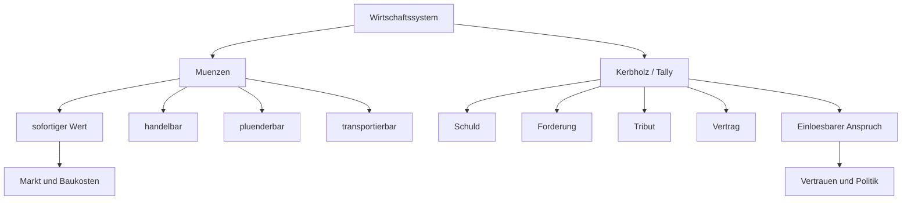
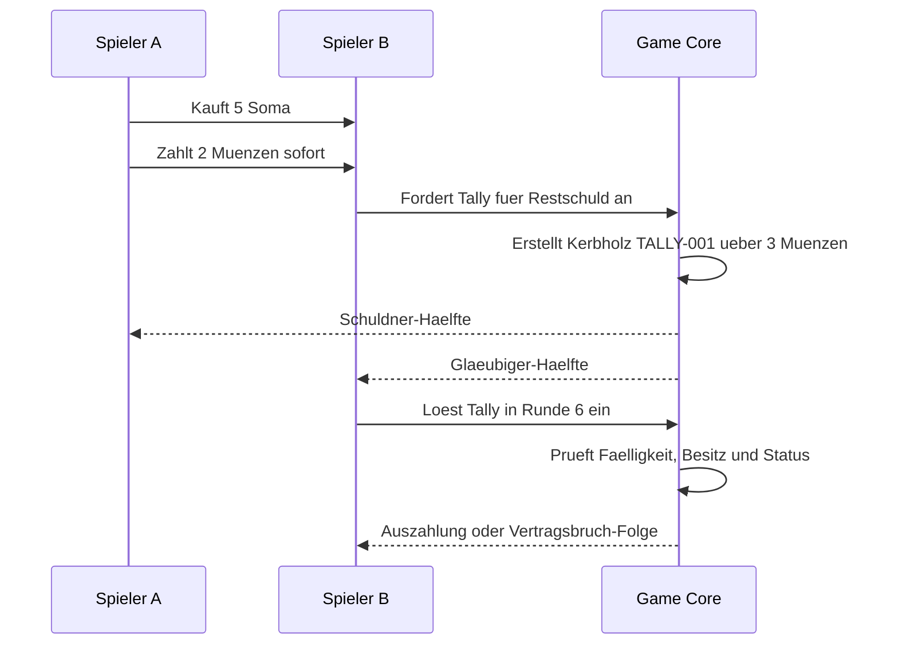
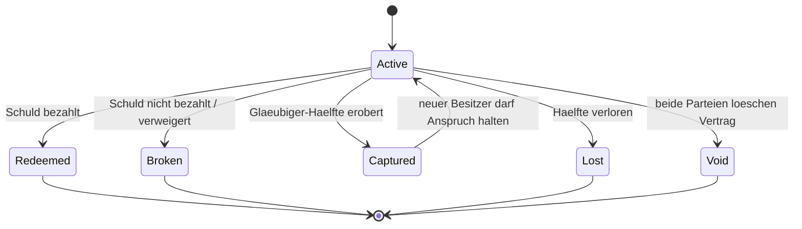
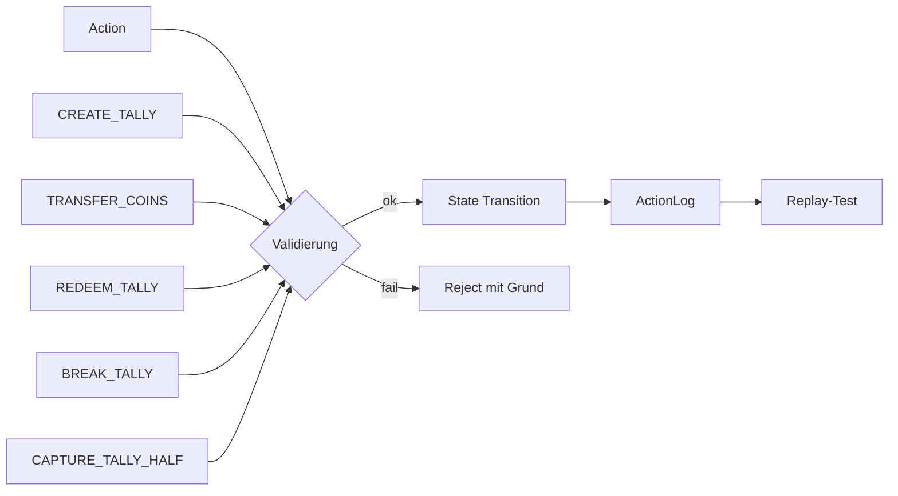
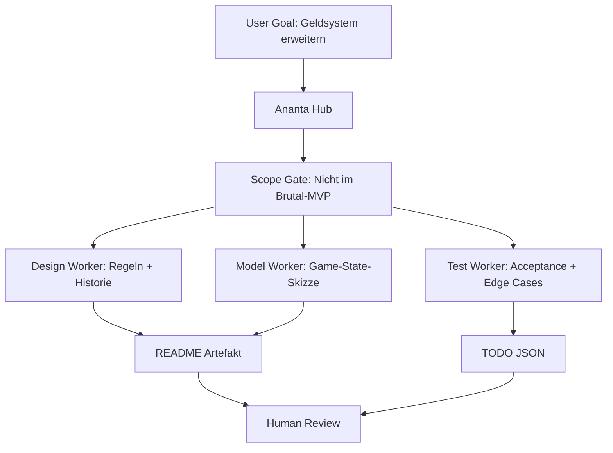

# Split-Coin-Tally Economy fuer das Ananta Strategie-Game

**Status:** Konzept- und Backlog-Modul  
**Einordnung:** Nicht Teil des Brutal-MVP. Erst nach erstem Papier-Playtest und stabilem Game-Core aktivieren.  
**Zweck:** Historisch inspiriertes Geldsystem aus chinesischem Muenzmodell und Kerbholz-/Tally-System als spielbares Economy-Beispiel fuer Ananta.

## 1. Kurzidee

Dieses Modul verbindet zwei alte Geld- und Nachweissysteme zu einer neuen Spielmechanik:

- **Muenzen** bilden frei uebertragbaren, standardisierten Wert.
- **Kerbhoelzer / Tallies** bilden Schuld, Anspruch, Vertrag und Vertrauen ab.

Dadurch entsteht kein simples `+1 Gold pro Runde`-System, sondern eine Economy aus Wert, Kredit, Beute, Vertrauen, Falschgeld, Forderungen und politischem Druck.

```text
Muenze   = mobiler Werttraeger
Kerbholz = pruefbarer Anspruch / Schuldnachweis
System   = Wert + Vertrag + Vertrauen + Audit
```

## 2. Historische Inspiration

### 2.1 Chinesisches Muenzmodell

Als Inspiration dient das Prinzip alter chinesischer Cash-Coins:

- runde Muenze,
- quadratisches Loch,
- buendelbar auf Schnur,
- als standardisierte Waehrung nutzbar,
- geeignet fuer Markt, Steuer, Sold und Tribute.

Wichtig: Fuer das Spiel wird keine exakte historische Simulation gebaut. Es geht um ein verstaendliches Modell: kleine, mobile, zaehlbare Werttraeger mit staatlicher oder lokaler Praegeautoritaet.

### 2.2 Kerbholz-/Tally-System

Das Kerbholz-System liefert den zweiten Teil:

- ein Holzstab wird mit Kerben versehen,
- danach gespalten,
- Schuldner und Glaeubiger besitzen je eine Haelfte,
- beide Haelften passen nur zusammen, wenn sie echt sind,
- dadurch entsteht ein einfacher physischer Manipulationsschutz.

Im Spiel wird daraus ein Vertrags- und Schuldsystem.

## 3. Kombiniertes Geldsystem

Das kombinierte System kann als **Split-Coin-Tally-System** beschrieben werden.



## 4. Spielmechanische Rollen

| Element | Bedeutung | Staerke | Risiko |
| --- | --- | --- | --- |
| Standardmuenze | allgemein akzeptierter Wert | einfach, schnell, handelbar | plunderbar, knapp, ggf. entwertbar |
| Lokale Muenze | regionale Praegung | Gebietskontrolle wird wichtiger | wird ausserhalb evtl. schlechter akzeptiert |
| Kerbholz | Schuld-/Anspruchsnachweis | erlaubt Kredit, Tribut, Lieferrechte | kann gebrochen, erobert oder politisch missbraucht werden |
| Vertrauen | sozialer/politischer Score | erleichtert Handel und Buendnisse | sinkt bei Vertragsbruch |
| Audit | prueft Tally-Echtheit | deterministisch testbar | braucht klare Game-State-Regeln |

## 5. Beispielablauf



## 6. Kernregeln fuer eine erste Economy-Version

### 6.1 Muenzen

- Jeder Spieler kann Muenzen besitzen.
- Muenzen koennen fuer Bau, Rekrutierung, Handel und Tribute genutzt werden.
- Muenzen koennen als Beute erobert werden, falls eine spaetere Regel das erlaubt.
- Lokale Muenzen koennen optional spaeter einen Wechselkurs oder Akzeptanzbereich erhalten.

### 6.2 Kerbholz / Tally

- Ein Tally entsteht aus einer freiwilligen Transaktion oder Tributregel.
- Ein Tally hat Schuldner, Glaeubiger, Werttyp, Wert, Faelligkeit und Status.
- Ein Tally ist aktiv, bis er eingeloest, gebrochen, verloren, erobert oder aufgehoben wird.
- Einloesung ist nur moeglich, wenn die Regeln Besitz, Faelligkeit und Status erlauben.

### 6.3 Vertrauen

- Vertragsbruch senkt Vertrauen.
- Hohes Vertrauen kann Handel erleichtern.
- Niedriges Vertrauen kann Tribute, Buendnisse oder Kredit verteuern.
- Vertrauen darf im ersten technischen Schritt simpel bleiben: z. B. Integer von -3 bis +3.



## 7. Game-State-Skizze

```ts
type CoinAccount = {
  playerId: string;
  standardCoins: number;
  localCoins: Record<string, number>;
};

type TallyContract = {
  id: string;
  debtorPlayerId: string;
  creditorPlayerId: string;
  valueType: "COINS" | "SOMA" | "UNIT_SERVICE" | "PASSAGE_RIGHT";
  amount: number;
  createdTurn: number;
  dueTurn?: number;
  debtorHalfOwnerId: string;
  creditorHalfOwnerId: string;
  status: "active" | "redeemed" | "broken" | "captured" | "lost" | "void";
  trustImpactOnBreak: number;
};

type EconomyState = {
  coinAccounts: CoinAccount[];
  tallyContracts: TallyContract[];
  trust: Record<string, Record<string, number>>;
};
```

## 8. Deterministische Aktionen



Mindestens benoetigte Actions:

- `TRANSFER_COINS`
- `CREATE_TALLY`
- `REDEEM_TALLY`
- `BREAK_TALLY`
- `CAPTURE_TALLY_HALF`
- `VOID_TALLY`

## 9. Warum das fuer Ananta als Demo gut ist

Dieses Economy-Modul ist ein gutes Ananta-Beispiel, weil es mehrere Eigenschaften prueft:

- fachliche Modellierung aus historischen Vorbildern,
- Scope-Kontrolle gegen Feature-Explosion,
- deterministische Game-State-Transitions,
- Artefakt-first Entwicklung,
- Tests fuer Vertragsbruch, Einloesung, Besitzwechsel und Replay,
- klare Trennung zwischen Design, Regeln, Core-Modell und UI.



## 10. Scope-Regel

Dieses Modul darf erst aktiv umgesetzt werden, wenn folgende Bedingungen erfuellt sind:

1. Brutal-MVP-Regeln sind stabil dokumentiert.
2. Mindestens ein Papier-Playtest wurde ausgewertet.
3. Minimaler Game-Core fuer Bewegung, AP, Kampf und Nagabanda ist modelliert oder geplant.
4. Economy wird als eigener Milestone behandelt, nicht als stiller Zusatz zum Core-MVP.

## 11. Erste Definition of Done

Das Modul gilt als konzeptionell bereit, wenn:

- Muenzregeln und Kerbholzregeln getrennt erklaert sind,
- die Verbindung beider Systeme als neue Geldmechanik klar ist,
- mindestens fuenf Beispielaktionen existieren,
- Testfaelle fuer Einloesung, Bruch, Eroberung und Replay definiert sind,
- keine aktive Abhaengigkeit zum Brutal-MVP entsteht.
