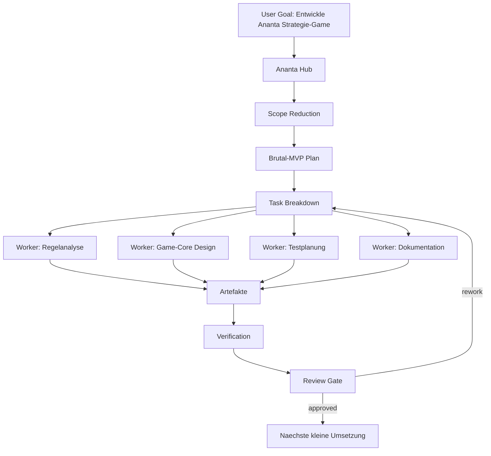
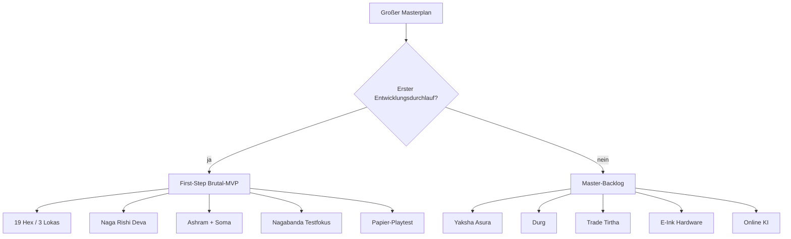
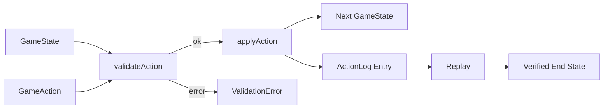
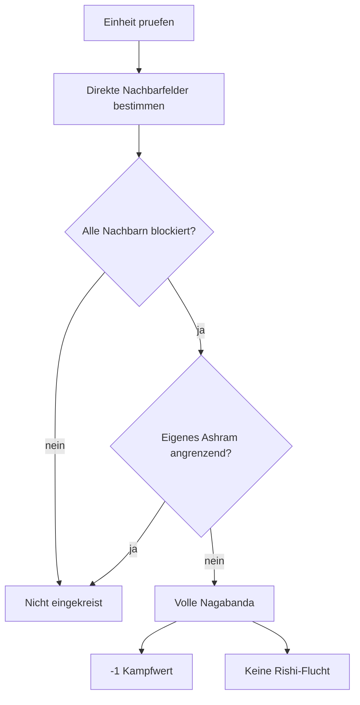
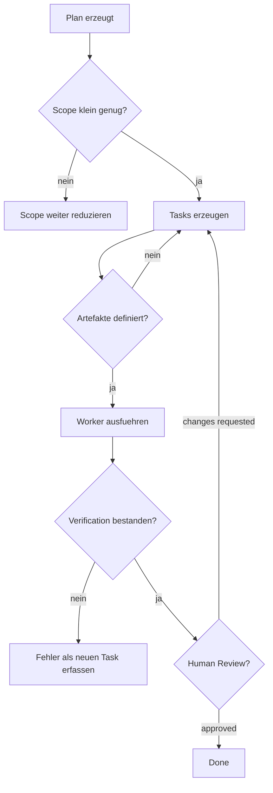

# Ananta Strategie-Game als Entwicklungs-Szenario fuer Ananta

**Stand:** 2026-05-24  
**Status:** Beispiel-/Demo-Szenario fuer das Ananta-Hauptprojekt  
**Zweck:** Dieses Dokument beschreibt, wie das geplante Strategie-Brettspiel `Ananta` mit dem Agenten-Management-System `Ananta` entwickelt werden soll.

Dieses Szenario ist bewusst kein zweites Produkt im Repository. Es ist ein grosses, realistisches Entwicklungsbeispiel fuer Ananta selbst: Ein komplexes Softwareprojekt wird nicht als "mach alles" an einen Agenten geworfen, sondern vom Hub in Scope, Tasks, Artefakte, Tests, Review-Gates und kleine Worker-Auftraege zerlegt.

## 1. Einordnung im Hauptprojekt

Ananta ist im Hauptprojekt eine kontrollierte Hub-Worker-Plattform fuer goal-basierte Agentenarbeit. Genau dafuer eignet sich das Strategie-Game als Beispiel:

- Der Nutzer formuliert ein grosses Ziel: `Entwickle ein lokales Strategie-Game Ananta`.
- Der Hub reduziert das Ziel auf einen kontrollierbaren MVP.
- Worker duerfen nur klar delegierte, kleine Aufgaben ausfuehren.
- Ergebnisse muessen als Artefakte, Tests, Logs und Review-Entscheidungen sichtbar bleiben.
- Keine direkte Vollautomatik ohne Review-Gates.

Das Spiel selbst dient also als Testfall fuer:

- Goal -> Plan -> Task -> Execution -> Verification -> Artifact
- grosse Planung vs. reduzierte First-Step-Arbeit
- sichere Agenten-Orchestrierung
- deterministische Softwareentwicklung
- Artifact-first Completion
- Review statt blindem Autopilot

## 2. Quellen und Konsolidierung

Eingearbeitet wurden folgende Planstaende:

| Quelle | Rolle nach Konsolidierung |
| --- | --- |
| `ananta_consolidated_masterplan_mermaid.md` | grosser Masterplan und Referenz |
| `ananta_consolidated_grosse_todo.json` | Master-Backlog, nicht aktiver Sprint |
| `ananta_first_step_schwachstellen_mvp_reduktion.md` | fuehrende fachliche Reduktion |
| `todo.ananta_first_step_mvp_reduktion.json` | fuehrende aktive TODO-Spur |

Wichtigste Korrektur: Der grosse Masterplan bleibt erhalten, wird aber nicht als aktive Arbeitsdatei verwendet. Fuer den ersten echten Entwicklungsdurchlauf gilt der Brutal-MVP aus der First-Step-Datei.

## 3. Fuehrende Entscheidung

**Aktive Entwicklungsbasis:** `todo.ananta_first_step_mvp_reduktion.json`  
**Aktives Begleitdokument:** `ananta_first_step_schwachstellen_mvp_reduktion.md`  
**Backlog/Referenz:** grosse konsolidierte Todo + Mermaid-Masterplan

Begruendung:

- Die grosse Todo ist inhaltlich wertvoll, aber zu breit fuer einen ersten Lauf.
- Zu viele Tasks sind P0 bzw. critical path.
- Zu viele Mechaniken sind vor dem ersten Playtest gleichzeitig aktiv.
- Der First Step reduziert das Spiel auf einen testbaren Kern.
- Genau diese Reduktion ist als Ananta-Agenten-Szenario interessant: Der Hub muss Scope reduzieren, nicht einfach alles starten.

## 4. Korrigierter Brutal-MVP

Der erste lauffaehige Game-Prototyp ist absichtlich klein.

| Bereich | First-Step-Entscheidung |
| --- | --- |
| Spieler | 2 lokal |
| Karte | 19 Hexfelder bevorzugt; 37 nur falls ohne Zusatzkomplexitaet |
| Regionen | 3 Lokas |
| Einheiten | Naga, Rishi, Deva |
| Gebaeude | Ashram |
| Ressourcen | zuerst nur Soma |
| Aktionspunkte | 6 AP testweise |
| Kampf | deterministisch |
| Kernmechanik | Nagabanda / Einkreisung |
| Technik | reiner TypeScript-Game-Core zuerst |
| UI | spaeter, nicht im ersten Schritt |

### Bewusst nicht im First Step

- Yaksha
- Asura
- Durga/Durg
- Patalas-Sonderregeln
- Tirtha-Mehrfachbonus
- Trade
- Fog of War
- komplexe Scout-/Produktionsaktivierung
- E-Ink-Optimierung
- Magnetbrett-/Hardware-Schnittstelle
- Online-Multiplayer
- KI-Gegner

## 5. Regelkorrekturen aus der Analyse

### 5.1 Grosse Planung nicht als aktiver Sprint

Die grosse Todo wird als Master-Backlog behandelt. Aktive Entwicklung startet nur mit First-Step-Tasks. Sonst entsteht sofort ein monolithischer Agentenauftrag.

### 5.2 Deva-Rush hart vereinfachen

Im First Step gilt:

- Deva darf bewegen oder angreifen.
- Kein Bewegen-und-Angreifen im selben Zug.
- Keine Kombikosten-Alternative im ersten Test.

Damit wird verhindert, dass der erste Playtest durch eine starke Rush-Einheit dominiert wird.

### 5.3 Rishi-Flucht begrenzen

Im First Step gilt:

- Rishi darf maximal einmal pro eigener Runde fliehen.
- Flucht nur auf ein freies Nachbarfeld.
- Keine Flucht bei voller Nagabanda.

Damit bleibt der Rishi beweglich, wird aber nicht zur nervigen Endlos-Ausweichfigur.

### 5.4 Tirtha und Trade raus

Tirtha wird im ersten Playtest entfernt oder maximal als einfaches `+1 Soma`-Feld getestet. Kein Kampfbonus, kein Loka-Bonus, kein Trade.

Empfehlung: Fuer Playtest 1 komplett entfernen.

### 5.5 Durga -> Durg spaeter

Die Namenskorrektur ist richtig, aber nicht relevant fuer den First Step. Da Durg/Durga nicht im Brutal-MVP vorkommt, wird diese Korrektur fuer spaetere Backlog-Arbeit geparkt.

### 5.6 E-Ink und Hardware parken

E-Ink und Magnetbrett bleiben Architekturziele, aber nicht Teil der ersten Umsetzung. Der Game-Core muss nur so gebaut sein, dass spaetere Renderer und Hardware-Bridges moeglich bleiben.

## 6. Agenten-Entwicklungsszenario

Das Game wird als reales Entwicklungsbeispiel fuer Ananta umgesetzt. Der Hub fuehrt die Kontrolle, Worker erhalten nur kleine, reviewbare Tasks.



## 7. Entwicklungsphasen

### Phase 0: Plan einfrieren

Ziel: Aus den grossen Planungen wird ein einziger fuehrender Arbeitsstand.

Ergebnisse:

- diese Szenario-Datei
- aktive TODO-Datei
- klare Out-of-Scope-Liste
- Demo-Flow-Verweis im Hauptprojekt

### Phase 1: Papier-Playtest

Ziel: Erst pruefen, ob das Spiel als Spiel funktioniert.

Ergebnisse:

- 19-Hex-Testkarte
- 2-Seiten-Kurzregel
- Marker fuer Naga/Rishi/Deva/Ashram
- mindestens ein dokumentierter Playtest
- Entscheidung zu Nagabanda, Deva, Rishi, AP und Kartengroesse

### Phase 2: Minimaler Game-Core

Ziel: Nur die getesteten Regeln in Code bringen.

Mindestumfang:

```text
packages/ananta-game-core/
  src/model.ts
  src/actions.ts
  src/validateAction.ts
  src/applyAction.ts
  src/nagabanda.ts
  src/combat.ts
  src/replay.ts
  test/*.test.ts
```

Keine Angular-Abhaengigkeit, kein Renderer, kein E-Ink.

### Phase 3: Replay und Tests

Ziel: Jede Aktion ist validierbar, loggbar und replayfaehig.

Mindesttests:

- Bewegung gueltig/ungueltig
- AP-Verbrauch
- Deva darf nicht bewegen und angreifen
- Rishi-Flucht erlaubt/blockiert
- Nagabanda: keine, teilweise, vollstaendige Einkreisung
- Kampf deterministisch
- Replay aus InitialState + ActionLog

### Phase 4: UI-Prototyp

Erst nach stabilen Core-Tests.

Moegliche Pfade:

- Angular-PWA, falls Integration ins bestehende Ananta-Frontend sinnvoll ist
- Vanilla/Svelte fuer kleinen separaten Game-Prototyp
- SVG-Hexrenderer zuerst
- E-Ink-Modus spaeter als Renderer-Profil

## 8. Mermaid: korrigierter Scope-Flow



## 9. Mermaid: Game-Core Zielarchitektur



## 10. Mermaid: Nagabanda-Minimalregel



Blockiert bedeutet im First Step nur:

1. gegnerische Einheit,
2. gegnerischer Naga-Einfluss,
3. unpassierbares Terrain.

## 11. Mermaid: Review-Gates fuer Ananta-Agenten



## 12. Beispiel-Goal fuer Ananta

```text
Entwickle das Ananta Strategie-Game als kontrolliertes Beispielprojekt im Ananta-Hauptprojekt.
Reduziere den vorhandenen grossen Masterplan auf einen Brutal-MVP, erstelle eine 19-Hex-Papier-Testkarte,
schreibe eine 2-Seiten-Kurzregel, plane Playtests und leite danach einen minimalen TypeScript-Game-Core ab.
Keine UI, kein E-Ink, keine Hardware und keine zusaetzlichen Spielmechaniken im ersten Lauf.
```

## 13. Erwartete Ananta-Artefakte

Der Hub sollte fuer dieses Szenario mindestens diese Artefakte planen:

| Artefakt | Zweck |
| --- | --- |
| `scope_decision.md` | Warum First-Step statt grosser Masterplan |
| `brutal_mvp_rules.md` | maximal 2 Seiten Regeln |
| `paper_map_19_hex.md` | Kartenskizze und Feld-IDs |
| `playtest_protocol_template.md` | Rundenzahl, Unklarheiten, Balance |
| `game_core_model.md` | TypeScript-Modell ohne UI |
| `action_log_example.json` | Replay-Beispiel |
| `test_plan.md` | Core-Tests fuer Regeln |

## 14. Definition of Done fuer dieses Szenario

Das Szenario ist erfolgreich, wenn:

- die aktive TODO-Spur klein und eindeutig ist,
- der grosse Masterplan nur noch Backlog ist,
- ein fremder Mensch mit maximal 2 Seiten Regeln eine Testpartie starten kann,
- mindestens ein Playtest echte Entscheidungen zu Nagabanda, Deva und Rishi liefert,
- danach ein minimaler Game-Core ohne UI-Abhaengigkeit geplant werden kann,
- Ananta dabei sichtbar Hub-gesteuert arbeitet und keine monolithische Agenten-Vollautomatik erzeugt.

## 15. Harte Leitregel

Bis der Brutal-MVP als Spiel funktioniert:

> Keine neuen Mechaniken hinzufuegen.

Erlaubt sind nur:

- Werte aendern,
- Regeln streichen,
- Regeln praezisieren,
- Tests und Erklaerbarkeit verbessern.

Nicht erlaubt:

- neue Einheiten,
- neue Ressourcen,
- neue Sonderfelder,
- neue Siegbedingungen,
- UI-/Hardware-Ausbau als Hauptarbeit.
