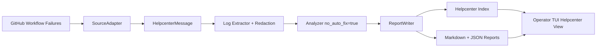
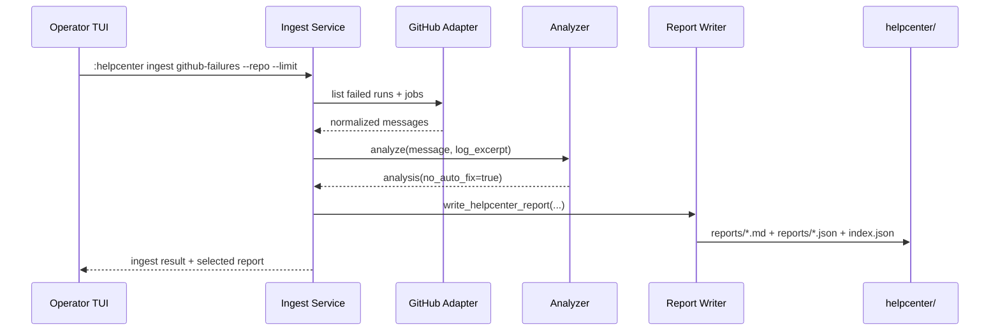

# Helpcenter Ingestion Guide

## Zweck und Struktur

Das Helpcenter ist ein analyseorientierter Ingestion-Pfad fuer Failure-Signale. Es schreibt Reports ausschliesslich unter:

- `helpcenter/reports/*.md`
- `helpcenter/reports/*.json`
- `helpcenter/index/helpcenter.index.json`

Die Reports sind read-only Analyseartefakte. Es gibt keinen automatischen Repair-Schritt.

## GitHub Failure Ingestion

TUI-Befehle:

- `:helpcenter`
- `:helpcenter ingest github-failures --repo owner/repo --limit N [--dry-run]`
- `:helpcenter open <analysis-id>`
- `:helpcenter suggest-followup [analysis-id]`

Ingestion-Ablauf:

1. GitHub-Run/Job-Fehler werden als HelpcenterMessage normalisiert.
2. Log-Auszug wird redaction-geprueft (Secrets/Credentials/Private Keys).
3. Analyzer erzeugt HelpcenterAnalysis mit `no_auto_fix=true`.
4. Writer erzeugt Markdown+JSON und aktualisiert `helpcenter/index/helpcenter.index.json`.
5. TUI rendert Reports/Detailansicht im Artifacts-Panel.

## No-Auto-Fix First Step

Das Helpcenter arbeitet strikt im Analysemodus:

- `no_auto_fix=true` ist verpflichtend.
- Es werden keine Patches erzeugt.
- Es wird keine Worker-Repair-Ausfuehrung gestartet.
- Tests pruefen, dass keine Dateien ausserhalb `helpcenter/` geschrieben werden.

## Report- und Index-Inhalt

Jeder JSON-Report enthaelt u. a.:

- `source_kind`, `source_url`, `source_refs`
- `fetched_at`, `workflow_run_id`, `job_id`, `commit_sha`
- `analyzer_version`, `prompt_template_ref`
- `content_hash`
- `redaction_status`

`helpcenter/index/helpcenter.index.json` fuehrt die Report-Metadaten inkl. Versionierung/Dedupe.

## Architektur (Mermaid)

### GitHub Failure Flow

## Security-Invarianten

- Hub orchestriert, Worker fuehrt delegierte Analyse aus (kein Worker-Orchestrieren).
- Redaction laeuft vor Persistierung von Log-Inhalten.
- Helpcenter schreibt nur in `helpcenter/`.
- Analyse bleibt von Ausfuehrungs- und Patch-Mechanik getrennt (SRP).

## Testmatrix

| Bereich | Nachweis |
|---|---|
| Schema/Writer/Index | `tests/test_helpcenter_contract_service.py`, `tests/test_helpcenter_report_writer_service.py` |
| GitHub Adapter + Limits | `tests/test_helpcenter_github_failure_adapter_service.py` |
| Log-Redaction + Pattern | `tests/test_helpcenter_log_extractor_service.py` |
| Analyzer (pytest/npm/import/timeout, no auto fix) | `tests/test_helpcenter_analyzer_service.py` |
| Ingest dry-run/write + helpcenter-only writes | `tests/test_helpcenter_ingest_service.py` |
| TUI command flow + detail/follow-up | `tests/test_tui_helpcenter_commands.py` |
| E2E ingest -> reports/index -> TUI view | `tests/test_helpcenter_ingest_e2e.py` |
