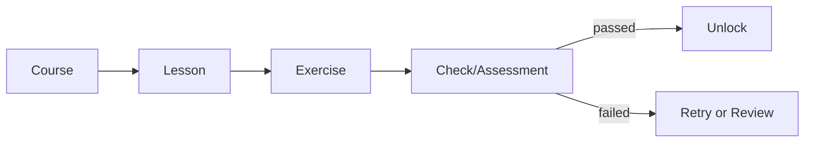

# Least Privilege Course System

## Zielbild

Das Kurs-System verbindet Ananta-Plattform, Strategie-Game und Security-Module zu einem durchgaengigen Lernpfad mit Default-Deny und kontrollierten Freischaltungen.

Es baut explizit auf vorhandenen Bausteinen auf:

- OnboardingChecklist als Einstiegspfad
- DemoModeService als read-only CoursePreview-Muster
- Instruction Profiles/Overlays als Lesson-/Exercise-Kontext

## Lernbausteine

1. **Course**: fachlicher Rahmen, Voraussetzungen, Grants, Unlock-Regeln.
2. **Lesson**: erklaert Konzepte, Risiken und sichere Entscheidungen.
3. **Exercise**: praktische Aufgabe in begrenzter Sandbox.
4. **Check/Assessment**: deterministische Bewertung mit klaren Kriterien.
5. **Unlock**: Freischaltung nur bei bestandenem Check oder Approval.

## Modulgruppen

- Strategie-Game Grundlagen und deterministische Regeln
- Hub-Worker und Rollenmodell
- Artefaktfreigaben, Encryption und Audit
- Sichere KI, Worker-Least-Privilege und RAG-Release-Gates
- Progress, Assessments, Badges und UI-Review

## Mermaid: Course -> Lesson -> Exercise -> Check -> Unlock

## Least-Privilege als Default

- Jeder Kurs startet mit minimalen Rechten.
- Rechte werden getrennt fuer User, Team, Worker, Artefakt und Remote-LLM betrachtet.
- Ohne explizite Freigabe und Nachweis kein Zugriff auf sensitive Pfade.
