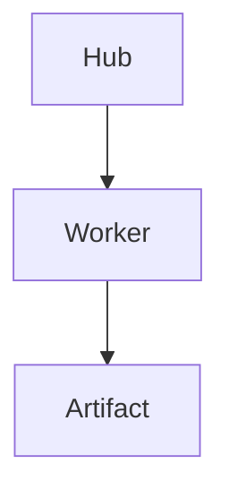

# Markdown Slides

Ananta provides a first-class Markdown slide workflow in `frontend-angular` at `/markdown-slides`.

## Authoring

Decks are plain Markdown files. A standalone line containing only `---` splits slides. Separators inside fenced code blocks are ignored.

````markdown
---
title: Demo Deck
theme: ananta-default
---

# First Slide

---

## Mermaid


````

Supported frontmatter fields are `title`, `author`, `theme`, `aspectRatio`, `createdAt`, `updatedAt`, `sourcePath`, and `deckId`.

Built-in themes:
- `ananta-default`
- `dark-console`
- `clean-docs`

## Security

Markdown is rendered with `marked`, sanitized with DOMPurify, and only then bound to Angular as trusted HTML. Script tags, inline event handlers, `javascript:` URLs, iframes, objects, embeds, forms, inputs, and buttons are blocked from preview output.

Mermaid fences are detected separately and rendered through a Mermaid service configured with `securityLevel: "strict"`. Mermaid parse/render failures create diagnostics and do not block editing.

## Persistence

The local draft adapter stores only Markdown source and selected slide index in browser `localStorage`. It never stores sanitized HTML as source of truth. Corrupt local state is discarded with a diagnostic.

Workspace-backed storage is represented as a disabled adapter until a Hub artifact/file endpoint is available. The frontend must not read or write arbitrary local paths.

## Artifact Contract

Markdown decks use artifact type `markdown_slide_deck`.

Contract fields:
- `sourcePath`
- `contentHash`
- `metadata`
- `slideCount`
- `diagnosticsSummary`
- `createdBy`
- `updatedBy`

The deck source remains a `.md` text file. Rendered HTML and PDF/PPTX outputs are derived artifacts with separate provenance.

## CodeCompass Boundary

The UI exposes placeholders for creating a deck from current context, explaining a deck, and attaching a deck to a run. These actions stay disabled until they are routed through Hub APIs and CodeCompass policy checks. The browser must not call arbitrary repository paths or worker endpoints directly.

## Export Contract

Export is intentionally disabled in the browser-only implementation. Export must be a Hub-governed asynchronous job:

```ts
create_export_job(deckArtifactId, format, theme, options)
```

Allowed formats are `html`, `pdf`, and `pptx`. The job response should contain `jobId`, `status`, `logs`, `outputArtifactId`, `warnings`, and `error`.

Validation must reject arbitrary file paths, unknown formats, unsafe theme names, and options that could become shell arguments. Output artifacts must include provenance linking source deck id, source hash, renderer, theme, options, and timestamp.

## Kova CLI Compatibility Decision

Direct Kova CLI execution is not added to the Angular app. The safe path is to evaluate Kova or a compatible renderer inside a restricted worker container:

- Licensing must be reviewed before bundling.
- Runtime dependencies must be reproducible and offline-capable.
- Large renderer dependencies must not increase the Angular or Android app bundle.
- Command construction must be owned by backend code, with validated enum options rather than user-controlled shell strings.
- Android delivery should keep authoring/preview local while delegating export to Hub/worker infrastructure when available.

Until that evaluation is complete, Ananta implements Kova-style Markdown authoring and safe preview, not full Kova export compatibility.
