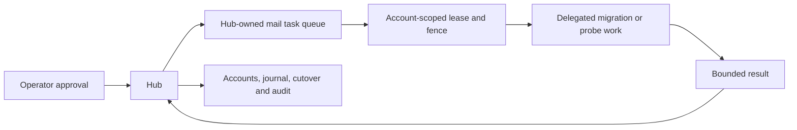

# Migration von IMAP zu MailAccount v2

Diese Migration normalisiert lokale Ananta-Account- und Metadatenspeicher. Sie
verschiebt keine Mailboxdaten auf dem externen Provider und führt keinen
automatischen IMAP-zu-JMAP-Cutover aus.

## Ziel und Kompatibilitätsgrenze

Legacy-Accounts werden additiv in `mail_account.v2` überführt. Der Mapper
bewahrt das bisherige Verhalten:

```json
{
  "account_id": "mail-account-1",
  "display_name": "Work",
  "host": "imap.example.test",
  "port": 993,
  "username_ref": "user://alice",
  "credential_ref": "secret://mail/alice",
  "tls_mode": "require_tls",
  "sync_policy": "headers_only",
  "enabled": true
}
```

wird zu:

```json
{
  "schema": "mail_account.v2",
  "account_id": "mail-account-1",
  "display_name": "Work",
  "requested_protocol": "imap",
  "resolved_protocol": "imap",
  "username_ref": "user://alice",
  "credential_ref": "secret://mail/alice",
  "sync_policy": "headers_only",
  "enabled": true,
  "provider_config": {
    "imap": {
      "host": "imap.example.test",
      "port": 993,
      "tls_mode": "require_tls",
      "auth_mode": "password_app_token"
    }
  }
}
```

Die Migration kopiert keine Klartext-Credentials. Ein Legacy-Datensatz mit
Passwort oder Token muss vor der Anwendung bereinigt und auf eine
`credential_ref` umgestellt werden.

## Bedeutung von `auto`, `jmap` und `imap`

| Modus | Verhalten |
|---|---|
| `imap` | Erzwungener Kompatibilitätsmodus. Legacy-Migrationen landen absichtlich hier. |
| `auto` | Der Hub darf `resolved_protocol` nach Rollout-Policy und erfolgreichen Gates zwischen IMAP und JMAP setzen. |
| `jmap` | Erzwungener JMAP-Modus. Ein IMAP-Fallback ist nicht zulässig. |

Ein Bestandskonto wechselt nicht allein deshalb zu JMAP, weil JMAP-Code oder
der lokale JMAP-Contract vorhanden ist. Für einen späteren JMAP-Cutover muss die
Account-Absicht explizit von erzwungenem `imap` auf `auto` umgestellt werden.
Diese Änderung erfolgt Hub-seitig und auditierbar. Erst danach kann der
Cutover-Service `resolved_protocol` unter seinen Gates auf `jmap` setzen.

Soll JMAP nach erfolgreicher Stabilisierung dauerhaft erzwungen werden, dürfen
`requested_protocol=jmap` und `resolved_protocol=jmap` nur gemeinsam als
validierter Hub-Accountzustand persistiert werden. Ein Mischzustand
`requested_protocol=jmap` mit `resolved_protocol=imap` ist ungültig.

## Orchestrierungsinvariante

Migration und Cutover bleiben Hub-owned:



- Nur der Hub legt `migration`- und `cutover`-Tasks an.
- Queue-Einträge tragen Idempotency-Key, Deadline und Retry-Budget.
- Eine account-spezifische Lease verhindert gleichzeitige Migration, Sync,
  Mutation oder Cutover für dasselbe Konto.
- Der Fencing-Token muss im Workerresultat zurückkommen; ein veraltetes
  Ergebnis darf keinen Accountzustand ändern.
- Worker dürfen keine Folgeaufträge erzeugen und den Cutover nicht selbst
  persistieren.
- Dauerhafte Pfade für Accounts, Metadaten, Backup und Journal müssen als
  explizite Hub-kontrollierte Volumes vorliegen. Implizit geteilter
  Containerzustand ist unzulässig.

## Ablauf

### 1. Rollout und Inputs einfrieren

- `ANANTA_MAIL_ROLLOUT_PHASE=infrastructure_off` beibehalten.
- Schreibende Mail-Operationen für die betroffenen Accounts anhalten.
- Legacy-Account- und Metadatendatei eindeutig bestimmen.
- Zielpfade und Journalpfad auf Hub-kontrolliertem Storage festlegen.
- Eine Sicherung außerhalb der Zielpfade erstellen.

### 2. Dry Run

`MailMigrationCommand` verwendet standardmäßig `dry_run=True`. Der Dry Run
validiert Account- und Metadaten-Mapping und meldet `migrated`, `skipped`,
`conflicted` und `failed`, schreibt aber keine v2-Stores.

Freigabekriterium:

- `failed=0`
- keine unbekannten Klartext-Credential-Felder
- alle Zielpfade liegen innerhalb des vorgesehenen persistenten Mounts
- der Operator hat Konflikt- und Rollbackplan dokumentiert

Ein Dry Run ist kein Provider- oder Live-E2E-Test.

### 3. Anwendung

Die angewendete Migration:

- erzeugt eine deterministische `mailmig-...`-ID aus Command und Pfaden,
- legt vor Schreibzugriffen `.migration-backup/<migration-id>/` an,
- schreibt Accounts und Nachrichten schrittweise,
- persistiert Account- und Message-Cursor atomar im
  `mail_migration_journal.v1`,
- überspringt identische Zielzeilen,
- zählt abweichende Zielzeilen als Konflikte statt sie still zu
  überschreiben,
- kann eine abgeschlossene Migration idempotent als `already_complete`
  erkennen.

Bei einem Fehler bleibt der letzte Journalcursor erhalten. Ein Resume
verarbeitet nur noch Einträge ab diesem Cursor. Vor einem Resume müssen Ursache
und Zielzustand geprüft werden; das Journal darf nicht manuell vorwärtsgesetzt
werden.

### 4. Lokale v2-Verifikation

Vor Netzwerkaktivierung:

- Accountanzahl und Reportzähler mit dem Legacy-Store vergleichen.
- Prüfen, dass migrierte Accounts `requested_protocol=imap` und
  `resolved_protocol=imap` besitzen.
- Prüfen, dass nur Referenzen, keine Credentialwerte persistiert wurden.
- Konflikte einzeln entscheiden; sie sind kein bestandener Zustand.
- Metadatenzugriff mit weiterhin erzwungenem IMAP prüfen.

### 5. Gestufter Provider-Rollout

| Phase | Aktion |
|---|---|
| `operator_opt_in` | Netzwerk, passive Beobachtung und explizite Diagnosen für ausgewählte Konten aktivieren; kein bestehender Cutover. |
| `jmap_preferred_new_auto` | Neue `auto`-Konten dürfen nach Discovery/Auth JMAP bevorzugen; migrierte `imap`-Konten bleiben unverändert. |
| `optional_existing_cutover` | Ausgewählte Bestandskonten dürfen nach expliziter Absichtsänderung und Cutover-Gates wechseln. |

Die Phasen werden nicht übersprungen. Fehlende Live-Evidenz, offene
Lizenzfreigabe oder nicht deterministische Seeds blockieren den Übergang zu
Bestands-Cutovern.

### 6. JMAP-Cutover pro Account

Für jeden Account separat:

1. Account-Lease durch den Hub beanspruchen.
2. Aktuellen Accountzustand und erwartetes `resolved_protocol` erfassen.
3. Bei Legacy-Konten `requested_protocol` kontrolliert auf `auto` umstellen.
4. JMAP-Discovery und Authentifizierung als delegierte, begrenzte Tasks
   ausführen.
5. Core- und Mail-Capabilities sowie Endpoint-Policy prüfen.
6. Operatorfreigabe oder eine ausdrücklich zugelassene Auto-Policy erfassen.
7. Kritischen `cutover`-Task mit dem erwarteten alten Provider ausführen.
8. Ergebnis nur mit aktuellem Fencing-Token persistieren.
9. Metadata-Sync prüfen; Body und Attachments weiterhin nicht automatisch
   laden.

Der Cutover schlägt geschlossen fehl bei:

- verändertem Ausgangszustand (`mail_cutover_state_conflict`),
- fehlender Freigabe (`mail_cutover_approval_required`),
- fehlgeschlagener Discovery (`jmap_discovery_required`),
- fehlgeschlagener Authentifizierung (`jmap_authentication_required`),
- abgelaufener oder fremder Lease,
- ungültigem Providerresultat.

## Rollback

| Problem | Aktion |
|---|---|
| v2-Dateimigration fehlerhaft | Mailzugriffe stoppen, Zielzustand sichern, Backup aus `.migration-backup/<migration-id>/` kontrolliert wiederherstellen und Journal nicht als `complete` markieren. |
| Einzelne Konflikte | Zielzeile nicht überschreiben; Quelle und Ziel manuell vergleichen und einen neuen idempotenten Migrationscommand planen. |
| JMAP-Discovery/Auth vor Cutover fehlerhaft | `resolved_protocol=imap` unverändert lassen; keine Datenrollback-Aktion nötig. |
| JMAP nach Cutover instabil | Hub-Lease erwerben, Account gegebenenfalls auf `requested_protocol=auto` zurückführen und einen freigegebenen Cutover zu `imap` mit erwartetem aktuellem Zustand ausführen. |
| Stale Workerresultat | Ergebnis wegen Fencing-Token verwerfen und Zustand aus dem Hub neu laden. |

Provider-Locators sind protokollspezifisch. Ein Rollback darf eine
JMAP-`Email/id` nicht als IMAP-UID interpretieren. Vorhandene Artefaktgrants
bleiben an ihre stabilen lokalen Referenzen und Scopes gebunden; ein Cutover
erteilt keine neuen Body- oder Attachment-Rechte.

## Erforderliche Live-Evidenz

Repository-eigene Contract-Fixtures reichen nicht als Nachweis für einen realen
Bestands-Cutover. Dieser benötigt mindestens:

- reproduzierbaren, nicht interaktiven Server-Bootstrap,
- kurzlebigen Testaccount und SecretStore-Referenz,
- deterministisch injizierte Testmail,
- erfolgreiche Discovery, Authentifizierung und Capability-Prüfung,
- Metadata-Sync über JMAP,
- nachweislich explizites Body-Laden,
- kontrollierten Cutover zu JMAP und zurück zu IMAP,
- Lease-Konflikt- und stale-fence-Negativfall,
- vollständigen Teardown ohne verbleibende Credentials oder Maildaten.

Bis ein solcher Lauf tatsächlich ausgeführt und als Evidence erfasst wurde,
darf keine erfolgreiche Live-Seed- oder E2E-Aussage dokumentiert werden.
