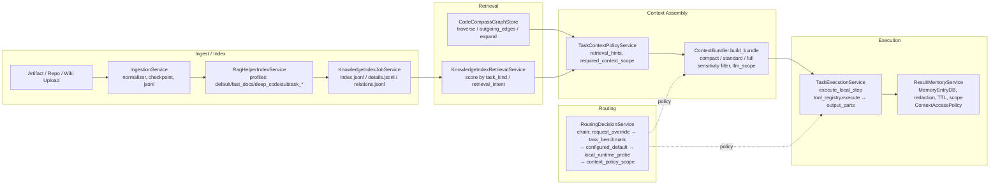
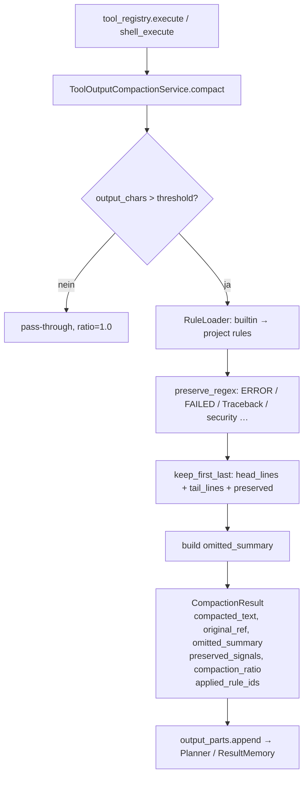
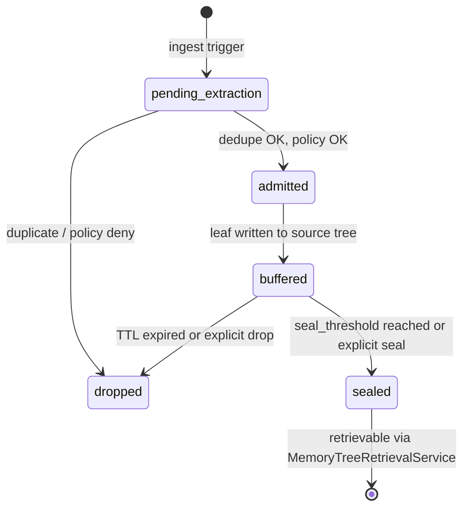

# OpenHuman-Inspired Memory & Routing — Ananta Adaptation

> **OHA-001** — Baseline documentation and gap analysis.
> GPL-Note: Konzepte werden nachgebaut, kein OpenHuman-Code direkt kopiert.

---

## 1. Bestehende Ananta-Pipeline (Baseline)



### Vorhandene Policy-Gates

| Gate | Service | Feld |
|------|---------|------|
| Sensitivity-Filter | `ContextBundler.build_bundle` | `llm_scope == "external_cloud_allowed"` blockt `internal_high`, `secret`, `credential`, `security_sensitive` |
| ContextAccessPolicy | `ResultMemoryService.record_worker_result_memory` | `ContextAccessPolicyEvaluator` blockt write bei policy deny |
| Redaktion | `ResultMemoryService` | `redact_before_persist=True` ruft `redact_text()` |
| Task-Neighbourhood | `TaskContextPolicyService.derive_retrieval_hints` | `required_context_scope` per `task_kind` |
| Routing-Fallback | `RoutingDecisionService` | `routing_fallback_policy.unavailable_action = mark_unavailable` |
| Tool-Guardrails | `config_defaults` → `llm_tool_guardrails` | `max_tool_calls_per_request`, class_limits (read/write/admin) |

---

## 2. Lücken gegenüber OpenHuman-Konzepten

| OpenHuman-Konzept | Ananta-Status | Lücke |
|---|---|---|
| **Memory Tree** (source/topic/global) | Fehlt vollständig | Nur flache `MemoryEntryDB`-Records, kein navigierbarer Summary-Tree mit Lifecycle (admitted→sealed→dropped) |
| **TokenJuice** (Tool-Output-Kompression) | Fehlt im Hot-Path | `output_parts.append(tool_result)` ohne Kompression; Planner erhält rohe Outputs |
| **Hint-Routing** (`hint:planning`, `hint:code` …) | Fehlt | `RoutingDecisionService` hat keine semantischen Hint-Schritte, nur Provider/Model-Felder |
| **Local-AI Workload-Flags** | Partiell | `lmstudio`/`ollama` konfigurierbar, aber kein workload-spezifisches opt-in (embeddings, summary, compaction) |
| **Markdown Memory Vault** | Fehlt | Kein Export-Layer; Memory nur als SQLite/JSONL |
| **Chunk-Lifecycle** | Fehlt | Kein `pending_extraction → admitted → buffered → sealed → dropped` |
| **Provenance-linked Summaries** | Fehlt | Kein `original_ref`, kein `omitted_summary` auf Chunk-Ebene |
| **Worker-Destination-Matrix** | Partiell | `llm_scope` in ContextBundler, aber kein `worker_profile`, kein `memory_scope` in TaskContextPolicy |

---

## 3. Geplante Service-Registry-Zuordnung (OHA-002)

| Neuer Service | Teil-Registry | Begründung |
|---|---|---|
| `memory_tree_store_service` | `KnowledgeServices` | Persistenz = Wissensdienst |
| `memory_tree_retrieval_service` | `KnowledgeServices` | Retrieval-Adapter auf Memory Tree |
| `tool_output_compaction_service` | `KnowledgeServices` | Kompression ist Knowledge-Pipeline-Schritt, nicht Task-Scheduling |
| `hint_routing_service` | `IntegrationServices` | Erweiterung des RoutingDecisionService, der in integrations lebt |

Feld-Kollisionscheck (geplante Namen vs. bestehende `KnowledgeServices`):
- bestehend: `rag_service`, `rag_helper_index_service`, `ingestion_service`, `knowledge_index_job_service`, `knowledge_index_retrieval_service`, `result_memory_service`
- neu: `memory_tree_store_service` ✓, `memory_tree_retrieval_service` ✓, `tool_output_compaction_service` ✓
- bestehend `IntegrationServices`: `mcp_registry_service`, `integration_registry_service`, `openai_compat_service`, `worker_job_service`, `agent_registry_service`, `agent_health_monitor_service`
- neu: `hint_routing_service` ✓

Keine Kollisionen.

---

## 4. Feature-Flag-Schema (OHA-003)

Neue Config-Schlüssel in `build_default_agent_config()` (alle additiv, Default = sicher/deaktiviert):

```json
{
  "memory_tree": {
    "enabled": false,
    "mode": "safe_readonly",
    "auto_ingest_knowledge_index": false,
    "auto_ingest_result_memory": false,
    "llm_summary_enabled": false,
    "llm_summary_cloud_allowed": false,
    "max_leaves_per_source": 500,
    "seal_threshold_leaves": 20
  },
  "tool_output_compaction": {
    "enabled": true,
    "fail_open": true,
    "builtin_rules_enabled": true,
    "project_rules_path": ".ananta/tool-output-rules",
    "max_input_chars_for_compaction": 4000,
    "max_output_chars": 2000,
    "always_preserve_signals": true
  },
  "hint_routing": {
    "enabled": false,
    "mode": "compatibility",
    "cloud_allowed_hints": [],
    "local_only_hints": ["hint:context_compaction", "hint:cheap_classify", "hint:local_embedding"],
    "unknown_hint_action": "mark_unavailable"
  },
  "memory_vault_export": {
    "enabled": false,
    "output_dir": ".ananta/memory",
    "export_mode": "local_only",
    "exclude_sensitivity": ["secret", "credential", "security_sensitive"]
  }
}
```

---

## 5. Tool-Output-Kompression Pipeline (OHA-004/005/006)



**Invarianten:**
- `ERROR`, `FAILED`, `Traceback`, `AssertionError`, `security`, `permission denied`, `blocked`, `credential` werden **immer** erhalten
- Kompression darf nie mehr als `max_output_chars` liefern
- `original_ref` = SHA-256 der Roh-Ausgabe (erste 16 Zeichen, hex)
- Bei Kompressionsfehler mit `fail_open=True` → Roh-Ausgabe wird weitergegeben (nicht silent geändert)

---

## 6. Memory Tree Lifecycle (OHA-008–012)



---

## 7. Matrix: OpenHuman → Ananta → Security-Constraint

| OpenHuman | Ananta-Adaptation | Security-Constraint |
|---|---|---|
| Memory Tree (Markdown-first) | MemoryTreeStore (DB/JSONL primary, Markdown als Export) | Vault = Sicht, nicht Wahrheit; Sensitive nie exportiert |
| TokenJuice (multi-layer rules) | ToolOutputCompactionService (builtin + project rules) | preserve_security_signals nicht deaktivierbar durch Projektregeln |
| `hint:*` routing | HintRoutingService auf RoutingDecisionChain | `cloud_allowed=false` blockt externe Provider für jeden Hint |
| Local AI opt-in | workload-spezifische `local_ai.usage.*` Flags | Health-Gate; Fallback nur policy-konform |
| Obsidian Vault | MemoryVaultExportService → `.ananta/memory/` | Secret/credential immer excluded |
| Sandboxed skills | Kein neues Skill-System; Tool-Guardrails bleiben | Allowlist + Signatur + Review bleibt Voraussetzung |
| Auto-Fetch (118+ Integ.) | Nur Ananta-interne Quellen (repo, todos, task-history) | Default aus; kein OAuth-Wildwuchs |

---

## 8. Rollout-Plan

1. **Feature Flags** (OHA-003): Alle neuen Features per Config deaktivierbar → Deploy ohne Verhaltensänderung
2. **ToolOutputCompaction** (OHA-004–007): Einschalten in Staging; Telemetry prüfen; compaction_ratio und preserved_signals validieren
3. **MemoryTree** (OHA-008–012): `safe_readonly` zunächst; manuelle Ingest-Tests; dann `auto_ingest_knowledge_index=true`
4. **ContextBundler** (OHA-013–014): Memory Tree Views additiv; bestehende Bundles bleiben kompatibel
5. **HintRouting** (OHA-016–018): `mode=compatibility` zunächst; schrittweise Hints einschalten
6. **Vault/Observability** (OHA-019–022): Letzter Schritt; Dashboard-Integration
7. **Tests & Regression** (OHA-023–025): Jeder Schritt hat eigene Tests; Regressionen geblockt durch `feature flags off → altes Verhalten`
