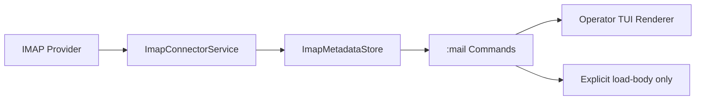
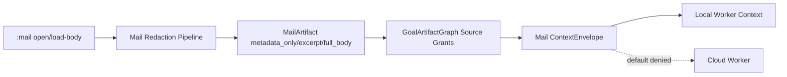

# Operator TUI IMAP Mail Client

Der IMAP-Client in der Operator TUI ist **lokal-first** und standardmäßig restriktiv:

- Mail-Bodys werden nicht automatisch in Worker-Kontext gegeben.
- Cloud-Worker bekommen Mail-Kontext standardmäßig nicht.
- Credentials werden über `credential_ref` eingebunden, nicht als Klartext.

## Account-Setup (SecretStore-basiert)

Lege zuerst eine Secret-Referenz an (z. B. `secret://imap/alice`) und nutze sie beim Account:

```bash
:mail account create --display-name Work --host imap.example.com --port 993 --username user://alice --credential-ref secret://imap/alice
```

Nützliche Konto-Kommandos:

```bash
:mail account list
:mail account status
:mail account disable <account-id>
:mail account delete <account-id>
```

## Mail lesen, suchen, Body explizit laden

```bash
:mail
:mail mailbox INBOX
:mail search from:alerts subject:build unread:true
:mail open <uid|message-id>
:mail load-body
```

Wichtig: `:mail load-body` ist explizit nötig; vorher bleibt der Body in der Detailansicht ungeladen.

## Freigabe an Goal/Worker

Mail-Kontext wird nur nach expliziter Freigabe in die Goal-Artefaktkette aufgenommen:

```bash
:mail artifact register-current --scope metadata_only
:mail grant-current-to-goal <goal-id> --scope excerpt
:mail context-envelope <goal-id> --target local_worker
```

Für Volltext gelten explizite Bestätigungen:

```bash
:mail artifact register-current --scope full_body --confirm-full-body
:mail grant-current-to-goal <goal-id> --scope full_body --confirm-full-body
```

## Attachments und Export

Attachments werden nur auf expliziten Befehl geladen:

```bash
:mail attachment list
:mail attachment download <filename>
:mail attachment register <filename>
```

Mail-Export:

```bash
:mail export current --format json
:mail export current --format text --include-body --confirm-body
:mail export current --format eml --goal <goal-id>
```

## Datenschutz-Defaults

- Keine automatische Inbox-Zusammenfassung durch Snake.
- Keine implizite Weitergabe von Body/Attachment an Worker.
- Redaction läuft vor Kontextfreigabe (Secrets werden maskiert).
- `metadata_only` ist der sichere Standard-Scope.

## Architektur-Flow (Mermaid)

### IMAP -> Metadata Store -> TUI



### Mail -> Artifact -> GoalGraph -> Worker ContextEnvelope



## Security-Invarianten

- **no auto body**: Body wird nur durch explizites `:mail load-body` geladen.
- **no auto worker**: Kein Mail-Kontext ohne explizite Grant-Aktion.
- **no plaintext credentials**: Account-Config nutzt `credential_ref`, nicht Passwortfelder.

## Testmatrix

| Bereich | Tests |
|---|---|
| Mock-IMAP Integration, Timeout/Login/TLS, headers-only | `tests/test_imap_mock_integration_flow.py`, `tests/test_imap_connector_service.py` |
| TUI Mail-View/Commands inkl. offline/degraded und explizites Body-Load | `tests/test_tui_imap_mail_view_commands.py`, `tests/test_tui_imap_mail_integration_commands.py`, `tests/test_tui_imap_account_commands.py` |
| Artifact/Worker Security, Redaction, Cloud denied default | `tests/test_imap_artifact_worker_security.py`, `tests/test_imap_mail_context_envelope_service.py`, `tests/test_imap_redaction_pipeline_service.py`, `tests/test_imap_schema_policy_unit.py` |
| E2E Mail lesen + Goal-Freigabe (Excerpt-only) | `tests/test_imap_mail_goal_grant_e2e.py` |

## Troubleshooting

### Login schlägt fehl (`imap_login_failed`)

- Prüfe Benutzer-Ref und `credential_ref`.
- Verifiziere App-Password/Token beim Provider.

### TLS-Fehler (`tls_mode_must_require_tls` / `imap_tls_required`)

- Nutze `tls_mode=require_tls` und Port `993`.
- Prüfe Proxy/Firewall, falls TLS-Handshake blockiert wird.

### Timeout (`imap_connect_timeout`)

- Prüfe Erreichbarkeit von Host/Port.
- Bei großen Mailboxen zunächst `headers_only` nutzen.

### Keine Mails sichtbar

- Prüfe aktives Konto mit `:mail account status`.
- Prüfe gewählte Mailbox und gesetzte Filter (`:mail filter ...`).
- Bei Bedarf `:mail mailbox INBOX` setzen und erneut `:mail` ausführen.
