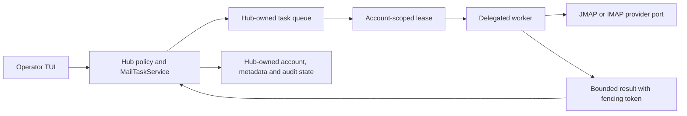

# Operator TUI Mail Client

Diese Seite ist der provider-neutrale Einstieg für Mail in der Operator TUI.
Die IMAP-spezifische Bestandsdokumentation bleibt als
[Kompatibilitätsreferenz](operator-tui-imap-mail-client.md) erhalten. Details
zum neuen Provider stehen im [JMAP-Runbook](jmap-provider.md); die Umstellung
bestehender Konten beschreibt die
[MailAccount-v2-Migration](migrations/imap-to-mail-account-v2.md).

## Sicherheitsmodell

Die Sicherheitsinvarianten gelten unabhängig vom Protokoll:

- Mail-Bodys werden nicht automatisch geladen.
- Attachments werden nicht automatisch heruntergeladen.
- Mail-Inhalte gelangen nicht automatisch in einen Worker-Kontext.
- Cloud-Worker erhalten Mail-Kontext standardmäßig nicht.
- Account-Datensätze enthalten nur `username_ref` und `credential_ref`, niemals
  Passwort, Token, Authorization-Header oder Session-Secret.
- Der Hub besitzt Queue, Freigaben, Leases, Cutover und Audit. Worker führen
  ausschließlich delegierte Mail-Operationen aus.

## MailAccount v2

`mail_account.v2` trennt die gewünschte Protokollpolitik von der aktuell
aufgelösten Providerbindung:

```json
{
  "schema": "mail_account.v2",
  "account_id": "mail-account-1",
  "display_name": "Work",
  "requested_protocol": "auto",
  "resolved_protocol": "jmap",
  "username_ref": "user://alice",
  "credential_ref": "secret://mail/alice",
  "sync_policy": "headers_only",
  "enabled": true,
  "provider_config": {
    "jmap": {
      "session_url": "https://mail.example.com/.well-known/jmap"
    },
    "imap": {
      "host": "imap.example.com",
      "port": 993,
      "tls_mode": "require_tls"
    }
  }
}
```

Zulässige `sync_policy`-Werte sind `manual`, `headers_only` und
`limited_recent`.

| `requested_protocol` | Bedeutung |
|---|---|
| `auto` | Der Hub ermittelt den Provider entsprechend der aktiven Rollout-Policy und hält das Ergebnis separat in `resolved_protocol`. |
| `jmap` | JMAP ist erzwungen. Ein stiller IMAP-Fallback wäre ein Vertragsbruch. |
| `imap` | IMAP ist erzwungen. Dieser Modus bewahrt das Verhalten migrierter Bestandskonten. |

`resolved_protocol` ist entweder `jmap`, `imap` oder `null`. Ein erzwungenes
Protokoll darf nicht auf das jeweils andere Protokoll aufgelöst werden. Bei
`auto` bleibt eine Änderung von `resolved_protocol` eine explizite,
Hub-kontrollierte Cutover-Aktion.

Die bestehende TUI-Kontoerstellung mit `--host`, `--port`, `--username` und
`--credential-ref` ist der IMAP-Kompatibilitätspfad. Dieses Runbook erfindet
keinen noch nicht belegten `:mail account`-Schalter für JMAP. JMAP-Konten
müssen über eine Oberfläche angelegt werden, die den obigen v2-Vertrag
vollständig validiert.

## Lesen und suchen

Die provider-neutrale Bedienfolge bleibt explizit:

```bash
:mail
:mail mailbox INBOX
:mail filter unread=true
:mail search from:alerts subject:build mailbox:INBOX unread:true
:mail open <message-ref>
:mail load-body
```

Die Liste und Suche arbeiten auf synchronisierten Metadaten. Erst
`:mail load-body` darf einen Body-Abruf als Hub-Task anfordern. Ein
protokollspezifischer Locator bleibt intern in `mail_message_ref.v2`; die
Oberfläche darf nicht annehmen, dass eine IMAP-UID eine JMAP-`Email/id` ist.

## Freigabe an Goals und Worker

```bash
:mail artifact register-current --scope metadata_only
:mail grant-current-to-goal <goal-id> --scope excerpt
:mail context-envelope <goal-id> --target local_worker
```

Volltext erfordert die bestehenden expliziten Bestätigungen:

```bash
:mail artifact register-current --scope full_body --confirm-full-body
:mail grant-current-to-goal <goal-id> --scope full_body --confirm-full-body
```

Der sichere Standard bleibt `metadata_only`. Redaction erfolgt vor der
Kontextfreigabe. Eine Providerumstellung erweitert keine vorhandenen Grants und
wandelt einen Metadata-Grant nicht in einen Body-Grant um.

## Attachments und Export

```bash
:mail attachment list
:mail attachment download <filename>
:mail attachment register <filename>
:mail export current --format json
:mail export current --format text --include-body --confirm-body
:mail export current --format eml --goal <goal-id>
```

Download und Export sind getrennte, auditierbare Aktionen. JMAP-Blob-URLs
werden erst nach Prüfung des Session-Ursprungs und der URI-Template-Variablen
expandiert.

## Hub-eigene Queue und Leases

Netzwerk- und Migrationsarbeit läuft als `mail_operation` durch den
`MailTaskService`. Zulässige Operationen sind `discovery`, `sync`, `body`,
`mutation`, `migration`, `cutover` und `diagnose`.



Wichtige Grenzen:

- Der Hub erzeugt Idempotency-Key, Deadline, Retry-Budget und Priorität.
- Pro lokalem Account verhindert eine Lease konkurrierende, widersprüchliche
  Operationen.
- Jede neue Lease besitzt einen monotonen Fencing-Token. Ein Ergebnis ohne
  gültigen Token wird nicht als aktuelle Ausführung akzeptiert.
- Worker erstellen keine Folge-Tasks und führen keinen selbstständigen
  Provider-Cutover durch.
- `cutover` ist kritisch priorisiert und erfordert zusätzlich die
  Cutover-Gates.

## Rolloutphasen

`ANANTA_MAIL_ROLLOUT_PHASE` ist standardmäßig `infrastructure_off`.

| Phase | Netz/Diagnose | Neue `auto`-Konten | Bestehender Cutover |
|---|---|---|---|
| `infrastructure_off` | aus | keine Auflösung | gesperrt |
| `operator_opt_in` | an | noch keine JMAP-Präferenz | gesperrt |
| `jmap_preferred_new_auto` | an | JMAP bevorzugt, falls Discovery und Auth erfolgreich sind | gesperrt |
| `optional_existing_cutover` | an | JMAP bevorzugt | nach Freigabe erlaubt |

Ein Phasenwechsel ist keine Erfolgsaussage. Bei fehlender Discovery,
Authentifizierung, Capability oder Endpoint-Freigabe bleibt der Account
unaufgelöst oder auf seinem bisherigen Provider.

## Cutover-Gates

Ein Wechsel von `resolved_protocol` wird nur angenommen, wenn:

- der Hub die Operation zugelassen hat,
- der erwartete bisherige Wert noch aktuell ist,
- eine Operator- oder explizite Auto-Policy-Freigabe vorliegt,
- für JMAP Discovery und Authentifizierung erfolgreich waren,
- die account-spezifische Lease und ihr Fencing-Token aktuell sind,
- das Ergebnis ohne Credentials, Body oder Attachment-Inhalt persistiert
  werden kann.

Details zu Bestandskonten und Rückkehr zu IMAP stehen im
[Migrationsrunbook](migrations/imap-to-mail-account-v2.md).

## Evidenzgrenze

Die JSON-Dateien unter `tests/fixtures/jmap/` und der repository-eigene
`ContractJmapAdapter` sind deterministische Vertragsdaten. Der lokale
Composition-Test belegt Hub-, Worker-, Provider- und Grant-Verhalten, aber
keine Interoperabilität mit einem extern betriebenen JMAP-Provider. Dieser
Nachweis bleibt ein separates Deployment-Gate.

## Troubleshooting

| Symptom | Prüfung |
|---|---|
| `mail_protocol_unresolved` | Rolloutphase, `requested_protocol`, Discovery und Authentifizierung prüfen. |
| `jmap_endpoint_address_forbidden` | Lokale Hosts und CIDRs müssen explizit erlaubt sein; öffentliche Ziele benötigen die externe Netzwerkfreigabe. |
| `jmap_https_required` | Öffentliche JMAP-Endpunkte müssen HTTPS verwenden. |
| `jmap_capability_missing` | Session muss sowohl JMAP Core als auch JMAP Mail ausweisen. |
| `mail_cutover_state_conflict` | Account neu laden und Cutover mit dem aktuellen `resolved_protocol` erneut planen. |
| Lease nicht verfügbar | Eine andere Mail-Operation hält die Account-Lease; nicht parallel am Hub vorbei ausführen. |
