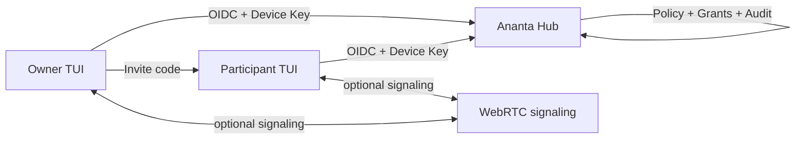
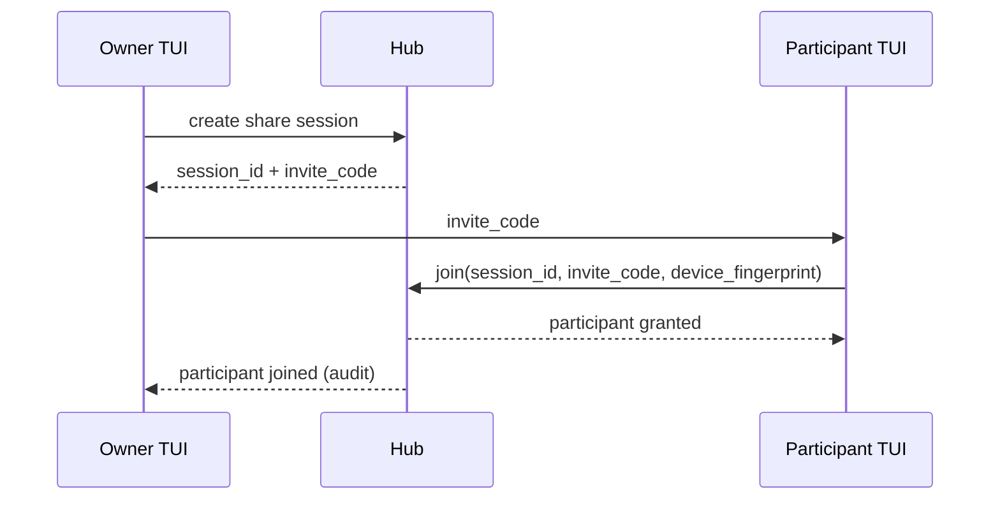
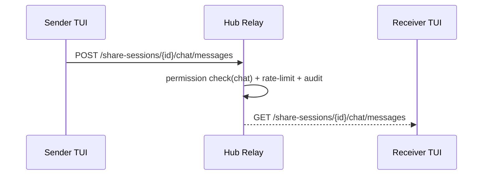
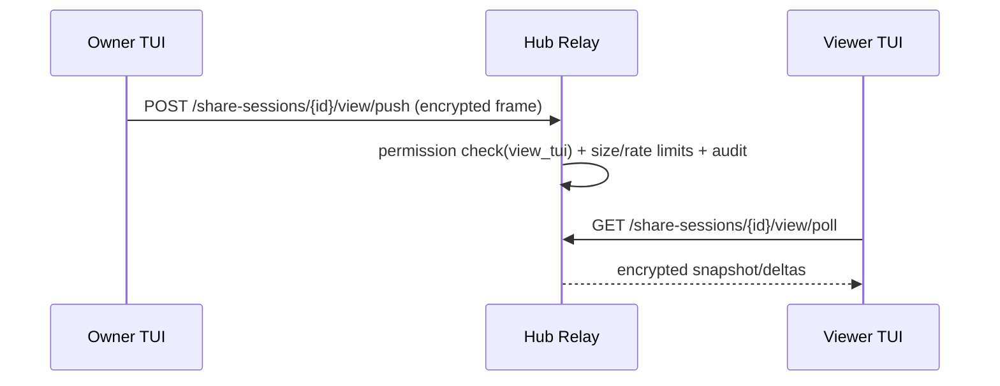

# Operator TUI Shared Sessions

This document explains how to use **OIDC + Device Key + Share Session** in the Operator TUI.

## Security model

1. **OIDC user identity** authenticates the human user.
2. **Device key fingerprint** identifies the concrete local TUI instance/device.
3. **Share session permissions** gate chat/view/cursor/artifact/control capabilities.
4. **Remote control stays disabled by default** (`remote_control=false`).

## Typical flow

1. Start TUI and open **Share / Teilnehmer**.
2. Run `:oidc login`.
3. Generate a device key with `:share key generate`.
4. Create session: `:share create <title>`.
5. Share invite code (`:share invite`) with participant.
6. Participant joins: `:share join <code>`.
7. Optionally enable view sharing: `:share view on`.

## Architecture

Hub relay is the MVP transport. Optional WebRTC signaling/data path can be used when available, but policy/permissions stay identical.

## Join sequence

## Chat sequence

## Shared view sequence

## Troubleshooting (OIDC/Keycloak)

- `oidc_context_required`: token does not contain `sub`; re-login via `:oidc login`.
- `not_authenticated`: expired token; login again.
- `Hub-Login fehlgeschlagen`: verify endpoint and credentials.
- `session_not_active`: session expired or revoked; create a new invite.
- `view_tui_permission_required`: owner must enable `view_tui` permission.
