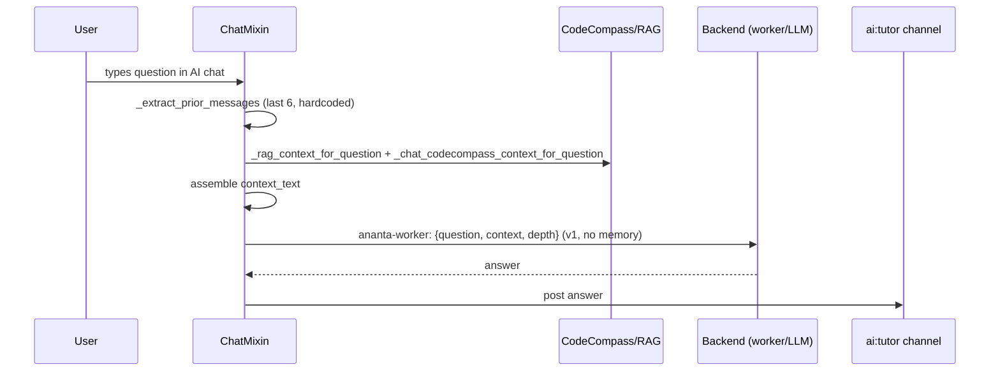
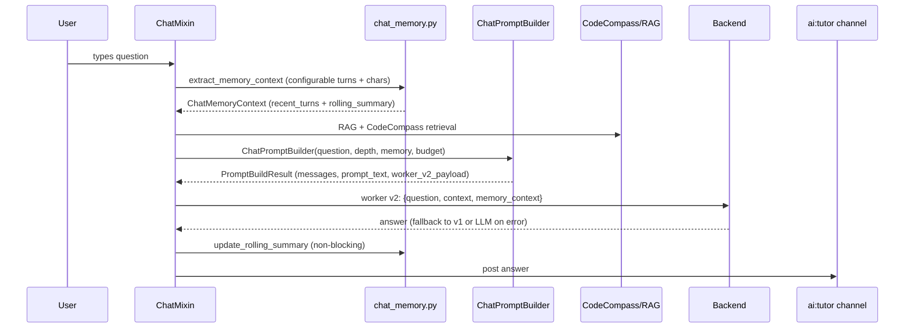

# AI-Snake Chat Memory, CodeCompass Context and Worker Configuration

## Current flow (before this track)



**Which backends received `prior_messages` before:**
- ✅ LMStudio/local — yes, via `_tutorial_ai_llm_ask`
- ❌ ananta-worker `/snake/ask` — no, only `{question, context, depth}`
- ❌ propose (opencode/hermes) — no, only plain prompt

## New flow (after this track)



## Memory layers

| Layer | Key | Default | Description |
|---|---|---|---|
| recent_turns | `chat_use_history` + `chat_history_turns` | enabled, 6 turns | Last N user/assistant messages |
| rolling_summary | `chat_use_summary` + `chat_summary_chars` | enabled, 1500 chars | Compact Q→A history summary |
| active_target | from artifact/goal/terminal | always | Selected artifact/goal context |
| codecompass_refs | `chat_use_codecompass` | enabled | Source pack + project references |
| rag_snippets | `chat_rag_top_k` | 24 | RAG retrieval results |
| runtime_status | `chat_include_runtime_status` | disabled | Active view, backend, snake state |

## Context budget policy

```
active_target → rolling_summary → recent_turns → codecompass → rag → runtime_status
```

Each section is allocated from the remaining `chat_context_chars` budget. When budget
is exhausted, later sections are omitted. Diagnostics show which sections were included.

## Worker payload versions

| Version | Fields | When used |
|---|---|---|
| v1 | `{question, context, depth}` | fallback, backward-compat |
| v2 | `{question, context, depth, memory_context}` | when `chat_pass_memory_to_worker=true` |

The client tries v2 first. If the server returns HTTP 400, it automatically falls back to v1.

## Existing settings in ai_snake_config_view.py

- `chat_backend` — Chat Provider (ananta-worker, opencode, lmstudio, hermes)
- `chat_backend_model` — Model for LMStudio/local backends
- `chat_use_codecompass` — Include CodeCompass in chat context
- `chat_include_local_project` — Include local project in source pack
- `chat_include_wikipedia` — Include Wikipedia source pack
- `chat_context_chars` — Max chars for context (500–20000)
- `chat_max_tokens` — Max tokens for LLM response
- `chat_rag_top_k` — RAG result count (8–120)
- `chat_answer_chars` — Max answer chars

## New memory settings (CMW-012)

| Setting | Type | Default | Description |
|---|---|---|---|
| `chat_use_history` | bool | true | Include recent turns in prompt |
| `chat_history_turns` | int | 6 | Max recent turns to include |
| `chat_history_chars` | int | 1800 | Max chars budget for recent turns |
| `chat_use_summary` | bool | true | Include rolling summary |
| `chat_summary_chars` | int | 1500 | Max chars for rolling summary |
| `chat_summary_update_every_turns` | int | 3 | Update summary every N Q&A turns |
| `chat_pass_memory_to_worker` | bool | true | Send v2 memory payload to worker |
| `chat_worker_mode` | choice | snake_ask | snake_ask / propose / auto |
| `chat_backend_fallback` | choice | lmstudio | none / lmstudio / local_knowledge |
| `chat_include_runtime_status` | bool | false | Include TUI state in prompt |

## Backend vs Visual provider distinction (CMW-013)

- **Visual Provider** (`ai_snake_provider_preference`) — controls which backend powers the visual AI-Snake heuristic/animation. Does not affect chat answer generation.
- **Chat Provider** (`chat_backend`) — controls which backend answers chat questions. Does not affect visual snake behavior unless explicitly linked.

## Chat context health indicator (CMW-017)

After each answer, the game state records:
- `last_chat_backend_used` — configured backend name
- `last_chat_backend_path` — actual path used (worker_v2 / worker_v1 / llm_direct / llm_fallback / local_knowledge)
- `last_chat_latency_ms` — round-trip latency
- `last_chat_fallback_reason` — why fallback was triggered (empty = no fallback)
- `last_chat_memory_status` — `{history_used, summary_used, codecompass_used, rag_count}`

These are visible in the Renderer Diagnostics View when `chat_memory_debug=true`.

## Rolling summary format

The rolling summary is a simple extractive in-memory summary stored in game state under
`chat_memory_summary`. After each Q&A pair it appends:

```
Q: <question_abbrev> → A: <answer_abbrev>
Q: <second question> → A: <second answer>
```

Oldest entries are dropped when the summary exceeds `chat_summary_chars`. No LLM call is
needed for summary generation — it is fast, non-blocking, and always available.

## Fallback policy

| `chat_backend_fallback` | Effect when main backend fails |
|---|---|
| `none` | Return error message to chat |
| `lmstudio` (default) | Fall back to LMStudio/local LLM |
| `local_knowledge` | Return answer from local knowledge base |

## Files

| File | Role |
|---|---|
| `chat_memory.py` | `ChatMemoryContext`, memory extraction, rolling summary |
| `chat_prompt_builder.py` | `ChatPromptBuilder` with budget policy, v2 payload |
| `chat_mixin.py` | Integration: memory build, prompt build, worker call, summary update |
| `ai_snake_config_view.py` | Config items and apply handler for all memory settings |
