# AI-Snake Heuristic Evolution

## Overview

The TUI AI snake learns from operator usage patterns and automatically improves its navigation
behavior through a structured lifecycle: **observation → candidate creation → validation →
simulation → shadow run → progressive rollout → active**.

---

## Three Layers

### 1. Runtime
The snake applies active heuristics from `heuristics/active/tui_snake/`.
Active heuristics control movement in real-time at ~18 TPS.

### 2. Learning
Accumulated decision traces trigger candidate proposals every 300 seconds (cooldown)
with a max of 3 candidates per hour (rate limit).

Candidates are stored in `heuristics/candidates/tui_snake/` with TTL (default 14 days).
Expired candidates are automatically moved to `heuristics/quarantine/tui_snake/`.

### 3. Governance
Controls *what gets learned and activated*. Orthogonal to movement mode.

| Mode | Behavior |
|---|---|
| `auto_without_human_approval` | Full auto-activation after all quality gates pass. **Default.** |
| `human_approval_required` | Candidates wait for explicit operator approval. |
| `observe_only` | No candidates created, no learning. |
| `frozen` | Candidates accumulate but are never activated. |

---

## Candidate Lifecycle

```mermaid
flowchart LR
    A[Decision Traces] --> B[ProposalService]
    B -->|fingerprint + dedup| C[candidates/tui_snake/]
    C -->|migration gate| D{simulation_result?}
    D -->|null| E[pending_simulation]
    D -->|exists| F[Validation]
    F -->|passed| G[Simulation]
    G -->|can_activate| H[Shadow Run + Watchdog]
    H -->|50 decisions AND 30s| I[Scoring]
    I -->|score ≥ 0.7 AND risk ≤ 0.3| J[Progressive Rollout]
    J -->|10% canary| K[Monitoring]
    K -->|OK + 20 decisions| L[50% partial]
    L -->|OK + 50 decisions| M[100% full active]
    K -->|rollback trigger| N[quarantine/]
    H -->|watchdog trigger| N
    G -->|failed| N
```



### Activation strategy: `promote_to_active`

The default strategy. After passing all gates, the candidate is written to
`heuristics/active/tui_snake/` with status `active`. Direct loading from `candidates/`
is disabled by default (`direct_candidate_runtime_allowed = false`).

### Progressive Rollout (10% → 50% → 100%)

Promotion never activates at 100% immediately. The rollout starts at 10% (canary)
and advances only after sufficient decisions without rollback triggers.

### Direct Candidate Runtime (debug mode only)

Set `direct_candidate_runtime_allowed = true` in `ActivationPolicy` to load candidates
directly without the full lifecycle. This is a debug-only mode and is shown as a warning
in the TUI.

---

## Candidate Fingerprint

Each candidate gets a stable SHA-256 fingerprint over:

```
SHA-256( domain + base_heuristic_ref + action_kind + parameters_canonical_json )
```

`fallback_reason` and `context_hash_pattern` are intentionally excluded (too variable).
Duplicate fingerprints increment `evidence_count` instead of creating a new file.

---

## Candidate TTL and Rate Limit

- **TTL**: `expires_at = saved_at + candidate_ttl_days * 86400` (default: 14 days)
- Expired candidates are moved to `quarantine/` at startup and daily.
- **Rate limit**: max 3 candidates per hour, 300s cooldown between proposals.
- Exceeded rate limit is logged with `reason_code: rate_limit_active`.

---

## Shadow Run

A candidate runs in shadow mode: the **active heuristic still controls movement**,
while the candidate computes hypothetical decisions in parallel.

Both thresholds must be met (AND gate):
- `min_decisions = 50`
- `min_duration_seconds = 30`

### Live Watchdog

Aborts the shadow run if:
- `shadow_no_movement_frames > 10` consecutive
- `shadow_decision_loop_detected` (same position 5x in a row)
- `shadow_exception_rate > 0.1`
- `shadow_invalid_action_rate > 0.2`

On trigger: candidate → `quarantine/`, audit event `candidate_shadow_watchdog_triggered` emitted.

---

## Scoring

After a successful shadow run, a score block is computed:

| Field | Meaning |
|---|---|
| `simulation_passed` | Must be `true` |
| `shadow_decision_count` | Must be ≥ 50 |
| `shadow_duration_seconds` | Must be ≥ 30 |
| `shadow_match_rate` | How often candidate agreed with active heuristic |
| `fallback_reduction_estimate` | Estimated reduction in fallback events |
| `risk_score` | 0.0 = safe, 1.0 = risky. Must be ≤ 0.3 |
| `activation_score` | 0.0 = not ready, 1.0 = perfect. Must be ≥ 0.7 |

---

## Rollback Triggers

Auto-rollback fires (and moves the active candidate to `quarantine/`) if:

- `fallback_rate_increased` (delta > 0.15)
- `ai_timeout_rate_increased`
- `snake_stuck_detected`
- `user_negative_feedback_threshold_reached` (3 negative feedbacks)
- `decision_duration_threshold_exceeded`
- `invalid_transition_detected`

Rollback works at every rollout stage. Previous active version is restored from `archive/`.

---

## User Feedback Keys (ASH-041)

| Key | Action |
|---|---|
| `+` | Positive feedback for current behavior |
| `-` | Negative feedback (3 negatives → rollback threshold) |
| `R` (Shift+r) | Rollback current auto-promoted heuristic |
| `P` (Shift+p) | Pin current heuristic (prevents automatic replacement) |

**Note**: `r` (lowercase) = `:refresh` (existing binding). `p` = `:prev section`.
Shift variants `R` and `P` are used to avoid conflicts.

---

## Artifact Intent Model (ASH-042)

Intent, movement, target, and interaction are separate fields in `SnakeArtifactDecision`:

| Field | Values |
|---|---|
| `intent` | `none`, `explain_artifact`, `inspect_artifact`, `move_to_artifact`, `chat_with_user` |
| `movement` | `none`, `fast_target`, `follow_user`, `lurk` |
| `target` | `RegionTarget` or `None` — `fast_target` is only valid with a target |
| `interaction` | `none`, `open_chat_when_arrived`, `explain_inline`, `show_detail` |

State progression after artifact arrival:

```
MOVE_TO_ARTIFACT → EXPLAIN_ARTIFACT → CHAT_WITH_USER
```

---

## TUI Debug View (ASH-040)

When snake debug is active, the following fields are shown:

- `active_heuristic_id`
- `current_candidate_id` (if shadow run active)
- `movement_mode` / `governance_mode`
- `activation_strategy`
- `last_reason_codes` (last 3 fallback reasons)
- `rollout_stage` (e.g. `canary 10%`)
- `activation_score` and `risk_score` of running candidate

---

## Audit Events (ASH-033)

All lifecycle events are emitted as structured, raw-data-free events:

- `snake_decision`
- `candidate_created` / `candidate_duplicate_merged`
- `candidate_validated` / `candidate_simulated`
- `candidate_shadow_started` / `candidate_shadow_completed`
- `candidate_shadow_watchdog_triggered`
- `candidate_auto_promoted`
- `candidate_rollout_stage_advanced`
- `candidate_quarantined`
- `heuristic_rollback`

Events are accessible via `snake_audit_events.get_events(event_type=..., limit=50)`.

---

## Migration: Existing Candidates (ASH-016)

All 11 existing candidates in `heuristics/candidates/tui_snake/` have
`simulation_result: null`. At startup, the migration gate sets their status to
`pending_simulation` and excludes them from active use.

The migration is idempotent — safe to run on every startup.
