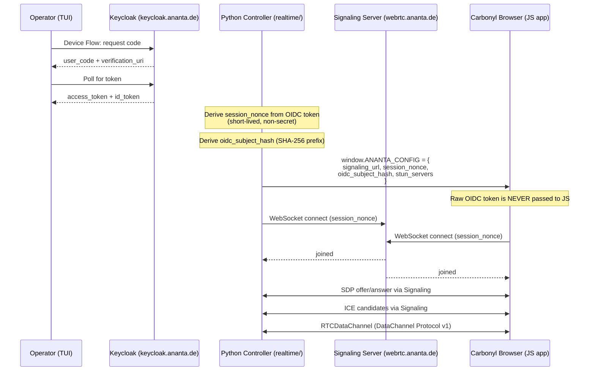
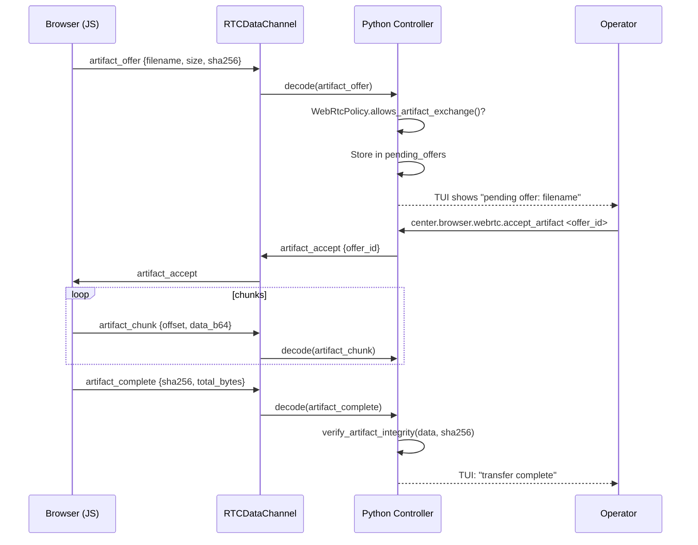

# Carbonyl WebRTC Session Architecture (Option C)

## Why Two Separate Stacks?

Ananta has two distinct protocols that both involve "WebRTC" in their name, but they serve completely different purposes and must never be confused:

| | `webrtc_transport.py` (Hub Relay) | `realtime/` (WebRTC DataChannel) |
|---|---|---|
| **Protocol** | HTTP-Polling | WebSocket signaling + RTCDataChannel |
| **Auth** | Hub-JWT | OIDC → Ananta session nonce |
| **Signaling server** | Hub `/webrtc/` endpoints | `wss://webrtc.ananta.de/signaling` |
| **Use case** | Share-Session TUI relay | Carbonyl browser DataChannel peer |
| **Camera/mic** | Never | Experimental (disabled by default) |
| **Artifact transfer** | Not supported | Protocol v1, explicit-accept-required |

**`webrtc_transport.py` is NOT modified by the `realtime/` stack.** They are independent code paths.

### Option C Decision

Option A (extend webrtc_transport.py) was rejected because the protocols, authentication, and signaling endpoints are fundamentally different. Mixing them would require complex conditionals and would make each harder to reason about.

Option B (replace webrtc_transport.py) was rejected because the Hub Relay path is still needed for Share-Session relay until all clients support WebRTC DataChannel natively.

**Option C** (separate `realtime/` package) keeps both paths clean, independent, and auditable.

---

## OIDC-before-WebRTC Flow



---

## DataChannel Artifact Transfer Flow



---

## Security Boundary

```
┌─────────────────────────────────────────────────────────────┐
│  Python side (trusted)                                      │
│                                                             │
│  • Holds raw OIDC access_token / refresh_token              │
│  • Holds full ICE candidate IPs                             │
│  • Enforces WebRtcPolicy                                    │
│  • Runs WebRtcAuditLog (never logs tokens or payloads)      │
│  • Owns session_nonce lifecycle                             │
└──────────────────────┬──────────────────────────────────────┘
                       │  window.ANANTA_CONFIG (non-secret)
                       │  • signaling_url
                       │  • session_nonce  ← short-lived, non-secret
                       │  • oidc_subject_hash  ← hash prefix only
                       │  • stun_servers / turn_servers (URLs only)
                       │  • datachannel_enabled, max_message_bytes
                       ▼
┌─────────────────────────────────────────────────────────────┐
│  Browser JS (untrusted from Python's perspective)           │
│                                                             │
│  • Receives ONLY derived metadata                           │
│  • NEVER receives raw OIDC token                            │
│  • NEVER receives TURN credentials (passed in ICE servers)  │
│  • Sends DataChannel messages with session_nonce            │
└─────────────────────────────────────────────────────────────┘
```

---

## Package Layout

```
client_surfaces/operator_tui/realtime/
    __init__.py                     Package marker + docstring
    signaling_models.py             SignalingMessage dataclass
    signaling_client.py             WebSocket client with URL allowlist
    datachannel_protocol.py         DataChannelProtocol v1
    webrtc_session_controller.py    Session orchestration
    webrtc_policy.py                WebRtcPolicy dataclass
    ice_probe.py                    IceProbe / IceProbeResult
    webrtc_audit.py                 WebRtcAuditLog / WebRtcAuditEvent

client_surfaces/operator_tui/visual/browser/webrtc_app/
    index.html                      HTML skeleton (OIDC/signaling/ICE/DC state)
    app.js                          Session init, reads window.ANANTA_CONFIG
    datachannel.js                  DataChannel Protocol v1 (JS)
    media_probe.js                  Media capability probe (disabled by default)
    style.css                       Dark theme, monospace, TUI-matching

scripts/
    operator_tui_webrtc_smoke.py    ICE/STUN/TURN probe script
```

---

## Service Notes

- `webrtc.ananta.de` and `keycloak.ananta.de` are **limited test services** and are not production-grade. They may have uptime, capacity, and rate-limit constraints.
- TURN credentials may be short-lived or rotated without notice in test environments.

## Warning: Audio/Video

Audio and video (camera, microphone, screen share) are **experimental and disabled by default** in `WebRtcPolicy`. They must be explicitly enabled via policy configuration and the `probeMediaCapabilities()` function in `media_probe.js` must be explicitly triggered by user action. They are never auto-activated.
