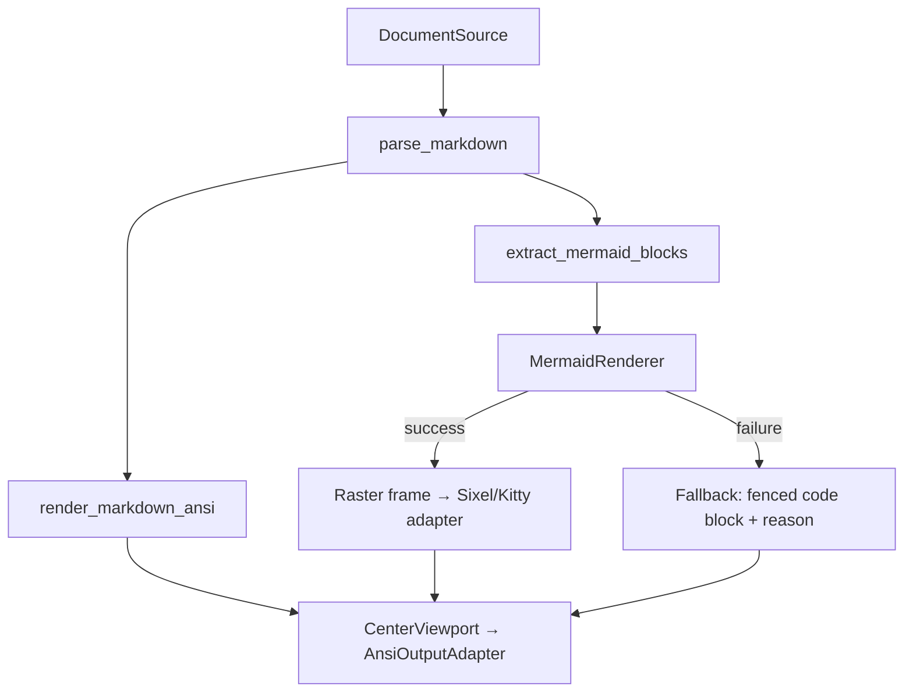
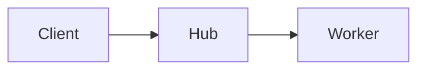

# Operator TUI — Markdown and Mermaid Center View

The `markdown_mermaid_document` view renders Markdown documents and embedded Mermaid diagrams
inside the Operator TUI center viewport.  It reuses the existing `VisualView` / `VisualViewport`
contract and never writes terminal escape sequences directly.

## Render paths



### Rendering modes

| Mode | Description |
|---|---|
| `markdown_ansi` | Markdown → ANSI/text lines → CenterViewport. Always available. |
| `markdown_raster_optional` | Markdown → HTML/PNG preview → raster frame → Sixel/Kitty fallback. |
| `mermaid_image` | Mermaid source → SVG/PNG via renderer backend → raster frame. |
| `mermaid_fallback` | Mermaid source → fenced code block with error/capability reason → ANSI. |

## Configuration

Add to `config/config.example.json` under the `markdown_mermaid` key:

```json
{
  "markdown_mermaid": {
    "markdown_mode": "ansi",
    "mermaid_mode": "auto",
    "mermaid_renderers": ["mermaid_cli", "playwright", "fallback_codeblock"],
    "timeout_seconds": 15.0,
    "max_diagram_width": 1280,
    "max_diagram_height": 720,
    "cache_enabled": true,
    "allowed_roots": ["/path/to/project/docs"]
  }
}
```

`markdown_mode` values: `ansi` (default), `raster_optional`, `source_only`.  
`mermaid_mode` values: `auto` (default), `image`, `source_only`, `disabled`.

## Switching to the view

Use the ViewSwitcher overlay (when available) to select `markdown_mermaid_document`.  The view
appears under *Views OK* when the ANSI Markdown fallback is available.  If Mermaid image
rendering is also available it will not be listed as degraded.

For local documents prefer:

```bash
:doc open /absolute/or/relative/path/to/file.md
```

This keeps Markdown/Mermaid on the dedicated document render path and avoids browser-mode quality pitfalls.

## Mermaid renderer dependency choices

### mermaid-cli (mmdc)

```
npm install -g @mermaid-js/mermaid-cli
# or project-local
npm install @mermaid-js/mermaid-cli
```

The renderer looks for `mmdc` on `PATH`.  It runs with a configurable timeout and size limits.

### Playwright

```
pip install playwright
playwright install chromium
```

Playwright requires `mermaid.min.js` to be present locally
(`node_modules/mermaid/dist/mermaid.min.js`).  It does **not** load remote resources.

## Minimal Markdown example

Pass `markdown_text` in the view state:

```python
state = {
    "markdown_text": "# My Document\n\nHello world.\n\n- item 1\n- item 2",
}
```

Or use a `DocumentSource`:

```python
from client_surfaces.operator_tui.visual.markdown.document_source import inline_source
state = {"document_source": inline_source("# Title\n\nContent")}
```

## Minimal Mermaid diagram example

Embed a fenced `mermaid` block inside Markdown:

```markdown
## Architecture


```

When `mmdc` is available, this renders as an image.  When unavailable, the source is shown with
the reason, e.g. `Mermaid image renderer unavailable: mmdc not found in PATH`.

## Common failures

| Failure | Cause | Result |
|---|---|---|
| `mmdc not found in PATH` | `@mermaid-js/mermaid-cli` not installed | Source-only fallback |
| `playwright package not installed` | `pip install playwright` missing | Source-only fallback |
| `timeout after 15.0s` | Diagram too complex or system too slow | Source-only fallback |
| `mermaid.min.js not found` | Playwright path, local npm package missing | Source-only fallback |
| Unsupported image protocol | Terminal does not support Sixel/Kitty | ANSI text output |
| File outside allowed roots | `allowed_roots` too restrictive | Placeholder error frame |

Markdown text rendering remains fully usable even when all Mermaid image rendering paths fail.

## WSL2 recommended stack

Baseline (best quality/effort in WSL2):

```bash
sudo apt install -y chafa
npm install -g @mermaid-js/mermaid-cli
```

Optional:

```bash
pip install playwright
playwright install chromium
npm install mermaid
```

Run diagnostics in TUI:

```bash
:doc preflight
```

`doc preflight` reports dependency status (`mmdc`, `node`, `chafa`, `playwright`, `mermaid.js`) and actionable hints.

## View switcher capability states

| Overlay label | Meaning |
|---|---|
| `[*markdown_mermaid_document]` | Active, all features OK |
| `[~markdown_mermaid_document: Mermaid image: mmdc missing]` | Active but Mermaid image degraded |
| `[ markdown_mermaid_document]` | Available, not active |

The `*` marker denotes the currently active view.  A `~` prefix means degraded.

## Smoke tool

```bash
# Render a Markdown file through ANSI mode
python scripts/operator_tui_markdown_mermaid_smoke.py docs/my-doc.md

# Custom viewport size and scroll offset
python scripts/operator_tui_markdown_mermaid_smoke.py docs/my-doc.md --width 120 --height 40 --scroll 5

# Source-only mode (no Mermaid image rendering attempt)
python scripts/operator_tui_markdown_mermaid_smoke.py docs/my-doc.md --mode source_only

# Pipe from stdin
echo "# Hello\n\nWorld" | python scripts/operator_tui_markdown_mermaid_smoke.py
```
