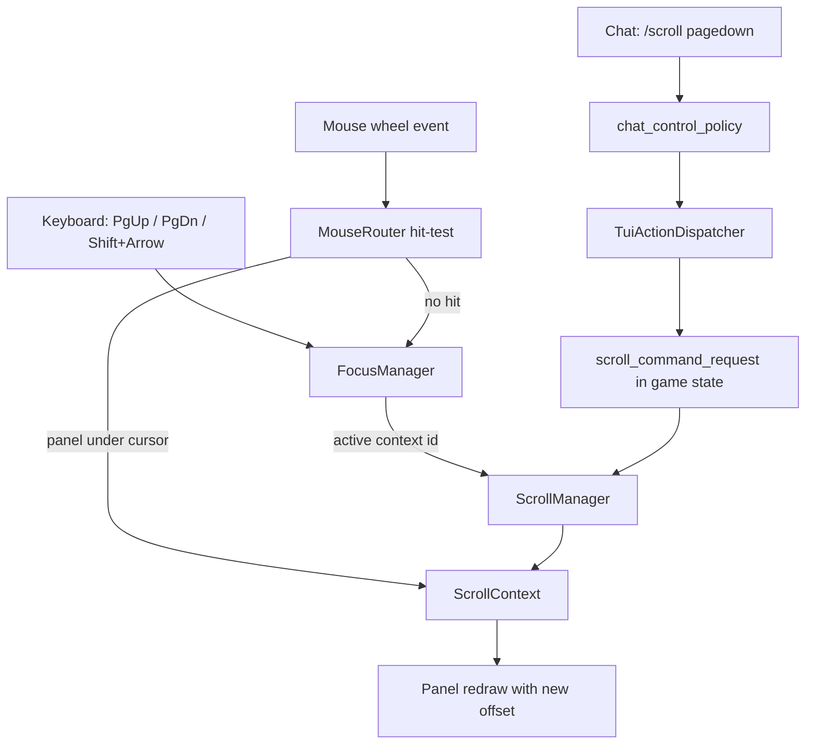

# Operator TUI — Scrollbars, Focus-aware Scrolling and Mouse Wheel

Every scrollable TUI area owns a `ScrollContext`.  A `FocusManager` decides which
`ScrollContext` receives `PgUp`/`PgDn` and mouse wheel events.  Each visible area can
show a compact scrollbar indicator.

## Architecture



## Layers

| Layer | File | Responsibility |
|---|---|---|
| `ScrollContext` | `scroll/scroll_context.py` | Content height, viewport height, offset, scroll methods |
| `ScrollManager` | `scroll/scroll_manager.py` | Registry of all active contexts, lifecycle, diagnostics |
| `FocusManager` | `focus/focus_manager.py` | Active panel focus, maps focus IDs to scroll context IDs |
| `MouseRouter` | `input/mouse_router.py` | Hit-test wheel events to panel rectangles |
| `scrollbar_renderer` | `scroll/scrollbar_renderer.py` | Compact scrollbar characters and minimal text indicator |

## Scrollable areas

| Focus ID | ScrollContext ID | Description |
|---|---|---|
| `chat_panel` | `chat_panel` | Chat history messages |
| `ai_panel` | `ai_panel` | AI/status output panel |
| `artifact_panel` | `artifact_panel` | Artifact list |
| `log_panel` | `log_panel` | Log/output panel |
| `main_content` | `main_content` | Main content/detail panel |
| `center_viewport` | `center_viewport` | Center VisualViewport text views (Markdown etc.) |

## Keyboard controls

| Key | Action | Effect |
|---|---|---|
| `PgUp` | `scroll_page_up` | Scroll focused panel one page up |
| `PgDn` | `scroll_page_down` | Scroll focused panel one page down |
| `Shift+↑` | `scroll_line_up` | Scroll focused panel one line up |
| `Shift+↓` | `scroll_line_down` | Scroll focused panel one line down |
| `Shift+Home` | `scroll_home` | Scroll to top |
| `Shift+End` | `scroll_end` | Scroll to bottom |
| `Ctrl+W` | `cycle_focus_or_channel` | Cycle focus between panels |
| `Ctrl+E` | `chat_focus` | Focus chat input |
| `F7` | `focus_left` | Focus left panel |
| `Ctrl+D` | `focus_right` | Focus right panel |

Chat input editing is **not** affected — scroll only applies to panel history/content, not the chat input buffer.

## Mouse wheel

Mouse wheel events are routed to the panel under the cursor when terminal mouse
reporting is enabled.  If the cursor is not over a scrollable panel, the focused panel
receives the event.  Mouse support can be disabled by config; keyboard scrolling always works.

### Snake mode and mouse wheel

Mouse wheel events are treated as scroll input only.  Snake `mouse-follow` ignores wheel-only
events (no `x,y` movement) and does not misinterpret them as target positions.

## Chat-control commands (from Snake Chat mode)

| Command | Effect |
|---|---|
| `/focus chat` | Focus chat panel |
| `/focus center` | Focus center viewport |
| `/focus artifacts` | Focus artifact panel |
| `/focus logs` | Focus log panel |
| `/focus nav` | Focus navigation panel |
| `/scroll up` | Scroll focused panel one line up |
| `/scroll down` | Scroll focused panel one line down |
| `/scroll pageup` | Scroll one page up |
| `/scroll pagedown` | Scroll one page down |
| `/scroll top` | Scroll to top |
| `/scroll bottom` | Scroll to bottom |

Denied or invalid scroll targets return a structured reason. Scroll commands are in
the autonomous E2E allowlist.

## Scrollbar visual

The chat panel shows a compact text indicator when scrolled away from the bottom:

```
▲12 ▼3
```

This means 12 lines above the current view and 3 below.  The indicator replaces the last
visible message line to stay within the reserved panel space.

For larger panels, the full `render_scrollbar_column()` produces a vertical column:

```
▲
░  ← empty track
█  ← thumb (current position)
█
░
▼
```

Terminal-friendly ASCII fallback (`^`, `|`, `.`, `v`) is used when unicode is unavailable.

## Focus indication

The footer/status area shows the active focus target when it differs from the default:

```
Focus: Chat  [PgUp/PgDn] Scroll
```

Changing focus with `Ctrl+W` cycles through registered focusable panels in layout order.

## Troubleshooting

| Problem | Likely cause | Fix |
|---|---|---|
| Mouse wheel does nothing | Terminal mouse reporting disabled | Enable via config or use keyboard scrolling |
| Wrong panel scrolls | Focus is on unexpected panel | Check footer focus indicator, use Ctrl+W to cycle |
| Chat input swallowed by scroll | Chat input buffer has focus, not history | Press Ctrl+E to cycle to history panel |
| Scrollbar blocks content | Panel width too narrow | Narrow scrollbar indicator auto-hides when space < 3 cols |
| PgUp/PgDn don't work in snake mode | Mode intercepts keys | Press Ctrl+W to set scroll focus to a non-snake panel first |
