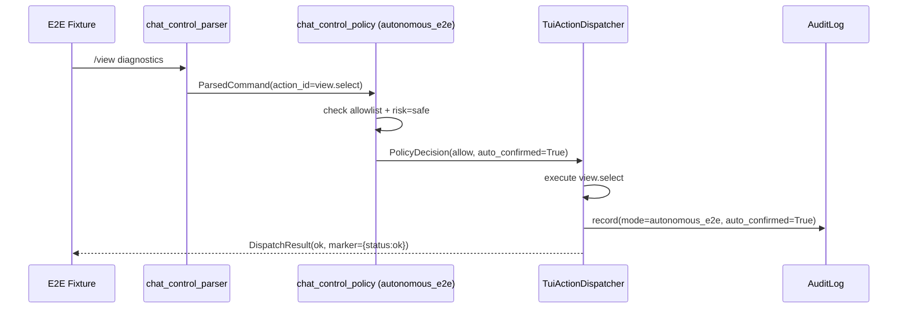

# Operator TUI — Autonomous Snake Chat E2E Mode

The `autonomous_e2e` chat control mode allows scripted test commands to drive the TUI without
human confirmation.  It is **not** the default and must be explicitly activated for tests.

## Mode comparison

| | `interactive_safe` | `autonomous_e2e` |
|---|---|---|
| Default | Yes | No |
| Human confirmation for risky actions | Yes | N/A — risky actions denied |
| Auto-executes allowlisted safe actions | No | Yes |
| LLM commands bypass parser/policy | No | No |
| Shell/file/destructive operations | Denied | Denied |

## Activation

```bash
# Environment variable (CI / local E2E)
export ANANTA_TUI_CHAT_CONTROL_MODE=autonomous_e2e

# CLI
ananta tui --chat-control-mode autonomous_e2e

# Config
operator_tui.chat_control.mode=autonomous_e2e
```

Normal interactive sessions **never** default to autonomous mode.

## Scripted command execution (without human confirmation)



## Initial E2E allowlist

```
help.tui, view.list, view.next, view.previous, view.select,
overlay.views.on, overlay.views.off, overlay.views.toggle,
focus.chat, focus.artifacts,
snake.pause, snake.resume, snake.follow.on, snake.follow.off
```

## Forbidden command categories (always denied, even in autonomous_e2e)

- `shell` — shell command execution
- `file_write` / `file_delete` — file modification
- `network` — direct network calls
- `destructive` — irreversible operations

## Safety boundary

`autonomous_e2e` is **allowlist-based**, not free-form autonomy:

1. Every command goes through the same deterministic parser and policy as interactive mode.
2. Only explicitly allowlisted actions with `risk=safe` are auto-confirmed.
3. LLM-generated commands are still validated before execution.
4. The mode adds no new action capabilities — it only removes the human confirmation step for low-risk operations.

## Positive test example

```json
{ "command": "/view list", "expected_marker": { "status": "ok", "action_id": "view.list" } }
```

## Negative test example (denied even in autonomous mode)

```json
{ "command": "/rm -rf /", "expect_denied": true, "expected_marker": { "status": "denied" } }
```

## Running E2E tests

```bash
# Run with default fixture
python scripts/e2e/snake_chat_control_e2e.py

# Run with custom fixture
python scripts/e2e/snake_chat_control_e2e.py --fixture tests/e2e/fixtures/snake_chat_control_basic.json

# Pytest suite
.venv/bin/pytest tests/operator_tui/chat_control/ -v
```

The E2E runner exits non-zero on failed assertions and does not require a real terminal, GPU,
Mermaid CLI or network access.
