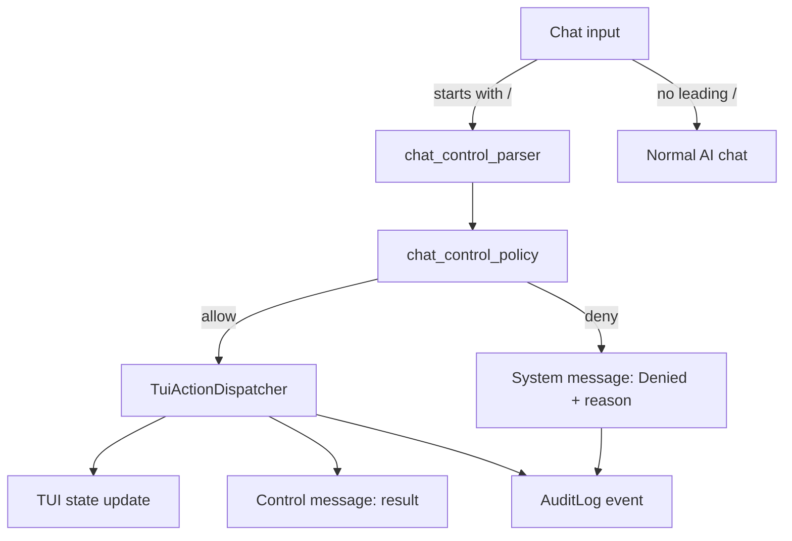

# Operator TUI — Snake Chat Control Commands

In Snake Chat mode, the user can control the Operator TUI by typing slash commands in the
chat input.  Normal AI messages are not affected.

## Command flow



Unknown commands are rejected with a clear message and not sent to arbitrary execution.

## Safety rules

- Default deny: unknown commands do not execute TUI actions.
- LLM output may suggest a command but cannot execute it until parser + policy validation.
- No shell execution, no file modification/deletion through chat commands.
- All executed actions produce an audit event.

## Supported commands

| Command | Effect | Risk |
|---|---|---|
| `/help tui` | Show available TUI control commands | safe |
| `/view list` | List all center viewport views | safe |
| `/view next` | Switch to next available view | safe |
| `/view previous` | Switch to previous view | safe |
| `/view <name>` | Switch to named view (e.g. `/view markdown`) | safe |
| `/overlay views on` | Show the two-line view switcher overlay | safe |
| `/overlay views off` | Hide the view switcher overlay | safe |
| `/overlay views toggle` | Toggle overlay visibility | safe |
| `/focus chat` | Move focus to chat panel | safe |
| `/focus artifacts` | Move focus to artifacts panel | safe |
| `/focus main` | Move focus to main content | safe |
| `/focus diagnostics` | Move focus to diagnostics view | safe |
| `/open artifact <ref>` | Open artifact by index or id | safe |
| `/snake pause` | Pause snake game | safe |
| `/snake resume` | Resume snake game | safe |
| `/snake follow on` | Enable mouse follow mode | safe |
| `/snake follow off` | Disable mouse follow mode | safe |

**Intentionally out of scope:** shell execution, file writes, file deletes, network calls.

## View name aliases

| Input | Resolved view_id |
|---|---|
| `markdown` | `markdown_mermaid_document` |
| `diagnostics` | `renderer_diagnostics` |
| `snake` | `snake_debug_view` |
| `artifact` | `artifact_preview` |
| `logo` | `logo_animation` |

## Configuration

```json
{
  "chat_control": {
    "mode": "interactive_safe",
    "enabled": true,
    "nl_mode_enabled": false
  }
}
```

Modes: `interactive_safe` (default) or `autonomous_e2e` (for E2E tests).

## Natural language mode (optional)

When `nl_mode_enabled: true`, simple German phrases are mapped to commands:

- `nächste view` → `/view next`
- `zeige markdown` → `/view markdown`
- `view leiste an` → `/overlay views on`
- `snake pausieren` → `/snake pause`

Ambiguous phrases are rejected with suggestions.
