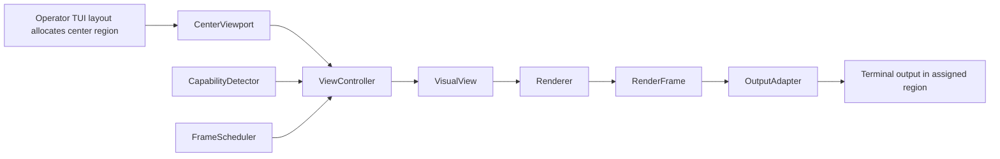

# Operator TUI VisualViewport Renderer System

## Purpose

The Operator TUI uses one controlled **center viewport** for visual output.  
The center viewport is protocol-agnostic and isolates visual rendering from the rest of the TUI.

## Architecture Layers

1. **CenterViewport**
   - Receives the assigned middle-area rectangle from the TUI layout.
   - Exposes cell and pixel geometry as `ViewportRegion`.
   - Enforces viewport ownership and minimum display behavior.
2. **ViewController** (runtime side)
   - Selects and updates the active `VisualView`.
   - Forwards normalized state/input.
   - Coordinates view switching without full TUI restart.
3. **VisualView**
   - Describes what should be shown.
   - Produces a scene model (`RenderScene`) without terminal protocol concerns.
4. **Renderer**
   - Converts scene data into a `RenderFrame` for a requested size.
   - Does not emit terminal escape sequences.
5. **OutputAdapter**
   - Draws `RenderFrame` into the assigned viewport region.
   - **Only layer allowed to emit protocol-specific terminal escapes**.
6. **CapabilityDetector**
   - Detects ANSI/Sixel/Kitty/OpenGL-offscreen availability and constraints.
7. **FrameScheduler**
   - Limits FPS, supports dirty-frame mode, and prevents output flooding.

## Pipeline

## Boundary and Safety Rules

- Visual output is clipped/constrained to the `CenterViewport` region.
- Visual components must not write outside the assigned rectangle.
- Views never emit protocol escape sequences directly.
- Renderers never write terminal output directly.
- Output adapters are the only terminal-protocol writers.
- OpenGL is optional and treated as a plugin renderer path, not as baseline dependency.
- ANSI fallback is always available and deterministic.

## Initial Components

### Initial Views

- `logo_animation`
- `snake_debug_view`
- `artifact_preview`
- `strategy_map_preview`
- `renderer_diagnostics`

### Initial Renderers

- `ansi_blocks`
- `cpu_raster`
- `svg_raster_optional`
- `opengl_offscreen_optional`

### Initial Output Adapters

- `ansi`
- `sixel`
- `kitty`
- `noop_diagnostics`

## Default Runtime Profile

- default pixels: `800x450`
- max pixels: `1280x720`
- target fps: `10`
- animation fps: `15`
- max fps: `30`
- fallback chain:
  1. `cpu_raster + kitty`
  2. `cpu_raster + sixel`
  3. `ansi_blocks + ansi`

## Operational Guidance and Terminal Limits

- OpenGL remains an **optional offscreen plugin**: it renders to frame buffers and the terminal still receives encoded frames via Kitty/Sixel/ANSI adapters.
- Recommended interactive target sizes:
  - normal: `800x450`
  - larger: `1024x576`
  - upper bound for responsive use: `1280x720`
- `1920x1080` at `60 FPS` is intentionally **not** the default terminal target; it can starve TUI input and status updates.
- On unsupported terminals (or broken graphics paths), keep `ansi_blocks + ansi` as stable fallback.

### Terminal-specific notes

- **Windows Terminal / WSL2**: Sixel/Kitty support varies by build and host; keep fallback chain enabled and avoid forcing image adapters.
- **WezTerm / Kitty / Ghostty-like**: Kitty protocol generally works best with raster frames; clear stale images on view switches.
- **Generic xterm/SSH**: assume ANSI-only unless capability detection explicitly says otherwise.

### Troubleshooting

1. If no image appears, run `python3 scripts/operator_tui_visual_smoke.py --capabilities-only` and verify detected adapters.
2. If redraw is slow, reduce target FPS and pixel size (prefer `800x450` and `10-15 FPS`).
3. If GPU/OpenGL path fails, do not block startup: switch renderer to `cpu_raster` or `ansi_blocks`.
4. If protocol support is flaky, force ANSI adapter and validate viewport clipping before re-enabling image adapters.
