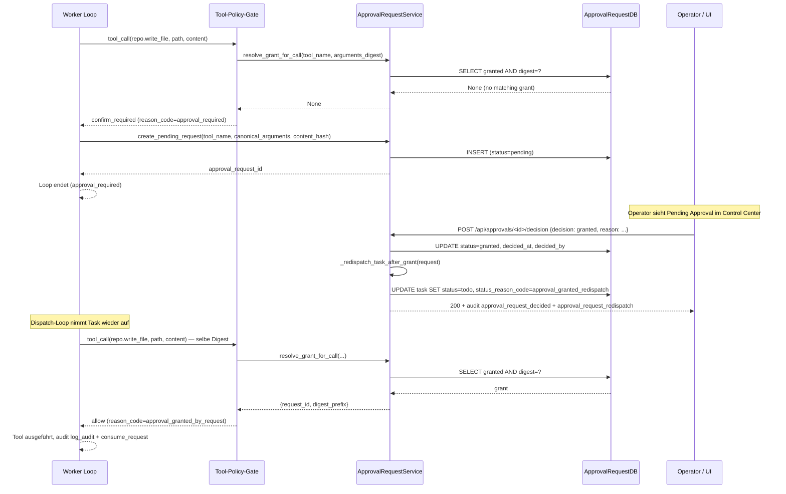
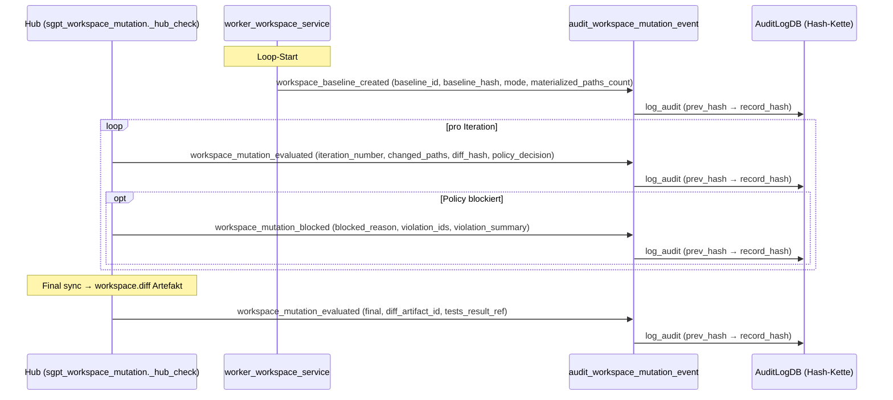

# Security: Approval Lifecycle & Workspace Mutation Audit

> **Scope:** ALWA-019. Kanonische Quelle für Approval- und
> Audit-Lifecycle, auf die andere Docs verlinken.

## Warum `tool_name`-Grants unsicher sind

Ein Approval-Grant nur anhand des Tool-Namens (`approvals=["repo.write_file"]`)
deckt **jeden** Aufruf dieses Tools ab — egal welcher Pfad, welcher
Inhalt, welcher Hash. Das ist eine klassische
**Confused-Deputy**-Verletzung:

  approvals=["repo.write_file"]  →  erlaubt Schreiben in `/etc/passwd`
                                   genauso wie in `tests/fixtures/...`

ALWA-DD-001 zieht die Konsequenz: **Grants sind an kanonisierte
Argumente gebunden, nicht an den Tool-Namen allein.** Konkret:

  • `canonical_arguments` ist die deterministisch normalisierte
    JSON-Form der Argumente (sort_keys, ensure_ascii, None/NaN
    behandelt, `content` und `unified_diff` werden durch
    `__content_hash__` ersetzt — der Roh-Inhalt liegt nur im
    Payload-Artifact, nicht im Request).
  • `arguments_digest = sha256(tool_name + canonical_json + target_fingerprint)`
    ist die Identität eines konkreten Calls.
  • `resolve_grant_for_call()` matcht Grants nur, wenn dieser Digest
    exakt passt, `status=granted` ist, `expires_at` nicht überschritten,
    und `task_id` / `goal_id` / `scope` kongruent sind.

Ein Grant für `repo.write_file path=foo.txt content=hash-A` deckt nicht
denselben Call mit `content=hash-B` ab.

## Statusmodell (ApprovalRequestDB)

  pending ─► granted ─► consumed
     │           │
     │           └► expired
     ├► denied
     ├► expired
     └► superseded   (durch neueren Request für gleiche task_id+tool_name
                       mit abweichendem digest)

Jeder Statuswechsel erzeugt ein Audit-Event
(`approval_request_created|decided|consumed|expired|superseded`)
mit `request_id`, `digest_prefix`, `scope_summary`, `reason_code` —
**niemals** mit rohen Argumenten.

## Auto-Approval und `blocked_without_separate_approval`

`approval_lifecycle.auto_approval_policy` (pro `governance_mode`):

  governance_mode.safe     read_only = true
  governance_mode.balanced read_only = true, controlled_workspace_writes = true, test_run = true
  governance_mode.strict   (none — alle Writes brauchen explizite Approval)

`approval_lifecycle.human_required_tools` ist eine harte
Default-Deny-Liste (nie automatisch freigegeben):

  git.push, git.commit, secret.read, service.restart,
  network.fetch_arbitrary, shell.run_unrestricted,
  external_worker.execute_mutation

`goal_pre_approvals` können beim Goal-Start scoped Grants für
erlaubte Toolklassen erzeugen (goal_id + workspace/materialized
scope + tool_class/tool_name + expiry + optional target_fingerprint).

## Workspace-Audit-Events

Drei kanonische Events werden vom Hub emittiert:

  workspace_baseline_created       — bei `refresh_mutation_baseline`
                                     (read_only emittiert nichts)
  workspace_mutation_evaluated     — pro Iteration `_hub_check()`
  workspace_mutation_blocked       — bei MutationGate-Block-Decision
                                     (5 paths: global_deny, hardening,
                                     approval_blocked, execution_risk_denied,
                                     scoped_mismatch) + final-answer
                                     policy_blocked

Pflichtfelder je Event: `task_id`, `goal_id`, `trace_id`,
`iteration_number`, `mutation_mode`, `changed_paths`,
`diff_hash` / `diff_artifact_id`, `policy_decision`,
`violation_ids`, `violation_summary`, `blocked_reason` (Block-Events).
Baseline zusätzlich: `baseline_id`, `baseline_hash`,
`materialized_paths_count`.

## Redaction (ALWA-DD-006)

Der Helper `audit_workspace_mutation_event()` droppt explizit:

  prompt, raw_prompt, raw_prompts, messages, raw_messages,
  raw_response, response_text, full_diff, unified_diff,
  file_content, raw_content, before, after

Auch wenn sie via `**extras` reinkommen. `changed_paths` werden
sortiert und auf 50 begrenzt — bei Überlauf wird
`changed_paths_truncated=true` und `changed_paths_count` gesetzt.
Der `_FORBIDDEN_RAW_FIELDS`-Schutz aus `agent/common/audit.py` greift
zusätzlich auf der `log_audit`-Ebene.

## Sequenzdiagramm — Approval Flow

## Sequenzdiagramm — Workspace Mutation Audit

## Verwandte Docs

  • `docs/security/ananta-worker-workspace-mutation-policy.md` — Mutation-Policy-Detail
  • `docs/security/ananta-worker-tool-calling-policy.md` — Tool-Loop-Policy
  • `docs/contracts/ananta-worker-tool-loop.md` — `needs_approval` / `approval_required`
  • `docs/contracts/ananta-worker-mutation-mode.md` — `controlled_workspace` vs `strict_patch_request`
  • `docs/ananta-worker-workspace-patch-iteration.md` — Feedback-Iteration
  • `agent/common/audit.py` — Konstanten + Helper
  • `agent/services/approval_request_service.py` — Lifecycle-Service
  • `agent/services/mutation_gate_service.py` — Gate-Integration

## Tests (Referenz)

  • `tests/test_alwa_workspace_audit_helper.py` — Helper-Konstanten + Redaction
  • `tests/test_alwa_workspace_audit_hooks.py` — Hook-Integration
  • `tests/test_alwa_redispatch.py` — Re-Dispatch
  • `tests/test_mutation_gate_service.py` — Gate-Tests inkl. digest
  • `tests/test_approval_binding.py` — Lifecycle-Grundlagen
  • `tests/test_approval_policy_service.py` — Policy-Integration
  • `tests/test_ananta_worker_tool_policy.py` — Tool-Loop-Policy
