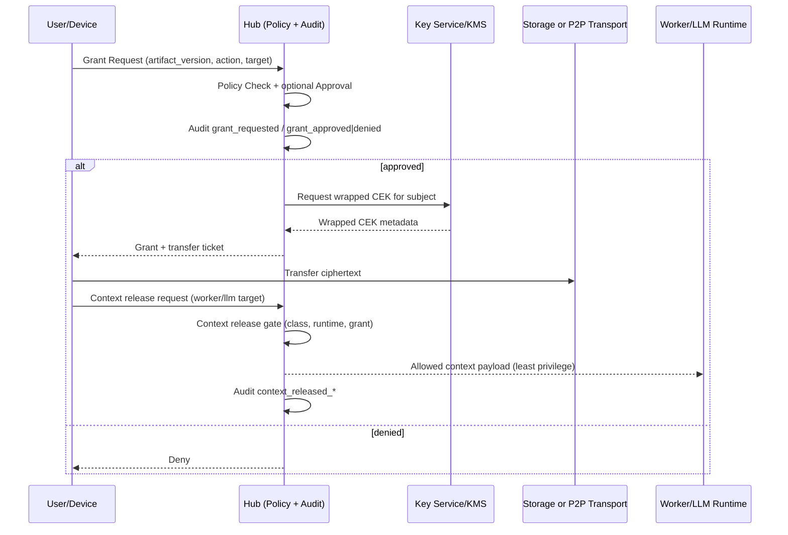

# Encrypted Artifact Exchange (Hub-Worker + OIDC + optional P2P)

## Zielbild

Dieses Dokument definiert die Zielarchitektur fuer den verschluesselten, berechtigungsgebundenen Artefakt-Austausch in Ananta.

- **Hub bleibt Control Plane** fuer Policy, Approval, Audit und Grant-Entscheidungen.
- **Worker bleiben Ausfuehrungsebene** und erhalten nur explizit freigegebene Artefakt-Kontexte.
- **Transport ist austauschbar** (Hub/Object-Storage oder optional WebRTC DataChannel), aber nie Policy-Quelle.
- **Default-Deny** gilt fuer Download, Decrypt, Share, Worker-Release und Remote-LLM-Release.

## Architektur-Schnitt (Identity / Authorization / Encryption / Transport / Audit / Context Release)

1. **Identity**
   - OIDC (inkl. Keycloak) liefert eine pruefbare User-Identitaet.
   - Device-Identitaet wird getrennt betrachtet (Device-Key-Binding, siehe `artifact-key-binding.md`).
2. **Authorization**
   - Hub bewertet Grants und Policies pro Artefaktversion und Zielkontext.
3. **Encryption**
   - Artefaktinhalt wird mit einem CEK (Content Encryption Key) verschluesselt.
   - CEK wird nur fuer berechtigte Subjekte verschluesselt bereitgestellt.
4. **Transport**
   - Modus A: Hub/Object-Storage.
   - Modus B: optional WebRTC-P2P.
5. **Audit**
   - Grant, Decrypt, Transfer und Context Release werden revisionsfaehig protokolliert.
6. **Context Release**
   - Jeder Worker-/LLM-Kontextdurchlauf passiert ein deterministisches Gate.

## "Serverless" sauber abgegrenzt

Mit "serverless" ist hier **nicht** "ohne jeden Server" gemeint, sondern:

- kein zentraler Artefakt-/Game-Server als alleinige Datenautoritaet fuer den P2P-Pfad,
- aber weiterhin Hilfsdienste fuer Signaling/STUN/TURN,
- und weiterhin ein Hub fuer Governance/Policy/Audit.

Signaling/STUN/TURN sind Transport-Hilfen, keine Berechtigungsinstanz.

OIDC/Keycloak ist Identity-Provider, aber weder Transport- noch Storage-Ersatz.

## End-to-End Freigabe- und Transferfluss

## Nicht-Ziele

- Kein Worker-zu-Worker-Orchestrationpfad.
- Kein implizites Recht durch Transporterfolg.
- Keine LLM-basierte Policy-Entscheidung ohne deterministische Regelbasis.

