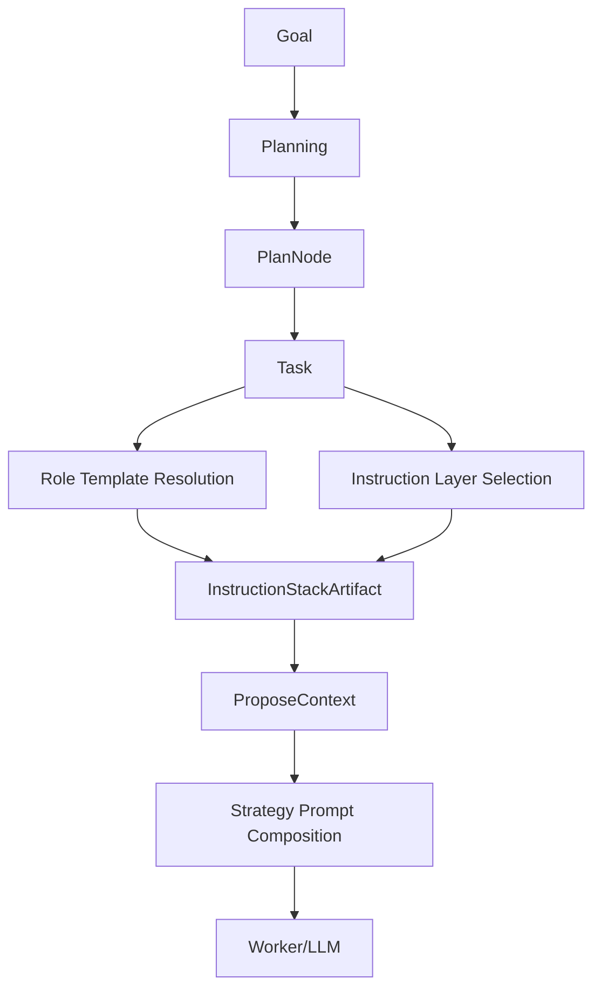
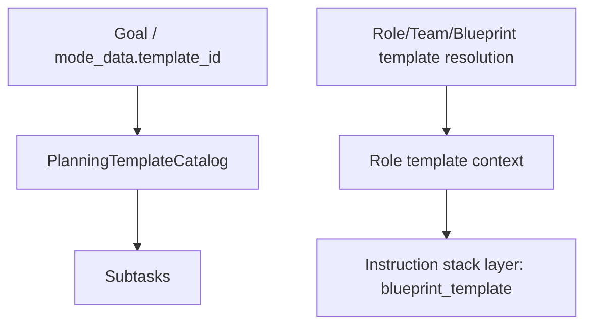
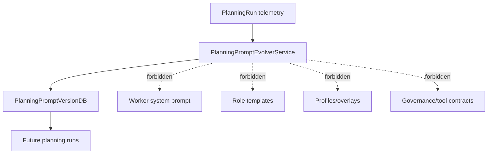

# Template, Role, Overlay, and Evolver Architecture

Status: Working architecture baseline.

## Scope Separation

- Planning templates: deterministic subtask generation during planning.
- Role/team/blueprint templates: execution-style context for a role, not subtask generation.
- User profile and task overlay: bounded preference layers (style/language/detail/working mode/formatting).
- Governance/security/approval/tool/runtime policy: dominant and non-overridable by profile/overlay.
- Planning prompt evolver: planning-only optimization, not worker prompt mutation.

## Goal to Worker Flow



## Planning Template vs Role Template



## Instruction Layer Order

```text
governance > blueprint_template > user_profile > task_overlay > task_input
```

## Prompt Evolver Boundary



Allowed evolver impact:
- planning prompt text/hints
- planning output-format guidance for future planning runs

Forbidden evolver impact:
- worker prompt composition
- role template content
- overlay/profile permissions
- governance/security/approval/tool/runtime policy
