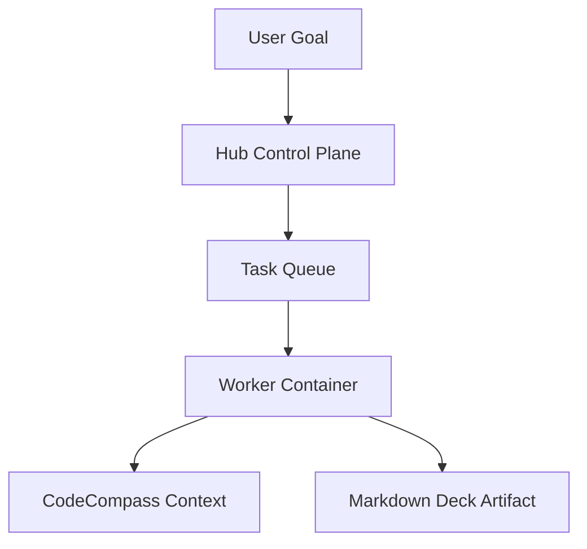

# Ananta Markdown Slides

Plain Markdown source, deterministic slide splits, safe preview, and Hub-governed export.

---

## Hub Worker Flow



---

## Code Block Separator Safety

The parser ignores separators inside fenced code blocks.

```text
This is not a slide break:
---
Still the same code block.
```

---

## Deck Artifact Contract

- Source remains plain `.md`
- Rendered HTML is derived output
- Export outputs are separate artifacts
- Provenance links source hash, theme, renderer, and job

---

## Security Boundary

Raw scripts, event handlers, active embeds, and `javascript:` links are removed before preview.

Export stays a backend worker job because privileged rendering must pass Hub policy.
