# Ananta Template-/Rollen-/Overlay-Architektur

Status: Entwurf / Analyse

Ziel dieser Datei: das aktuelle Template-, Rollen-, Blueprint-, Overlay- und Prompt-System von Ananta verständlich darstellen und daraus konkrete Architekturverbesserungen ableiten.

Wichtig: Der Dateiname `templeate` folgt absichtlich der angefragten Schreibweise.

---

## 1. Kurzüberblick

Ananta hat mehrere Ebenen, die zusammen den späteren Worker-Prompt und die Task-Ausführung beeinflussen:

1. **Goal / Mode / Mode Data**  
   fachlicher Auftrag des Users.

2. **Goal Config / Workflow Effective**  
   scoped Konfiguration für Planning, Routing, LLM, Policies und Execution.

3. **Planning Templates**  
   deterministische Subtask-Vorlagen aus dem Planning-Katalog.

4. **Blueprints / Blueprint Roles / Blueprint Artifacts**  
   Team- und Rollenstruktur mit Task-Artifacts, Templates und Defaults.

5. **Plan / PlanNodes**  
   materialisierte Planstruktur mit Rationale, Retrieval-Hints, Verification-Spec und Blueprint-Provenance.

6. **Task / Worker Execution Context / Worker Execution Contract**  
   konkrete ausführbare Arbeitseinheit für Worker.

7. **Instruction Layer / User Profile / Overlay**  
   zusätzliche Prompt-Schichten für Stil, Sprache, Arbeitsmodus und taskbezogene Hinweise.

8. **ProposeContext / PromptContextBundle / ProposeStrategy**  
   finaler Kontext für LLM-/Worker-Strategien.

9. **Finaler Worker-Prompt**  
   strategieabhängig gebauter Prompt plus Tools, Policies und Context Bundle.

---

## 2. Gesamtfluss: Goal bis Worker

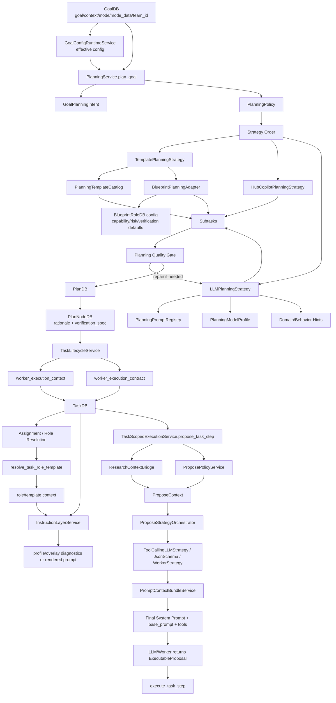

---

## 3. Datenmodell-Überblick

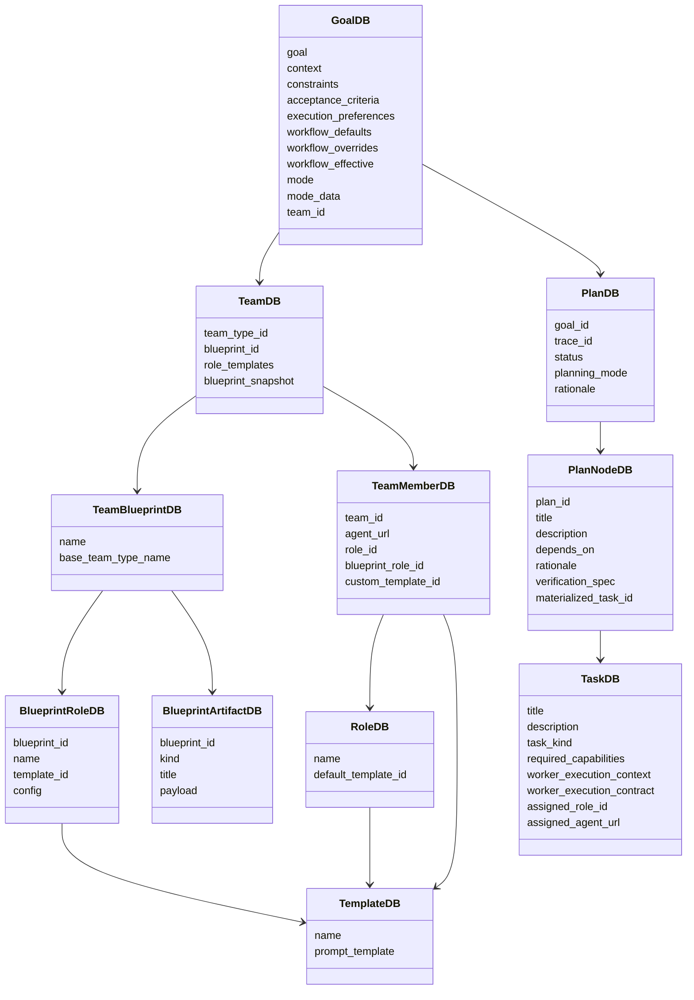

---

## 4. Zwei verschiedene Template-Systeme

### 4.1 Planning Template

Planning Templates erzeugen aus einem Goal direkt eine Liste von Subtasks. Sie sind deterministische Plan-Vorlagen.

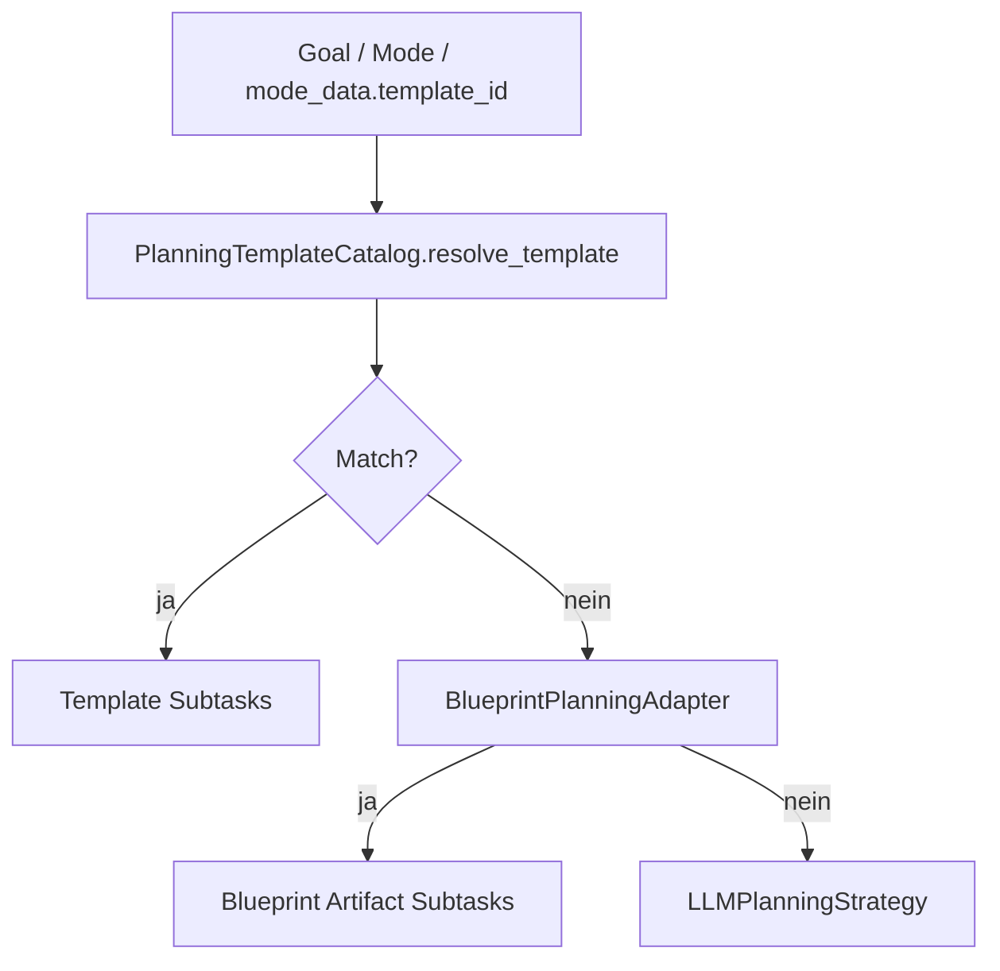

**Funktion:**

- schnell
- deterministisch
- geeignet für bekannte Goal-Typen
- erzeugt PlanNodes ohne LLM

### 4.2 Role / Team / Blueprint Template

Rollen-/Team-/Blueprint-Templates beschreiben eher, **wie** eine Rolle arbeiten soll, nicht zwingend welche Subtasks entstehen.

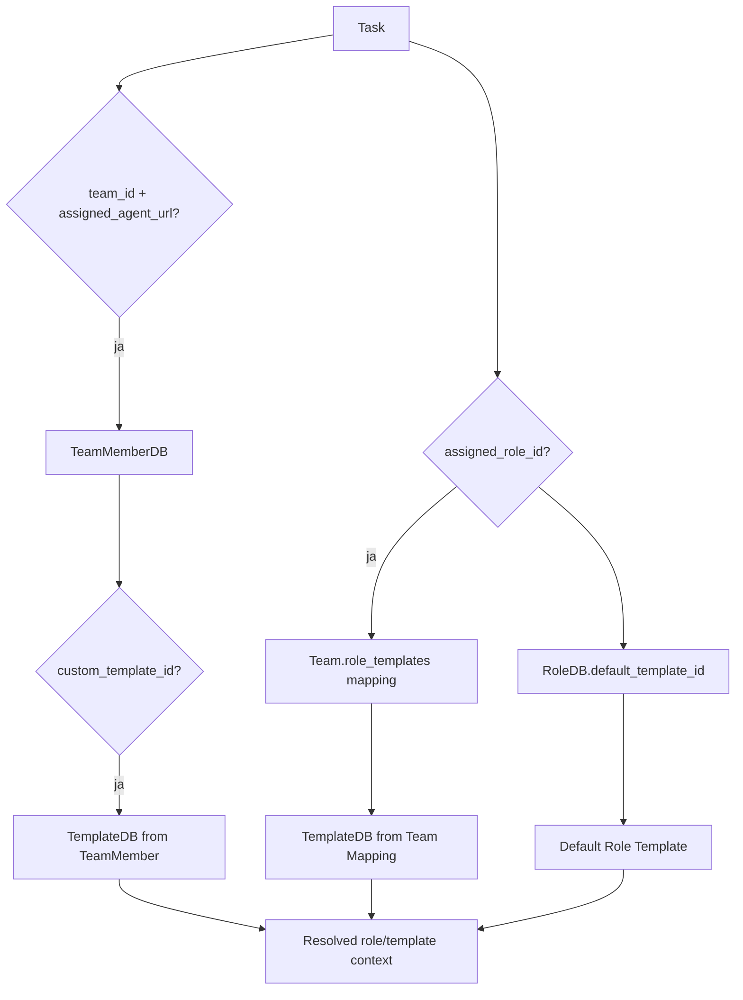

**Priorität der Auflösung:**

1. TeamMember `custom_template_id`
2. Team `role_templates[role_id]`
3. Role `default_template_id`

---

## 5. Blueprint Planning

Blueprints können Task-Artifacts und Rollen-Defaults liefern.

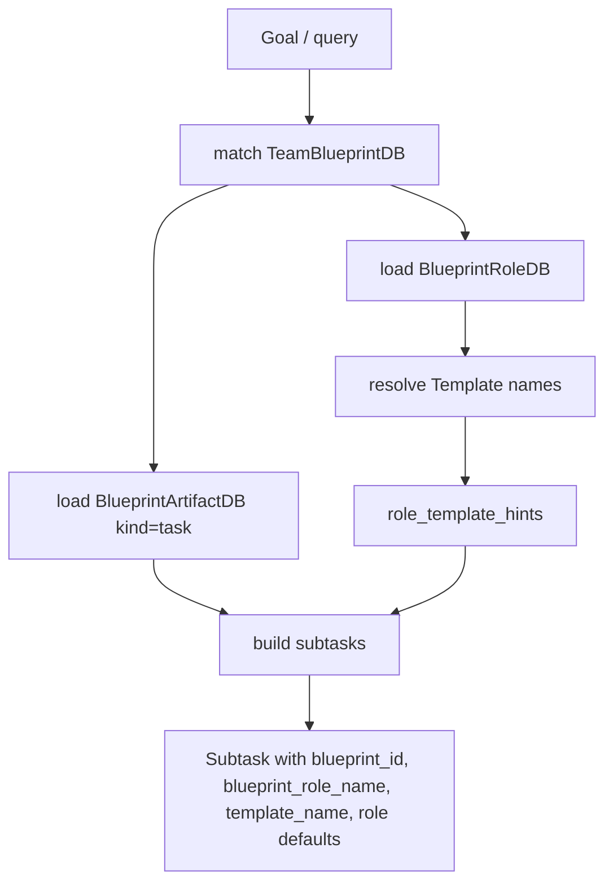

Dabei können aus `BlueprintRoleDB.config` übernommen werden:

- `capability_defaults`
- `risk_profile`
- `verification_defaults`

Diese Daten dürfen später nicht nur Prompt-Deko sein. Sie müssen in Routing, Verification, Context Policy und Worker Contract wirken.

---

## 6. PlanNode als zentrale Übersetzungsschicht

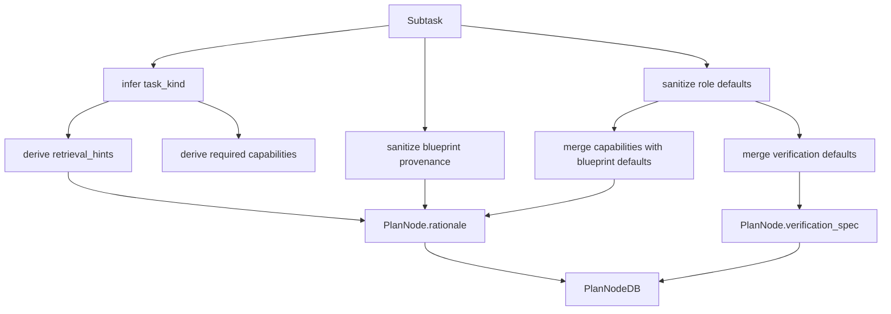

`PlanNode.rationale` ist aktuell die wichtigste Brücke zwischen Planning und späterer Ausführung.

Typische Inhalte:

```json
{
  "task_kind": "coding",
  "retrieval_intent": "symbol_and_dependency_neighborhood",
  "required_context_scope": "module_and_related_symbols",
  "preferred_bundle_mode": "standard",
  "required_capabilities": ["coding", "analysis"],
  "blueprint_id": "...",
  "blueprint_role_name": "...",
  "template_name": "...",
  "blueprint_role_defaults": {
    "capability_defaults": {},
    "risk_profile": {},
    "verification_defaults": {}
  }
}
```

---

## 7. Task-Materialisierung

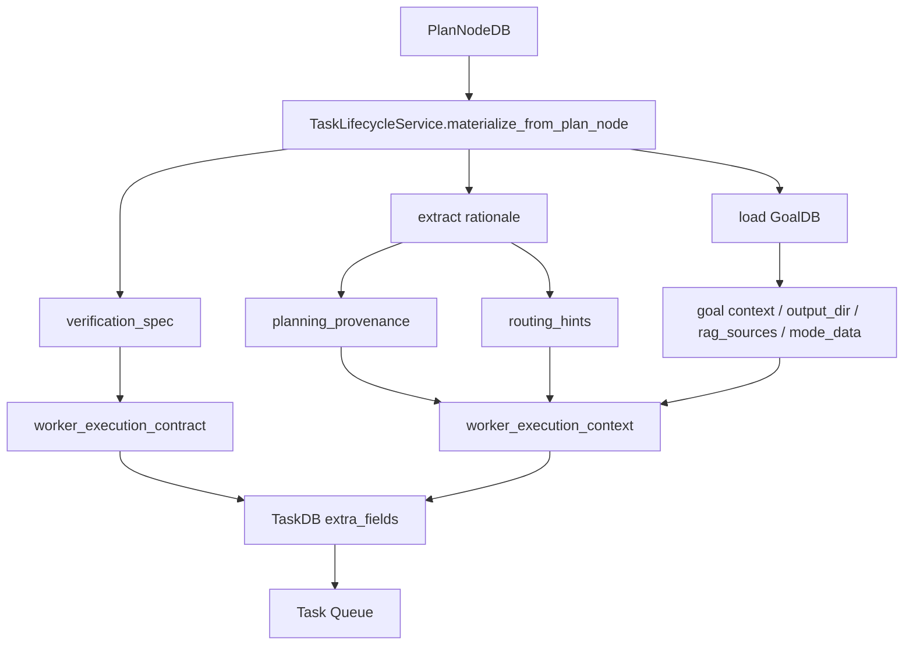

Der `worker_execution_context` ist der erste konkrete Ausführungskontext für Worker. Er enthält:

- `planning_provenance`
- `routing_hints`
- Goal-Kontext
- Workspace-Informationen
- Research/RAG Quellen
- optional repair foundation

Der `worker_execution_contract` enthält erwartete Artefakte und Verification-Vorgaben.

---

## 8. Instruction Layer / Overlays

Die Instruction-Layer haben eine feste Reihenfolge:

```text
governance > blueprint_template > user_profile > task_overlay > task_input
```

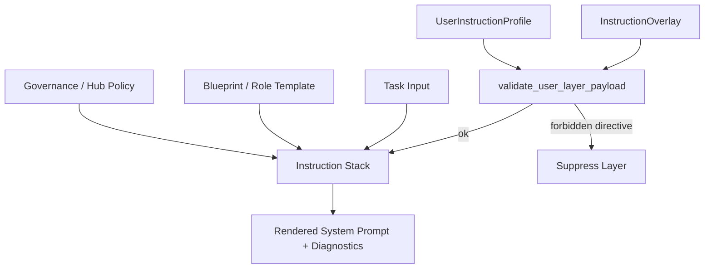

Erlaubter User-Einfluss:

- Stil
- Sprache
- Detailgrad
- Arbeitsmodus
- Formatierung

Verbotener User-Einfluss:

- Approval Policy
- Governance Policy
- Security Policy
- Allowed Tools
- Write Access
- Runtime Execution

---

## 9. Aktuelle Schwachstelle

Der Code hat bereits einen `InstructionLayerService.assemble_for_task()`, der einen `rendered_system_prompt` bauen kann.

Aktuell wirkt es aber so, dass dieser gerenderte Systemprompt nicht konsequent in die finale Propose-/Worker-Prompt-Erzeugung integriert ist. Stattdessen tauchen Instruction-Informationen eher im `PromptContextBundle` als Meta/Diagnostics auf.

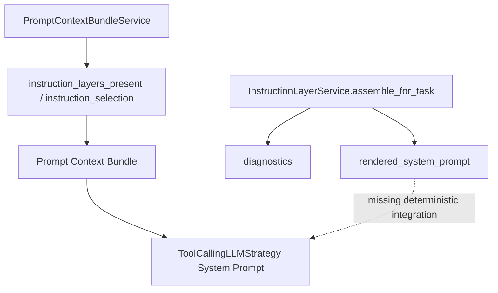

**Soll:**

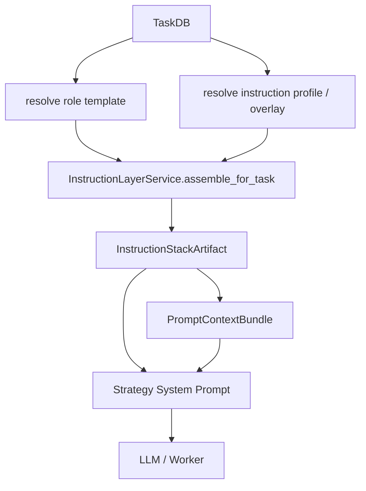

---

## 10. Finaler Task-Prompt an Worker / LLM

Bei `tool_calling_llm` besteht der Prompt effektiv aus:

- Systemprompt der Strategie
- Task-Beschreibung
- Goal ID / Task ID / Task kind
- governed context summary
- PromptContextBundle JSON
- Tool-Definitionen
- strikte Tool-Call-Anweisung

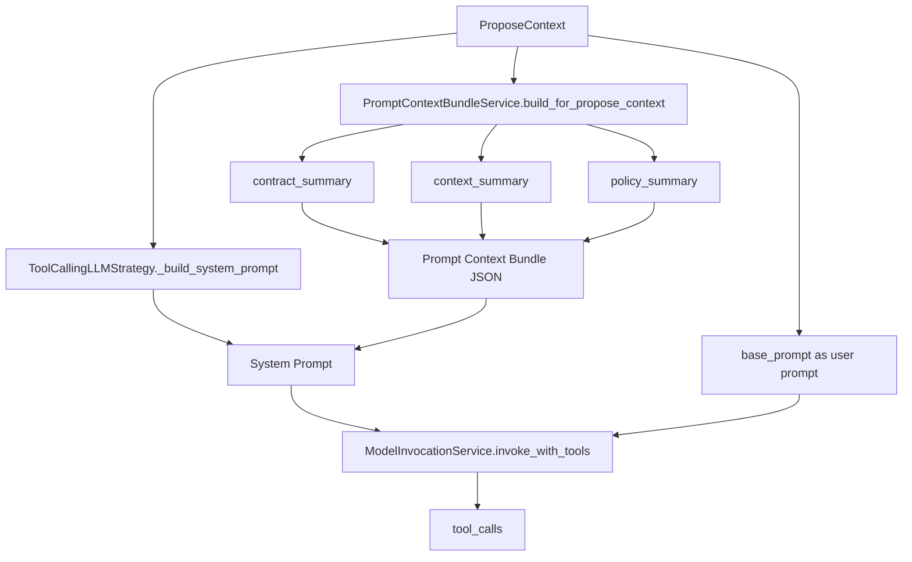

---

## 11. Zielarchitektur

Die Zielarchitektur sollte die Prompt-Schichten nicht nur als lose Strings behandeln, sondern als auditierbare Artefakte.

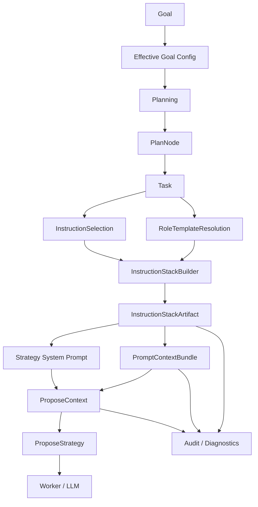

Eigenschaften:

- deterministic merge order
- policy-dominant
- auditierbar
- keine Tool-/Security-Eskalation durch User-Layer
- finaler Prompt enthält wirklich den gerenderten Instruction Stack
- PromptContextBundle und Systemprompt nutzen dieselbe Quelle

---

## 12. Empfohlene Verbesserungen

### 12.1 InstructionStackArtifact einführen

Ein explizites Artefakt, das enthält:

```json
{
  "schema": "instruction_stack.v1",
  "task_id": "...",
  "goal_id": "...",
  "role_template": {},
  "applied_layers": [],
  "suppressed_layers": [],
  "rendered_system_prompt": "...",
  "diagnostics": {},
  "checksum": "..."
}
```

### 12.2 ProposeContext erweitern

`ProposeContext` sollte optional tragen:

- `instruction_stack`
- `rendered_system_prompt`
- `instruction_diagnostics`

### 12.3 ToolCallingLLMStrategy anpassen

Systemprompt sollte bestehen aus:

1. Governance/System rules
2. Role Template Prompt
3. User Profile
4. Task Overlay
5. Strategy-spezifische Tool-Call-Regeln
6. PromptContextBundle

### 12.4 PromptContextBundle anpassen

Nicht nur `instruction_layers_present`, sondern:

- stack checksum
- applied layers
- suppressed layers
- role/template ids
- compatibility status
- rendered prompt hash

### 12.5 Planning und Execution klar trennen

Planning-Templates erzeugen Tasks.  
Role-Templates steuern Arbeitsweise.  
Instruction-Overlays steuern nur erlaubte Stil-/Arbeitsmodus-Präferenzen.

Diese Trennung sollte in Code, Doku und Tests sichtbar sein.

---

## 13. Wichtigste Regel

Der finale Prompt darf nie aus zufällig zusammengesetzten Strings entstehen.

Er sollte immer aus einem deterministischen, validierten und auditierbaren Stack kommen:

```text
Goal -> Plan -> Task -> RoleTemplate -> InstructionStack -> ProposeContext -> StrategyPrompt -> Worker
```
